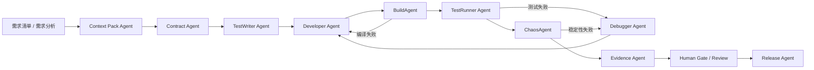
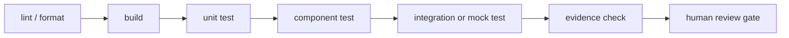

# 从零搭建 AI Agent 开发环境方案

适用目标：核心网产品 2.11 全量需求在 2026-06-30 前交付。

适用仓库：`<workspace-root>`

核心原则：这不是“给程序员配一个 AI 助手”，而是搭建一套可并发、可回放、可审计、可自愈的 AI Agent 开发工厂。人类负责架构裁决、契约评审、安全审计、环境协调和最终验收；Agent 负责上下文理解、测试生成、代码实现、构建修复、调试、回归和证据产出。

## 一、目标形态

### 1.1 最终要建成什么

| 能力 | 目标 |
| --- | --- |
| 需求拆解 | 34 条 2.11 需求全部拆为 ADU（Agentic Delivery Unit），每个 ADU 有明确输入、输出、测试和验收证据。 |
| 上下文复用 | 每类任务使用 Context Pack，避免每个 Agent 反复读取全仓库。 |
| 并发执行 | 支持 40-70 个 Agent 槽位并行工作，常态 45-55 个槽位。 |
| 隔离开发 | 每个 ADU 使用独立 worktree 或独立分支，避免 Agent 相互覆盖代码。 |
| 自愈闭环 | TestWriter -> Developer -> BuildAgent -> TestRunner -> Debugger -> ChaosAgent 自动循环。 |
| 人类门禁 | 所有跨模块 contract、P0 问题、安全/数据库/加密/HA 风险必须进入 HITL 审查。 |
| 证据发布 | 每个需求输出 evidence bundle，6/30 可按 L3/L2/L1 明确交付状态。 |

### 1.2 完成等级

| 等级 | 定义 | 6/30 口径 |
| --- | --- | --- |
| L3 真实验收 | 代码、部署、真实环境联调、测试和证据齐全。 | 可宣称完成。 |
| L2 模拟验收 | 代码完成，使用 mock、simulator、容器环境完成验收。 | 可宣称软件侧完成。 |
| L1 PoC | 只有方案、接口或 PoC，未形成发布代码闭环。 | 只能作为预研项。 |

## 二、总体架构

### 2.1 Agent 工厂结构



### 2.2 角色分工

| 类型 | 主要职责 | 是否写代码 |
| --- | --- | --- |
| Orchestrator Agent | 分配 ADU、控制依赖、检查状态、阻断冲突。 | 否 |
| Context Pack Agent | 读取需求、代码、测试、历史文档，生成可复用上下文包。 | 否 |
| Contract Agent | 生成 API、数据结构、配置、告警、指标和验收断言。 | 少量 |
| TestWriter Agent | 先写单测、接口测试、仿真测试、回归脚本和 mock。 | 是 |
| Developer Agent | 按红灯测试和 contract 实现代码。 | 是 |
| BuildAgent | 处理编译、依赖、类型、链接和构建脚本问题。 | 是 |
| TestRunner Agent | 运行单测、集成、仿真、压力、长稳和回归。 | 否 |
| Debugger Agent | 使用日志、GDB、Valgrind、抓包定位失败根因。 | 是 |
| ChaosAgent | 执行主备切换、网络故障、进程重启、DB failover。 | 否 |
| Evidence Agent | 收集命令、日志、抓包、截图、配置和验收结论。 | 否 |
| Human Gate | 架构、安全、外部资源、发布门禁和最终验收。 | 否 |

## 三、基础资源准备

### 3.1 控制节点

控制节点可以使用当前 Mac，用于编排、审查、文档、提交和证据管理。

最低建议：

| 资源 | 建议 |
| --- | --- |
| CPU | 8 核以上 |
| 内存 | 32 GB 以上 |
| 磁盘 | 200 GB 可用空间 |
| 网络 | 可访问代码仓库、模型服务、Linux worker、制品仓库 |
| 本地目录 | `<workspace-root>` 作为主工作区 |

控制节点不建议承担所有 Open5GS 运行测试，因为 UPF、TUN/TAP、Linux 网络命名空间、iptables、Valgrind、部分内核能力更适合 Linux worker。

### 3.2 Linux worker

建议准备 4-8 台 Linux worker，或者 4-8 个等价 VM/裸机/云主机。

| Worker 类型 | 数量 | 用途 |
| --- | ---: | --- |
| build-worker | 1-2 | Meson/Ninja、C/C++ 编译、静态检查。 |
| unit-worker | 1-2 | CUnit、pytest、Node/TS 单测。 |
| integration-worker | 2-3 | Open5GS、UERANSIM、gNBSim、MongoDB、NMS 联调。 |
| chaos-worker | 1 | HA、DB failover、网络故障、长稳和压力测试。 |

最低可行配置：

| 资源 | 每台建议 |
| --- | --- |
| OS | Ubuntu 22.04/24.04 或目标国产 OS 环境 |
| CPU | 8-16 vCPU |
| 内存 | 16-64 GB |
| 磁盘 | 100-300 GB |
| 权限 | 可创建 network namespace、TUN/TAP、容器和 systemd 服务 |

### 3.3 外部联调资源

这些资源决定相关需求能否从 L2 升到 L3：

| 资源 | 关联需求 | 不具备时的处理 |
| --- | --- | --- |
| UERANSIM / gNBSim | 5G 注册、会话、QoS、5G-LAN | 容器模拟 L2。 |
| eNB / 4G EPC 仿真环境 | 4G 状态、4G/5G 互操作 | 日志注入和仿真 L2。 |
| IMS 或 SIPp | IMS 告警 | SIPp/mock 告警源 L2。 |
| 达梦数据库 | 达梦适配、达梦 HA | DAO + mock/容器替代 L2。 |
| 江南信安加密卡 | 加密卡适配 | provider + SDK mock L2。 |
| 国密 USIM | 国密 UDM/USIM | 算法 provider + 测试向量 L2。 |
| SM4 基站或配合端 | N3 SM4 隧道 | tunnel PoC + mock peer L2。 |

## 四、仓库与目录规范

### 4.1 主仓库布局

当前工作区建议统一为：

```text
`<workspace-root>/`
  open5gs/             # 核心网 C/C++ 主仓库或子模块
  open5gs-nms/         # NMS/OAM 前后端
  UERANSIM/            # RAN/UE 仿真
  docs/                # 需求、设计、计划、验收和环境文档
  tests/               # 项目级测试、5G-LAN、回归和工具
  .ai-agent/           # AI Agent 工厂运行数据
```

如果某些目录不存在，不要强行创建业务仓库；先由 Context Pack Agent 在 `inventory.md` 中记录实际路径。

### 4.2 AI Agent 工厂目录

建议新增：

```text
.ai-agent/
  registry/
    requirements.yaml
    adu.yaml
    owners.yaml
  context-packs/
    common/
    open5gs-core/
    open5gs-nms/
    5glan-ha/
    security-localization/
    oam-observability/
  contracts/
    metrics.schema.yaml
    alarms.schema.yaml
    oam-api.openapi.yaml
    license.schema.yaml
    5glan.schema.yaml
    ha-state.schema.yaml
    db-adapter.schema.yaml
    crypto-provider.schema.yaml
  runs/
    YYYYMMDD-HHMMSS-<adu-id>/
      prompt.md
      commands.log
      build.log
      test.log
      debug.md
      evidence.yaml
  prompts/
    context-pack-agent.md
    contract-agent.md
    testwriter-agent.md
    developer-agent.md
    build-agent.md
    debugger-agent.md
    evidence-agent.md
  policies/
    code-boundary.md
    security.md
    review-gates.md
    token-budget.md
  release/
    acceptance-matrix.yaml
    known-issues.md
    l2-l3-status.md
```

### 4.3 分支和 worktree 规则

| 对象 | 规则 |
| --- | --- |
| 主干 | 只接收已通过 contract、测试、review 和 evidence 的 PR。 |
| ADU 分支 | `agent/<lane>/<req-id>/<slug>` |
| worktree | 每个实现型 ADU 独立 worktree。 |
| 合并粒度 | 一个 ADU 一个 PR，跨模块需求可拆多个 PR。 |
| 冲突域 | 同一文件同一冲突域同时只允许一个实现 Agent 写入。 |

禁止多个 Agent 直接在同一个工作树上改同一批文件。

## 五、工具链安装

### 5.1 通用工具

控制节点和 worker 都建议具备：

```bash
git --version
rg --version
python3 --version
node --version
npm --version
docker --version
```

建议安装：

| 工具 | 用途 |
| --- | --- |
| ripgrep | 快速代码搜索。 |
| git worktree | Agent 分支隔离。 |
| Python 3.11+ | 测试脚本、证据生成、mock 服务。 |
| Node.js 20+ | open5gs-nms、前端、TypeScript 工具。 |
| Docker / Compose | Open5GS、MongoDB、UERANSIM、mock 服务环境。 |
| jq / yq | JSON/YAML contract 和证据处理。 |
| tcpdump / tshark | 网络和协议证据。 |
| gdb / lldb | crash 和 core dump 调试。 |
| Valgrind / ASan / UBSan | 内存和未定义行为检查，优先 Linux。 |

### 5.2 Open5GS 工具链

Linux worker 建议：

```bash
meson --version
ninja --version
gcc --version
clang --version
pkg-config --version
```

常用命令模板：

```bash
meson setup build --prefix=/opt/open5gs
ninja -C build
meson test -C build
```

具体依赖以仓库当前 README、Meson 报错和 worker OS 为准，不在 Agent prompt 中硬编码过时依赖清单。

### 5.3 NMS/OAM 工具链

进入 `open5gs-nms` 后先读取 `package.json`，以实际 scripts 为准。

常见命令模板：

```bash
npm install
npm run lint
npm run test
npm run build
```

Agent 不得臆造前端或后端命令；必须先读取 `package.json`。

## 六、Agent 运行规范

### 6.1 ADU 定义

每个 ADU 必须包含：

```yaml
id: REQ-05-5GLAN-VN-GROUP
requirement: 5G LAN 实现优化
lane: 5glan-ha
level_target: L3
input_context:
  - context-packs/common
  - context-packs/5glan-ha
contracts:
  - contracts/5glan.schema.yaml
code_scope:
  allowed:
    - open5gs/src/upf
    - open5gs/src/smf
    - tests/5glan
  forbidden:
    - unrelated modules
tests_required:
  - unit
  - integration
  - regression
evidence_required:
  - build log
  - test log
  - config sample
  - packet capture or equivalent runtime proof
human_gate:
  - UPF/5G-LAN expert review
```

### 6.2 Agent 输入输出契约

| Agent | 输入 | 输出 |
| --- | --- | --- |
| Context Pack Agent | 需求、相关代码路径、历史文档 | `context-pack.md`、代码地图、风险清单。 |
| Contract Agent | context pack、需求验收点 | schema、OpenAPI、配置样例、验收断言。 |
| TestWriter Agent | contract、代码地图 | 失败测试、mock、测试说明。 |
| Developer Agent | 红灯测试、contract、允许修改路径 | 代码 diff、实现说明。 |
| BuildAgent | diff、构建日志 | 构建修复 diff、失败分类。 |
| TestRunner Agent | 测试命令、环境 | 测试日志、失败复现命令。 |
| Debugger Agent | 失败日志、core、抓包 | 根因报告、修复建议或 diff。 |
| ChaosAgent | 可部署版本、故障场景 | chaos 日志、恢复时间、异常清单。 |
| Evidence Agent | 所有日志和产物 | `evidence.yaml`、验收摘要、限制说明。 |

### 6.3 Prompt 基本模板

每个 Agent prompt 至少包含：

```text
你是 <Agent 类型>。
目标 ADU: <id>
需求: <需求名>
目标等级: <L2/L3>
允许读取: <path list>
允许修改: <path list>
禁止修改: <path list>
必须遵守 contract: <contract path>
必须运行测试: <command list>
必须输出证据: <evidence list>
失败时不要扩大 scope，先记录失败原因和最小复现。
```

## 七、自愈开发闭环

### 7.1 内环：测试先行

1. Contract Agent 冻结接口和验收断言。
2. TestWriter Agent 生成失败测试。
3. Developer Agent 只为让测试通过而实现。
4. BuildAgent 自动修复编译和类型问题。
5. TestRunner Agent 跑最小测试集。

退出条件：

| 条件 | 要求 |
| --- | --- |
| 编译 | 当前 ADU 涉及模块通过构建。 |
| 单测 | 新增测试从红到绿。 |
| 回归 | 相关历史测试不退化。 |
| 证据 | commands、logs、diff、测试结果可回放。 |

### 7.2 外环：调试和稳定性

1. TestRunner 发现 crash、timeout、回归失败。
2. Debugger 使用日志、GDB、Valgrind、抓包定位根因。
3. Developer 最小修复。
4. TestRunner 回放失败场景。
5. Evidence Agent 记录根因、修复和复测。

超过 3 轮仍失败，必须进入 Human Gate，不再让 Agent 无限制循环。

### 7.3 Chaos 闭环

适用于 HA、多线程、数据库、UPF、SM4、违规外联、备份恢复：

| 场景 | 验证内容 |
| --- | --- |
| 进程重启 | 状态恢复、告警、会话影响。 |
| 网络断链 | 超时、重连、主备切换、数据一致性。 |
| DB failover | 重连、事务、数据完整性。 |
| UPF 压力 | 吞吐、延迟、丢包、CPU/内存。 |
| 长稳 | 内存泄漏、句柄泄漏、日志膨胀。 |

## 八、CI/CD 与本地流水线

### 8.1 最小流水线

每个 PR 必须经过：



### 8.2 推荐检查项

| 层级 | 检查 |
| --- | --- |
| C/C++ | 编译、单测、ASan/UBSan、Valgrind 重点路径、静态分析。 |
| NMS/OAM | TypeScript typecheck、lint、unit、API contract、build。 |
| API | OpenAPI/schema 校验、请求响应样例、兼容性。 |
| 数据库 | migration、schema、备份恢复、failover。 |
| 安全 | secret 扫描、证书权限、TLS/mTLS、密钥不入日志。 |
| 发布 | evidence bundle 完整性、验收矩阵、已知问题。 |

### 8.3 PR 模板

每个 Agent PR 必须包含：

```markdown
## ADU
- ID:
- Requirement:
- Lane:
- Target level: L2/L3

## Contract
- Contract files:
- Changed API/schema/config:

## Verification
- Build:
- Unit:
- Integration:
- Regression:
- Chaos:

## Evidence
- Evidence path:
- Logs:
- Config samples:
- Packet capture / runtime proof:

## Risk
- Rollback:
- Known limitations:
- Human gate required:
```

没有 evidence 的 PR 不进入人类 review。

## 九、Context Pack 体系

### 9.1 为什么必须做 Context Pack

如果 40-70 个 Agent 每次都读取全仓库，会导致：

| 问题 | 后果 |
| --- | --- |
| token 浪费 | 成本和上下文噪音暴涨。 |
| 判断漂移 | 不同 Agent 对同一需求理解不一致。 |
| 合并冲突 | 重复修改相同文件。 |
| 证据不可追溯 | 很难复盘 Agent 为什么这样改。 |

### 9.2 Context Pack 内容

每个 Context Pack 建议包含：

```text
# Context Pack: 5glan-ha

## Scope
本包覆盖 5G-LAN、UPF、SMF、PFCP、HA、工业增强网关接口。

## Requirements
关联需求编号和验收断言。

## Code Map
关键目录、关键函数、关键配置、关键测试。

## Existing Behavior
当前已实现能力和限制。

## Contracts
必须遵守的 schema/API/config。

## Test Commands
最小验证命令、集成验证命令、回归命令。

## Risk
并发、性能、协议兼容、硬件依赖、回滚点。
```

### 9.3 2.11 建议 Context Pack

| 包 | 覆盖 |
| --- | --- |
| `common` | 构建、目录、代码风格、证据格式、全局风险。 |
| `oam-observability` | KPI、告警、OAM、LMT、链路检测。 |
| `5glan-ha` | 5G-LAN、UPF、SMF、HA、工业增强接口。 |
| `policy-license` | License、QoS、SIM 子网、4G/5G 互操作。 |
| `security-localization` | 加密卡、国密、TLS、ARPF、EIR、达梦、SM4。 |
| `architecture-reliability` | 多线程、zk、备份恢复、内存池、OMU。 |
| `new-products` | 业务分析服务器、工业网关、工业协议代理。 |
| `release-evidence` | 验收矩阵、发布包、已知问题、L2/L3 状态。 |

## 十、测试环境分层

### 10.1 L2 软件侧环境

L2 环境必须优先搭建，因为它不依赖外部硬件，是 6/30 保底交付基础。

| 组件 | L2 实现 |
| --- | --- |
| RAN/UE | UERANSIM、gNBSim、mock UE。 |
| IMS | SIPp 或 mock alarm source。 |
| 达梦 | adapter contract + mock/容器替代。 |
| 加密卡 | crypto provider + SDK mock。 |
| 国密 USIM | 测试向量 + provider mock。 |
| SM4 N3 | mock peer + tunnel PoC。 |
| OAM/NMS | 本地 API + UI + mock 数据。 |

### 10.2 L3 真实环境

L3 环境用于最终补证：

| 环境 | 验收重点 |
| --- | --- |
| 真实 5G RAN/UE | 注册、PDU 会话、QoS、5G-LAN。 |
| 4G/EPC/IMS | 4G 状态、互操作、IMS 告警。 |
| 达梦 HA | 连接、迁移、failover、恢复。 |
| 加密卡 | provider 调用、密钥安全、性能。 |
| 国密 USIM | 鉴权向量、互通、安全审计。 |
| SM4 基站侧 | 隧道建立、性能、故障恢复。 |

## 十一、证据包标准

### 11.1 evidence.yaml

每个 ADU 必须输出：

```yaml
adu_id: REQ-06-HA-ACTIVE-STANDBY
requirement: 双活模式 HA
level_result: L2
commit: <sha>
environment:
  os: Ubuntu 22.04
  worker: integration-worker-02
commands:
  - command: ninja -C build
    result: pass
  - command: meson test -C build
    result: pass
tests:
  unit: pass
  integration: pass
  chaos: partial
artifacts:
  build_log: runs/.../build.log
  test_log: runs/.../test.log
  packet_capture: runs/.../ha-failover.pcap
  config_sample: runs/.../ha.yaml
limitations:
  - 真实双活网络环境未到位，本次为容器级 L2 验收。
human_review:
  required: true
  reviewer_role: H3 UPF/5G-LAN/HA expert
```

### 11.2 验收矩阵

发布前形成：

| 字段 | 说明 |
| --- | --- |
| 需求编号 | 原始 34 条需求编号。 |
| 技术小节 | 对应需求分析中的技术小节。 |
| 完成等级 | L3/L2/L1。 |
| 代码入口 | 主要文件和模块。 |
| 测试入口 | 测试文件和命令。 |
| 证据路径 | evidence bundle 路径。 |
| 限制说明 | 未达 L3 的原因。 |
| 人类签核 | HITL reviewer 和结论。 |

## 十二、安全与权限边界

### 12.1 Secret 管理

Agent prompt 中禁止出现：

| 禁止内容 |
| --- |
| 真实私钥、证书私钥、token、生产密码。 |
| 加密卡真实密钥材料。 |
| 真实用户数据、IMSI/IMEI 明文清单。 |
| 生产环境连接串。 |

允许使用：

| 允许内容 |
| --- |
| mock secret。 |
| 测试证书。 |
| 脱敏日志。 |
| 测试向量。 |
| 本地临时数据库。 |

### 12.2 修改权限

| Agent 类型 | 可写范围 |
| --- | --- |
| Context/Contract | `.ai-agent/`、`docs/`、contract 文件。 |
| TestWriter | 测试目录、mock、少量测试辅助。 |
| Developer | ADU 明确允许的源码路径。 |
| BuildAgent | 构建脚本、依赖描述、ADU 相关源码。 |
| Debugger | ADU 相关源码和测试。 |
| Evidence | `.ai-agent/runs/`、`docs/`、release evidence。 |

任何 Agent 不得修改 unrelated 文件、删除用户改动、扩大需求范围。

## 十三、从零搭建步骤

### Day 0：盘点和初始化

目标：把当前真实仓库状态变成 Agent 可消费的 inventory。

输出：

| 产物 | 内容 |
| --- | --- |
| `.ai-agent/registry/requirements.yaml` | 34 条需求映射。 |
| `.ai-agent/registry/inventory.md` | 仓库目录、构建方式、测试方式、外部依赖。 |
| `.ai-agent/policies/code-boundary.md` | 各 lane 可写范围。 |
| `.ai-agent/policies/security.md` | secret、证书、数据脱敏规则。 |

验收：

| 检查 | 标准 |
| --- | --- |
| 需求 | 34 条需求都有 ID 和目标等级。 |
| 代码 | 每个需求至少有候选代码路径或明确“需新增服务”。 |
| 测试 | 每个需求至少有测试策略。 |
| 风险 | 外部资源缺口单独列出。 |

### Day 1：Context Pack 和 Contract

目标：冻结 Agent 并发工作的共同语言。

输出：

| 产物 | 内容 |
| --- | --- |
| `context-packs/common` | 全局构建、测试、证据规范。 |
| `context-packs/<lane>` | 各 lane 代码地图和需求映射。 |
| `contracts/*.yaml` | 指标、告警、OAM、License、DB、Crypto、HA 等 contract。 |

验收：

| 检查 | 标准 |
| --- | --- |
| contract | 可被测试直接引用。 |
| schema | 可用工具校验。 |
| 评审 | H1 和相关领域专家完成第一轮 review。 |

### Day 2：Worker 和 CI

目标：让 Agent 的每个改动都能自动构建、测试、归档证据。

输出：

| 产物 | 内容 |
| --- | --- |
| build-worker | 可编译 Open5GS。 |
| unit-worker | 可运行 C/C++、Python、Node 测试。 |
| integration-worker | 可运行 Open5GS + MongoDB + UERANSIM/gNBSim。 |
| CI pipeline | lint、build、unit、integration、evidence check。 |

验收：

| 检查 | 标准 |
| --- | --- |
| Open5GS | 最小构建通过。 |
| NMS | package scripts 可运行。 |
| 仿真 | 至少一条注册或 mock session 可跑通。 |
| 证据 | 每次 run 都生成 logs。 |

### Day 3：自愈闭环

目标：让 Agent 能自动从失败中恢复，而不是每次都等人类看日志。

输出：

| 产物 | 内容 |
| --- | --- |
| TestWriter prompt | 可生成红灯测试。 |
| BuildAgent prompt | 可分类编译错误并修复。 |
| Debugger prompt | 可使用日志、core、抓包定位根因。 |
| retry policy | 失败最多自愈 3 轮，超过进入 Human Gate。 |

验收：

| 检查 | 标准 |
| --- | --- |
| 编译失败 | BuildAgent 可自动修复一个真实小错误。 |
| 测试失败 | Debugger 可输出最小根因报告。 |
| 证据 | 每轮重试有独立日志。 |

### Day 4：L2 mock 和外部环境

目标：所有外部依赖需求都有 L2 保底路径。

输出：

| 产物 | 内容 |
| --- | --- |
| crypto mock | 加密卡 provider mock。 |
| db adapter mock | 达梦 adapter/migration mock。 |
| IMS mock | 告警源或 SIPp 场景。 |
| SM4 mock peer | N3 SM4 tunnel PoC peer。 |
| RAN/UE sim | UERANSIM/gNBSim 基础场景。 |

验收：

| 检查 | 标准 |
| --- | --- |
| L2 路径 | 每个硬件依赖需求都有可跑测试。 |
| 限制说明 | L2/L3 差异被记录。 |
| 升级路径 | 真实资源到位后知道如何补证。 |

### Day 5：试跑 2 个代表需求

建议选择：

| 需求 | 原因 |
| --- | --- |
| KPI 上报增强 | 覆盖 OAM、指标、NMS、证据链。 |
| 5G LAN 实现优化 | 覆盖核心网协议、UPF/SMF、仿真和回归。 |

验收：

| 检查 | 标准 |
| --- | --- |
| ADU | 从 context 到 evidence 全流程走完。 |
| PR | 模板完整，证据齐全。 |
| 人类 review | H1/H3/H5/H7 能按证据快速判断。 |

### Day 6-7：扩展到全量并发

目标：从试点变成 40-70 Agent 的生产节奏。

输出：

| 产物 | 内容 |
| --- | --- |
| 全量 ADU 看板 | 每个需求状态：contexted/planned/tested/implemented/reviewed/evidenced/released。 |
| lane 队列 | 各 lane 并发上限和冲突域。 |
| 日报 | Agent AH、失败类型、P0/P1、L2/L3 状态。 |

验收：

| 检查 | 标准 |
| --- | --- |
| 并发 | 常态 45-55 槽位可运行。 |
| 冲突 | 同一冲突域不会重复改。 |
| 人类负载 | 8 人只处理门禁，不陷入普通 debug。 |

## 十四、8 人人类团队接入方式

| 角色 | 接入点 | 不做什么 |
| --- | --- | --- |
| H1 总架构 | contract freeze、跨 lane 冲突、发布门禁。 | 不做普通编码。 |
| H2 5GC 控制面 | AMF/SMF/UDM/AUSF/PCF、QoS、License。 | 不逐行修普通编译错。 |
| H3 UPF/5G-LAN/HA | UPF、PFCP、5G-LAN、HA、SM4。 | 不被动陪跑所有测试。 |
| H4 EPC/IMS | 4G、互操作、IMS 告警。 | 不处理无关 NMS UI。 |
| H5 OAM/DB | OAM、NMS、达梦、备份恢复。 | 不替 Agent 写 CRUD。 |
| H6 安全国产化 | 加密卡、国密、TLS、ARPF/EIR。 | 不接触真实 secret 进入 prompt。 |
| H7 QA/环境 | 测试策略、仿真、Chaos、证据可信度。 | 不手工整理所有日志。 |
| H8 发布产品 | 验收矩阵、限制说明、客户口径。 | 不参与实现细节争论。 |

人类介入触发条件：

| 触发条件 | 处理 |
| --- | --- |
| contract 影响 2 个以上 lane | H1 + 对应专家评审。 |
| 自愈超过 3 轮仍失败 | Debugger 输出根因包后进入 HITL。 |
| 安全/密钥/证书/隐私风险 | H6 必审。 |
| L2 无法升级 L3 | H8 决策交付口径。 |
| P0/P1 发布阻塞 | H1/H7/H8 联合裁决。 |

## 十五、最小可行版本

如果时间或资源有限，先搭建最小可行 AI Agent 环境：

| 模块 | 最小配置 |
| --- | --- |
| 控制节点 | 当前 Mac + Git + Codex/Agent runtime。 |
| worker | 1 台 build-worker + 1 台 integration-worker。 |
| 隔离 | 每个 ADU 独立 git worktree。 |
| 上下文 | 先做 `common`、`oam-observability`、`5glan-ha` 三个 Context Pack。 |
| contract | 先冻结 metrics、alarms、oam-api、5glan。 |
| 测试 | build + unit + 1 条 UERANSIM/gNBSim 或 mock 场景。 |
| 证据 | 每个 run 保存 commands、logs、evidence.yaml。 |

这个版本可以在 2-3 天内启动试跑，但不适合直接支撑 34 条需求全量并发。全量并发至少需要 Day 0-Day 7 的完整搭建。

## 十六、不要做的事

| 禁止项 | 原因 |
| --- | --- |
| 让所有 Agent 直接读全仓库 | token 浪费、理解漂移、冲突增加。 |
| 多个 Agent 改同一个工作树 | 极易覆盖用户和其他 Agent 的改动。 |
| 没有测试就让 Developer Agent 写代码 | 会变成不可验证的代码生成。 |
| 没有证据就让人类 review | 人类会被迫重新跑全流程。 |
| 硬件不到位还承诺 L3 | 会把交付风险隐藏到最后。 |
| Agent 无限自愈 | 超过 3 轮通常说明 contract、环境或根因判断有问题。 |
| 把真实 secret 放进 prompt | 安全不可控且不可审计。 |
| 让 AI 替代发布裁决 | L2/L3 口径必须由人类负责。 |

## 十七、第一周落地清单

| 日期 | 必须完成 | 退出条件 |
| --- | --- | --- |
| D0 | `.ai-agent` 目录、需求 registry、inventory、权限策略。 | 34 条需求可被 ADU 引用。 |
| D1 | Context Pack、contract 初版。 | 每条需求至少有上下文和验收断言。 |
| D2 | Linux worker、CI、日志归档。 | 一个空 PR 可完成流水线。 |
| D3 | TestWriter/Developer/Build/Debug 自愈链路。 | 一个故意失败用例可自动修复或产出根因。 |
| D4 | L2 mock/simulator 环境。 | 外部依赖项都有保底测试路径。 |
| D5 | KPI + 5G-LAN 两个试点 ADU。 | 两个 PR 有完整 evidence。 |
| D6-D7 | 全量 ADU 队列和 lane 并发。 | 可扩展到 45-55 常态 Agent 槽位。 |

## 十八、验收标准

这套 AI Agent 开发环境搭建完成的判断标准：

| 维度 | 标准 |
| --- | --- |
| 需求 | 34 条需求全部进入 registry，有 ADU 拆解。 |
| 上下文 | 每个 lane 有 Context Pack。 |
| 契约 | 跨模块接口有 contract，不靠口头约定。 |
| 隔离 | Agent 修改都发生在独立 worktree/分支。 |
| 自愈 | 编译、测试、调试至少能自动闭环 1 个真实试点。 |
| 测试 | L2 环境可稳定跑，L3 资源有清单和补证路径。 |
| 证据 | 每个 ADU 产出 evidence bundle。 |
| 人类 | 8 人只在门禁点介入，普通编码/debug 不消耗 HH。 |
| 发布 | 能生成 acceptance matrix、known issues、L2/L3 status。 |

如果以上全部满足，就可以把 2.11 交付从“人类项目组开发”切换成“AI Agent 工厂交付”。
