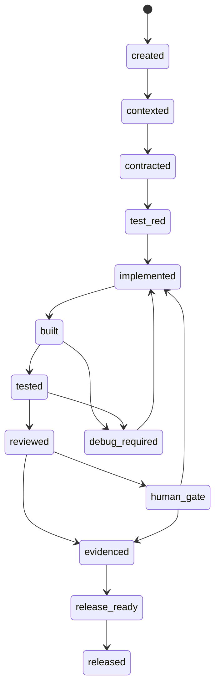
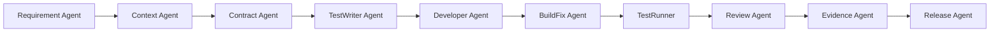
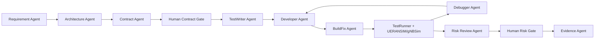

# 5G 核心网 AI Agent 工厂：Agent 选型与协作机制

评估日期：2026-06-07

目标：定义一个可用于 5G 核心网需求开发、测试、验收和发布的 AI Agent 工厂中，Agent 应如何选型，以及 Agent 之间应如何协作。

参考：

- OpenAI Agents SDK 官方文档：Agent definitions、models/providers、orchestration、guardrails、results/state、integrations/observability、evals。
- OpenAI Codex 文档：worktrees、sandboxing、subagents、workflows、MCP、agent approvals/security。
- 本仓库既有 AI-native 成本模型：`docs/ai-agent-factory-ai-native-cost-model.md`

## 一、总体原则

5G 核心网 Agent 工厂不应该选“一个万能 Agent”，而应该按任务风险和上下文形态拆成多类 Agent。

核心原则：

| 原则 | 说明 |
| --- | --- |
| 按任务选 Agent | 不同 Agent 使用不同模型、工具、权限和上下文。 |
| 按工件协作 | Agent 之间通过 ADU、Contract、Patch、Test Log、Evidence 交接，不靠自由聊天。 |
| 按风险升级 | 低风险自动流转，高风险进入 Review Agent 或 Human Decision Event。 |
| 按权限隔离 | 会写代码的 Agent 必须被 worktree、目录白名单和测试门禁约束。 |
| 按证据发布 | 没有 evidence bundle 的产物不能进入发布链。 |

一句话：

> Agent 工厂的协作核心不是“多 Agent 讨论”，而是“多 Agent 围绕同一个可验证工件状态机推进”。

## 二、Agent 分层选型

### 2.1 四层 Agent

| 层级 | Agent 类型 | 特征 | 模型选型 |
| --- | --- | --- | --- |
| L0 编排层 | Orchestrator、Planner、Queue Manager | 不直接改代码，管状态、依赖、优先级和升级。 | 强推理 + 中等上下文 |
| L1 认知层 | Requirement、Context、Contract、Architect | 读大量文档和代码，生成结构化约束。 | 长上下文 + 强推理 |
| L2 执行层 | TestWriter、Developer、BuildFix、Debugger | 写测试、写代码、跑命令、修失败。 | 代码能力强 + 工具调用强 |
| L3 审查层 | Review、Risk、Security、Evidence、Release | 判断风险、证据、发布口径。 | 强推理 + 保守输出 |

### 2.2 模型分级

不建议所有 Agent 都用最高价模型。建议分为三档：

| 模型档位 | 用途 | Agent |
| --- | --- | --- |
| 高推理模型 | 架构、协议、复杂 debug、安全、发布裁决前审查。 | Architect、Contract、Debugger、Risk Review、Security Review、Release Review |
| 中档代码模型 | 大多数代码生成、测试生成、普通 review、日志分析。 | Developer、TestWriter、BuildFix、Evidence |
| 低成本/快速模型 | 摘要、分类、状态更新、格式化、简单检索。 | Queue Manager、Log Summarizer、Registry Updater、Report Formatter |

模型选择规则：

| 条件 | 选择 |
| --- | --- |
| 涉及 UPF/HA/多线程/安全/数据库一致性 | 高推理模型 |
| 涉及大规模代码修改 | 中档代码模型起步，失败后升级高推理模型 |
| 只是更新状态、生成摘要、整理证据 | 低成本模型 |
| 自愈超过 2-3 轮 | 自动升级更强模型或进入 HDE |
| 发布门禁前 | 高推理 Review Agent + 人类裁决 |

## 三、推荐 Agent 清单

### 3.1 编排与规划

| Agent | 职责 | 输入 | 输出 | 是否写代码 |
| --- | --- | --- | --- | --- |
| Orchestrator Agent | 维护 ADU 队列、依赖、优先级、并发槽位和升级。 | requirement registry、ADU 状态、CI 结果。 | 下一批任务、阻塞清单、升级事件。 | 否 |
| Requirement Analyst Agent | 把需求拆成 ADU、验收断言、风险等级。 | 原始需求、历史文档。 | ADU spec、acceptance criteria。 | 否 |
| Architecture Agent | 判断需求应落在哪些模块，识别跨模块契约。 | Context Pack、代码地图。 | 架构方案、冲突域、contract 列表。 | 否 |

### 3.2 上下文与契约

| Agent | 职责 | 输入 | 输出 | 是否写代码 |
| --- | --- | --- | --- | --- |
| Context Pack Agent | 生成和维护 lane 级上下文包。 | 代码、测试、文档、历史缺陷。 | context-pack.md、code map、test map。 | 否 |
| Contract Agent | 定义 API、schema、配置、指标、告警、证据格式。 | ADU spec、架构方案。 | YAML/OpenAPI/schema、验收断言。 | 少量 |
| Compatibility Agent | 检查新 contract 是否破坏已有接口和测试。 | contract diff、历史 schema。 | 兼容性报告。 | 否 |

### 3.3 实现与自愈

| Agent | 职责 | 输入 | 输出 | 是否写代码 |
| --- | --- | --- | --- | --- |
| TestWriter Agent | 先写失败测试、mock、仿真脚本。 | contract、acceptance criteria。 | test patch、mock、test command。 | 是 |
| Developer Agent | 根据红灯测试实现代码。 | test patch、context、contract。 | code patch、实现说明。 | 是 |
| BuildFix Agent | 修复编译、链接、类型、依赖问题。 | build log、diff。 | build fix patch。 | 是 |
| Debugger Agent | 分析 test failure、core、pcap、Valgrind。 | test log、pcap、core、代码。 | root cause、fix patch 或升级事件。 | 是 |
| Refactor Agent | 在测试保护下做局部重构。 | code smell、review feedback。 | refactor patch。 | 是 |

### 3.4 审查与发布

| Agent | 职责 | 输入 | 输出 | 是否写代码 |
| --- | --- | --- | --- | --- |
| Code Review Agent | 检查 bug、回归、边界条件。 | diff、tests、context。 | review findings。 | 否 |
| Risk Review Agent | 检查并发、性能、数据一致性、安全、回滚。 | diff、evidence、risk profile。 | risk verdict、HDE 建议。 | 否 |
| Security Review Agent | 检查 secret、证书、TLS、国密、加密卡、脱敏。 | diff、config、logs。 | security verdict。 | 否 |
| Evidence Agent | 汇总命令、日志、pcap、截图、配置、验收结论。 | CI artifacts、test logs。 | evidence bundle。 | 否 |
| Release Agent | 生成发布说明、已知问题、回滚方案、验收矩阵。 | evidence bundles、ADU 状态。 | release package draft。 | 否 |

### 3.5 5GC 专用 Agent

| Agent | 领域 |
| --- | --- |
| AMF/SMF Control-plane Agent | 注册、会话、QoS、N1/N2、SBI。 |
| UPF/Data-plane Agent | PFCP、PDR/FAR/QER、N3/N6、5G-LAN、性能。 |
| OAM/NMS Agent | 指标、告警、北向接口、页面、权限。 |
| Security/Localization Agent | 达梦、加密卡、国密、TLS、ARPF、EIR。 |
| Interop Agent | 4G/5G、IMS、SIPp、UERANSIM/gNBSim。 |
| Test Lab Agent | 拓扑、仿真、pcap、长稳、Chaos。 |

这些不是不同“人格”，而是不同 context pack、工具权限和风险规则。

## 四、协作方式

### 4.1 不采用自由群聊

不建议让多个 Agent 在同一个聊天上下文中自由讨论同一份代码。原因：

| 问题 | 后果 |
| --- | --- |
| 上下文污染 | 每个 Agent 混入无关讨论。 |
| 责任不清 | 不知道哪个 Agent 对哪个工件负责。 |
| 冲突难控 | 多个 Agent 可能同时修改同一文件。 |
| 证据不完整 | 对话里说完成，不等于有可回放证据。 |

推荐：

```text
Agent 通过工件协作，不通过自由聊天协作。
```

### 4.2 ADU 状态机

每个需求拆成 ADU，每个 ADU 按状态流转：



状态转移必须有工件：

| 状态 | 必须产物 |
| --- | --- |
| contexted | Context Pack 引用、代码路径、测试路径。 |
| contracted | schema/API/config/验收断言。 |
| test_red | 失败测试和复现命令。 |
| implemented | patch 和实现说明。 |
| built | build log。 |
| tested | test log、仿真结果。 |
| reviewed | review verdict。 |
| evidenced | evidence.yaml、日志、pcap/配置样例。 |
| release_ready | release note、known issues、rollback。 |

### 4.3 Agent 交接契约

Agent 之间交接必须用结构化文件：

```yaml
adu_id: REQ-5GC-QOS-001
state: contracted
owner_agent: ContractAgent
next_agent: TestWriterAgent
allowed_paths:
  - open5gs/src/smf
  - open5gs/src/upf
  - tests/qos
contracts:
  - .ai-agent/contracts/qos-policy.schema.yaml
required_tests:
  - unit
  - integration
  - regression
risk_flags:
  - upf
  - qos
  - runtime-session-change
human_gate:
  required_if:
    - contract_changed
    - p0_failure_after_3_loops
    - l3_claim
```

### 4.4 工作树隔离

写代码的 Agent 必须独立 worktree：

```text
worktrees/
  agent-qos-testwriter/
  agent-qos-developer/
  agent-qos-debugger/
```

规则：

| 规则 | 说明 |
| --- | --- |
| 一个 ADU 一个主 worktree | 避免互相覆盖。 |
| TestWriter 先写测试 | Developer 不允许绕过测试。 |
| Debugger 只修复当前失败 | 不扩大 scope。 |
| Review Agent 不直接改代码 | 只输出 findings。 |
| 合并必须经过 evidence | 没证据不合并。 |

## 五、典型协作流程

### 5.1 普通 OAM/配置需求



大多数 OAM/配置需求可以全自动完成，只在发布前抽检。

### 5.2 UPF/HA/5G-LAN 高风险需求



高风险需求的关键是：contract 先有人类裁决，代码完成后 Risk Review 再决定是否需要人类复核。

### 5.3 安全/国产化/外部硬件需求

```mermaid
flowchart LR
  A["Requirement Agent"] --> B["Security/Localization Agent"]
  B --> C["Provider Contract Agent"]
  C --> D["Mock TestWriter Agent"]
  D --> E["Developer Agent"]
  E --> F["L2 Mock Validation"]
  F --> G["Evidence Agent"]
  G --> H["L2/L3 Classifier"]
  H --> I["External Lab Agent"]
  I --> J["Human L3 Decision"]
```



这类需求必须先做 L2 mock/provider，再争取 L3 补证。不要让 Agent 一开始就在真实硬件日志里消耗大量 token。

## 六、Agent 选型矩阵

| 任务 | 推荐 Agent | 模型档位 | 工具权限 | 是否可自动合并 |
| --- | --- | --- | --- | --- |
| 需求摘要 | Requirement Agent | 低/中 | 读文档 | 是 |
| ADU 拆分 | Requirement + Orchestrator | 中/高 | 读文档/registry | 需抽检 |
| 代码地图 | Context Agent | 中 | 读仓库 | 是 |
| API/schema | Contract Agent | 高 | 写 contract | 高风险需人类 |
| 单测生成 | TestWriter | 中 | 写 tests | 是 |
| 核心代码实现 | Developer | 中/高 | 写白名单源码 | 否，需测试 |
| 编译修复 | BuildFix | 中 | 写相关源码/构建 | 是，若低风险 |
| crash/debug | Debugger | 高 | 读日志/core/pcap，写相关源码 | 否 |
| 普通 review | Code Review | 中 | 读 diff | 是 |
| 高风险 review | Risk/Security Review | 高 | 读 diff/evidence | 否 |
| 证据整理 | Evidence | 低/中 | 读 artifacts，写 evidence | 是 |
| 发布结论 | Release + Human Gate | 高 + 人类 | 读全量 evidence | 否 |

## 七、协作协议

### 7.1 每个 Agent 必须输出结构化结果

统一输出：

```yaml
agent: DeveloperAgent
adu_id: REQ-5GLAN-002
result: success
state_transition:
  from: test_red
  to: implemented
changed_files:
  - open5gs/src/upf/...
commands_run:
  - ninja -C build
artifacts:
  - .ai-agent/runs/.../build.log
risks:
  - multicast-regression
next:
  agent: TestRunnerAgent
  reason: run integration regression
```

### 7.2 Agent 不能口头宣称完成

完成必须由状态机和证据决定：

| 宣称 | 必须有 |
| --- | --- |
| build pass | build log |
| test pass | test log |
| L2 complete | mock/simulator evidence |
| L3 complete | external lab evidence |
| release ready | acceptance matrix + rollback |

### 7.3 升级规则

| 触发 | 升级到 |
| --- | --- |
| 自愈失败超过 3 轮 | Human Decision Event |
| 修改 contract | Architecture/Risk Review + HDE |
| 涉及密钥/证书/国密/加密卡 | Security Review + HDE |
| 涉及 UPF 数据面性能 | Risk Review + HDE |
| 声称 L3 | Evidence Review + Human Gate |
| 修改公共 API | Compatibility Review |

## 八、MVP 阶段的最小 Agent 集

不要一开始建二十多个 Agent。MVP 只需要 7 个：

| Agent | 是否必须 |
| --- | --- |
| Orchestrator Agent | 必须 |
| Context Pack Agent | 必须 |
| Contract Agent | 必须 |
| TestWriter Agent | 必须 |
| Developer Agent | 必须 |
| Debugger/BuildFix Agent | 必须，可先合并 |
| Evidence Agent | 必须 |

MVP 阶段可以暂时不建：

| Agent | 替代方式 |
| --- | --- |
| Release Agent | 人工整理 + Evidence Agent 辅助。 |
| Security Review Agent | 高风险需求先不做，或人工审。 |
| Compatibility Agent | contract 少时人工审。 |
| Chaos Agent | 生产工厂阶段再加。 |
| External Lab Agent | L3 阶段再加。 |

## 九、生产阶段扩展

生产可用后扩展为：

| Lane | Agent |
| --- | --- |
| `orchestration-lane` | Orchestrator、Registry、Cost Controller |
| `context-contract-lane` | Context、Contract、Compatibility |
| `implementation-lane` | TestWriter、Developer、BuildFix、Debugger |
| `review-lane` | Code Review、Risk Review、Security Review |
| `validation-lane` | TestRunner、Chaos、Lab、Performance |
| `evidence-release-lane` | Evidence、Release、L2/L3 Classifier |

## 十、最终建议

Agent 选型建议：

1. 不要选一个万能 Agent，按任务拆 Agent。
2. 不要所有任务都用最高模型，按风险和上下文规模分层用模型。
3. 写代码 Agent 必须受 worktree、目录白名单、测试和 evidence 约束。
4. 5GC 专用 Agent 本质是专用 Context Pack + 专用工具权限 + 专用风险规则。
5. Orchestrator 不应写代码，只管状态、依赖、成本和升级。
6. Review Agent 不应替代人类发布裁决，只负责降低人类审查量。

协作机制建议：

1. 通过 ADU 状态机协作。
2. 通过 Contract、Patch、Test Log、Evidence 交接。
3. 不采用多 Agent 自由群聊作为主流程。
4. 自愈最多 3 轮，超过进入 HDE。
5. L2/L3 必须由 Evidence Agent + Human Gate 共同判定。

最小可行组合：

```text
Orchestrator
Context Pack
Contract
TestWriter
Developer
BuildFix/Debugger
Evidence
```

生产推荐组合：

```text
Orchestrator
Requirement Analyst
Architecture
Context Pack
Contract
Compatibility
TestWriter
Developer
BuildFix
Debugger
Code Review
Risk Review
Security Review
TestRunner
Chaos
Evidence
Release
L2/L3 Classifier
```

判断标准：

> 一个 Agent 工厂是否成熟，不看 Agent 数量，而看每个需求能否稳定完成 ADU -> Contract -> Test -> Patch -> Validation -> Review -> Evidence -> Release 的可回放闭环。
