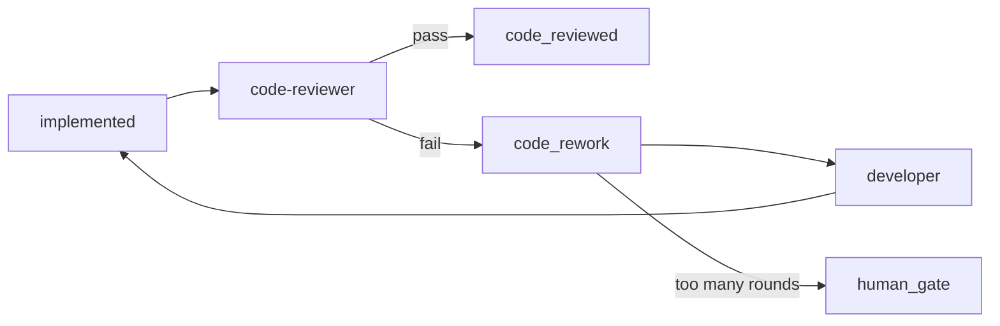
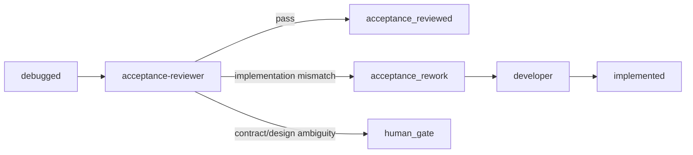

# Agent Factory Contract Hardening, Code Review, and Acceptance Review Implementation Plan

> **For agentic workers:** REQUIRED SUB-SKILL: Use `superpowers:subagent-driven-development` (recommended) or `superpowers:executing-plans` to implement this plan task-by-task. Steps use checkbox (`- [ ]`) syntax for tracking.

**Goal:** Strengthen Agent Factory so weak contracts cannot pass downstream, failed code review is automatically routed back to `developer`, and implementation mismatch cannot enter `evidence`.

**Architecture:** Extend the existing file-backed Agent Factory state machine with hard contract assertions, a dedicated `code-reviewer` Agent, and a dedicated `acceptance-reviewer` Agent. The Orchestrator remains the single authority for state transitions and rework routing; the standalone Dashboard is the only UI/API target for this implementation.

**Tech Stack:** Python Orchestrator/runner, Hermes executor, JSON registry under `.ai-agent/registry`, Markdown/JSON artifacts under `.ai-agent/*`, standalone Express backend in `agent-factory-dashboard/backend`, React/Zustand frontend in `agent-factory-dashboard/frontend`.

---

## 1. Scope

本方案只要求更新独立 Dashboard 版本：

```text
agent-factory-dashboard/
scripts/
.ai-agent/
```

不再更新、不再验收 NMS 集成版本：

```text
open5gs-nms/
```

后续所有新功能、测试和验收只以 `agent-factory-dashboard` 为准。

## 2. Problem Statement

当前流程中存在三个质量漏洞：

1. `contract` 阶段产出的验收标准可能偏软，后续 Agent 可以用“描述性完成”替代“可验证完成”。
2. `developer` 后没有专门的代码审查 Agent，`buildfix-debugger` 更关注 build/test 修复，不等价于 coding review。
3. `buildfix-debugger` 后直接进入 `evidence`，如果实现结果与需求预期不一致，仍可能生成 evidence 并进入 `evidenced`。

本次增强要把这三个漏洞改成硬流程：

```text
contract 必须产出硬验收契约
developer 后必须通过 code-reviewer
debugged 后必须通过 acceptance-reviewer
```

## 3. Target Workflow

### 3.1 Normal Flow

```mermaid
flowchart LR
  A["designed"] --> B["contract"]
  B --> C["contracted"]
  C --> D["testwriter"]
  D --> E["test_red"]
  E --> F["developer"]
  F --> G["implemented"]
  G --> H["code-reviewer"]
  H --> I["code_reviewed"]
  I --> J["buildfix-debugger"]
  J --> K["debugged"]
  K --> L["acceptance-reviewer"]
  L --> M["acceptance_reviewed"]
  M --> N["evidence"]
  N --> O["evidenced"]
```



### 3.2 Code Review Rework Flow



### 3.3 Acceptance Review Rework Flow



## 4. State Machine Design

### 4.1 New ADU States

Add these states to the canonical ADU state list:

| State | Meaning | Next Agent |
| --- | --- | --- |
| `code_reviewed` | Implementation passed code review | `buildfix-debugger` |
| `code_rework` | Code review failed and developer must revise | `developer` |
| `acceptance_reviewed` | Implementation passed final acceptance review | `evidence` |
| `acceptance_rework` | Acceptance review failed and developer must revise | `developer` |

Existing states remain:

```text
created
analysis_review
analyzed
contexted
design_review
designed
contracted
test_red
implemented
debugged
evidenced
human_gate
paused
canceled
```

### 4.2 Updated Orchestrator Mapping

Update `scripts/hermes_agent_orchestrator.py`:

```python
STATE_NEXT = {
    "created": ("requirement-analyst", "analysis_review"),
    "analysis_review": (None, "analysis_review"),
    "analyzed": ("context-pack", "contexted"),
    "contexted": ("detail-designer", "design_review"),
    "design_review": (None, "design_review"),
    "designed": ("contract", "contracted"),
    "contracted": ("testwriter", "test_red"),
    "test_red": ("developer", "implemented"),
    "code_rework": ("developer", "implemented"),
    "acceptance_rework": ("developer", "implemented"),
    "implemented": ("code-reviewer", "code_reviewed"),
    "code_reviewed": ("buildfix-debugger", "debugged"),
    "debugged": ("acceptance-reviewer", "acceptance_reviewed"),
    "acceptance_reviewed": ("evidence", "evidenced"),
    "evidenced": (None, "evidenced"),
    "human_gate": (None, "human_gate"),
    "paused": (None, "paused"),
    "canceled": (None, "canceled"),
}
```

### 4.3 Agent Result Transition Rules

`hermes_agent_run.py` must treat `code-reviewer` and `acceptance-reviewer` differently from ordinary Agents.

For ordinary Agents:

```json
{
  "result": "success",
  "next_state": "implemented"
}
```

For `code-reviewer` pass:

```json
{
  "result": "success",
  "review_status": "pass",
  "next_state": "code_reviewed",
  "artifacts": [
    ".ai-agent/reviews/{{ADU_ID}}-code-review.json",
    ".ai-agent/reviews/{{ADU_ID}}-code-review.md"
  ]
}
```

For `code-reviewer` fail:

```json
{
  "result": "success",
  "review_status": "fail",
  "next_state": "code_rework",
  "rework_target": "developer",
  "artifacts": [
    ".ai-agent/reviews/{{ADU_ID}}-code-review.json",
    ".ai-agent/reviews/{{ADU_ID}}-code-review.md"
  ]
}
```

For `acceptance-reviewer` pass:

```json
{
  "result": "success",
  "acceptance_status": "pass",
  "next_state": "acceptance_reviewed",
  "artifacts": [
    ".ai-agent/acceptance/{{ADU_ID}}-acceptance-review.json",
    ".ai-agent/acceptance/{{ADU_ID}}-acceptance-review.md"
  ]
}
```

For `acceptance-reviewer` fail:

```json
{
  "result": "success",
  "acceptance_status": "fail",
  "next_state": "acceptance_rework",
  "rework_target": "developer",
  "artifacts": [
    ".ai-agent/acceptance/{{ADU_ID}}-acceptance-review.json",
    ".ai-agent/acceptance/{{ADU_ID}}-acceptance-review.md"
  ]
}
```

If review output is malformed or missing required report files, runner must return `result = "failed"` and leave ADU state unchanged.

## 5. Contract Hardening Design

### 5.1 Contract File Schema

Strengthen `.ai-agent/contracts/{{ADU_ID}}.json` to require measurable acceptance assertions.

Required schema:

```json
{
  "version": 2,
  "adu_id": "REQ-XXX",
  "source_documents": {
    "analysis": ".ai-agent/analysis/REQ-XXX.md",
    "design": ".ai-agent/designs/REQ-XXX-detailed-design.md"
  },
  "scope": {
    "in_scope": [
      "A concrete behavior that must be implemented"
    ],
    "out_of_scope": [
      "A concrete behavior that must not be implemented"
    ],
    "allowed_write_paths": [
      "agent-factory-dashboard/backend/src/...",
      "agent-factory-dashboard/frontend/src/..."
    ]
  },
  "acceptance_assertions": [
    {
      "id": "A1",
      "title": "Backend validates ping target",
      "requirement": "The API rejects private malformed targets and invalid count/timeout values.",
      "verification_type": "automated_test",
      "verification_command": "npm run test:link-diagnostics",
      "expected_evidence": [
        "Test output contains PASS for invalid target rejection"
      ],
      "must_pass": true,
      "risk_if_missing": "Operators may execute unsafe diagnostic commands."
    }
  ],
  "negative_assertions": [
    {
      "id": "N1",
      "title": "No production C core changes",
      "forbidden_change": "Do not modify open5gs/src or open5gs/lib for this NMS-only requirement.",
      "verification_command": "git diff --name-only | rg '^(open5gs/src|open5gs/lib)/' && exit 1 || exit 0",
      "must_pass": true
    }
  ],
  "evidence_requirements": [
    {
      "id": "E1",
      "assertion_id": "A1",
      "artifact": ".ai-agent/evidence/REQ-XXX.json",
      "required_fields": [
        "assertions.A1.status",
        "assertions.A1.command",
        "assertions.A1.observed_result"
      ]
    }
  ],
  "quality_gates": {
    "code_review_required": true,
    "acceptance_review_required": true,
    "minimum_assertions": 3,
    "minimum_negative_assertions": 1
  }
}
```

### 5.2 Hard Contract Validation Rules

The `contract` Agent must not return `success` unless all rules pass:

1. `version` is `2`.
2. `adu_id` equals the active ADU id.
3. `acceptance_assertions.length >= quality_gates.minimum_assertions`.
4. Each acceptance assertion has:
   - `id`
   - `title`
   - `requirement`
   - `verification_type`
   - either `verification_command` or `manual_verification_steps`
   - `expected_evidence`
   - `must_pass`
5. At least one `negative_assertion` exists for forbidden behavior or forbidden paths.
6. Every `evidence_requirement.assertion_id` maps to an existing acceptance assertion.
7. `allowed_write_paths` must not be broader than ADU `allowed_write_paths`.
8. No assertion may use vague phrases as the only expected evidence:
   - `works correctly`
   - `implemented`
   - `looks good`
   - `as expected`
   - `normal`

### 5.3 Contract Notes

`.ai-agent/contracts/{{ADU_ID}}-notes.md` must be written in Chinese and include:

```markdown
# {{ADU_ID}} 硬验收契约说明

## 验收目标

## 必须通过的断言

## 禁止发生的结果

## 自动化验证命令

## 人工验收步骤

## Evidence 需要收集的字段
```

### 5.4 Optional Local Contract Validator

Create:

```text
scripts/validate_agent_contract.py
```

CLI:

```bash
python3 scripts/validate_agent_contract.py --adu REQ-XXX
```

Expected pass output:

```text
PASS contract REQ-XXX assertions=5 negative_assertions=2 evidence_requirements=5
```

Expected fail output:

```text
FAIL contract REQ-XXX: acceptance_assertions[1].expected_evidence is vague: works correctly
```

The Orchestrator should run this validator after `contract` succeeds. If validation fails, it must mark the `contract` run as failed and keep ADU in `designed`.

## 6. Code Reviewer Agent Design

### 6.1 Agent Registration

Modify `.ai-agent/registry/agents.json`:

```json
{
  "agents": {
    "code-reviewer": {
      "description": "Review developer changes against approved analysis, design, hard contract, tests, security boundaries, and maintainability rules.",
      "prompt": ".ai-agent/prompts/code-reviewer-agent.md",
      "worktree": false,
      "hermes_args": []
    }
  }
}
```

### 6.2 Prompt File

Create:

```text
.ai-agent/prompts/code-reviewer-agent.md
```

Prompt content:

```markdown
# Code Reviewer Agent

Review the implementation for ADU `{{ADU_ID}}`.

## Mission

You are a strict coding reviewer. Your job is to decide whether the implementation may proceed to build/debug, or must be sent back to `developer`.

## Required Inputs

Read these files before judging:

1. `.ai-agent/analysis/{{ADU_ID}}.md`
2. `.ai-agent/designs/{{ADU_ID}}-detailed-design.md`
3. `.ai-agent/contracts/{{ADU_ID}}.json`
4. `.ai-agent/contracts/{{ADU_ID}}-notes.md`
5. Latest `developer` run under `.ai-agent/runs/`
6. Current changed files from the workspace

## Review Criteria

You must fail the review if any item is true:

1. Implementation violates an acceptance assertion.
2. Implementation ignores an approved design decision.
3. Implementation modifies paths outside ADU `allowed_write_paths`.
4. Implementation adds broad unrelated refactors.
5. Implementation lacks tests required by the contract.
6. Implementation weakens validation, authorization, path safety, command safety, or state-machine safety.
7. Implementation introduces hidden behavior not described in contract.
8. Implementation only satisfies the happy path while required negative assertions are untested.

## Output Artifacts

Write:

1. `.ai-agent/reviews/{{ADU_ID}}-code-review.json`
2. `.ai-agent/reviews/{{ADU_ID}}-code-review.md`

JSON schema:

```json
{
  "version": 1,
  "adu_id": "{{ADU_ID}}",
  "review_status": "pass",
  "summary": "Short Chinese summary",
  "checked_files": [
    "path/to/file"
  ],
  "contract_assertion_results": [
    {
      "assertion_id": "A1",
      "status": "pass",
      "reason": "Why this assertion is satisfied or not",
      "evidence": [
        "file path, command, or code reference"
      ]
    }
  ],
  "findings": [
    {
      "id": "CR-1",
      "severity": "P1",
      "file": "path/to/file",
      "line": 123,
      "title": "Validation can be bypassed",
      "detail": "Chinese explanation",
      "required_fix": "Concrete fix instruction for developer"
    }
  ],
  "required_developer_actions": [
    "Concrete action"
  ],
  "next_state": "code_reviewed"
}
```

Markdown report must be written in Chinese.

## Final Response

Return exactly one JSON block:

```json
{
  "result": "success",
  "review_status": "pass",
  "next_state": "code_reviewed",
  "changed_files": [
    ".ai-agent/reviews/{{ADU_ID}}-code-review.json",
    ".ai-agent/reviews/{{ADU_ID}}-code-review.md"
  ],
  "artifacts": [
    ".ai-agent/reviews/{{ADU_ID}}-code-review.json",
    ".ai-agent/reviews/{{ADU_ID}}-code-review.md"
  ],
  "risks": [],
  "next_agent": "buildfix-debugger"
}
```

If review fails, return:

```json
{
  "result": "success",
  "review_status": "fail",
  "next_state": "code_rework",
  "changed_files": [
    ".ai-agent/reviews/{{ADU_ID}}-code-review.json",
    ".ai-agent/reviews/{{ADU_ID}}-code-review.md"
  ],
  "artifacts": [
    ".ai-agent/reviews/{{ADU_ID}}-code-review.json",
    ".ai-agent/reviews/{{ADU_ID}}-code-review.md"
  ],
  "risks": [
    "Code review failed. Developer rework required."
  ],
  "next_agent": "developer"
}
```
```

### 6.3 Code Review Result Validation

Runner must validate `.ai-agent/reviews/{{ADU_ID}}-code-review.json`.

Pass is valid only if:

1. `review_status === "pass"`.
2. `findings` is empty or only contains `P3` informational findings.
3. Every `contract_assertion_results[*].status` is `pass`.
4. `checked_files.length > 0`.
5. `next_state === "code_reviewed"`.

Fail is valid only if:

1. `review_status === "fail"`.
2. `findings.length > 0`.
3. Every finding has `severity`, `title`, `detail`, and `required_fix`.
4. `next_state === "code_rework"`.

Invalid report means Agent failure, not review failure.

## 7. Acceptance Reviewer Agent Design

### 7.1 Agent Registration

Modify `.ai-agent/registry/agents.json`:

```json
{
  "agents": {
    "acceptance-reviewer": {
      "description": "Verify final implementation against hard contract and approved requirement/design before evidence is created.",
      "prompt": ".ai-agent/prompts/acceptance-reviewer-agent.md",
      "worktree": false,
      "hermes_args": []
    }
  }
}
```

### 7.2 Prompt File

Create:

```text
.ai-agent/prompts/acceptance-reviewer-agent.md
```

Prompt content:

```markdown
# Acceptance Reviewer Agent

Verify whether ADU `{{ADU_ID}}` is truly ready to enter evidence.

## Mission

You are the final acceptance reviewer. You must prevent implementations that differ from the approved requirement, detailed design, or contract from entering `evidence`.

## Required Inputs

Read:

1. `.ai-agent/analysis/{{ADU_ID}}.md`
2. `.ai-agent/designs/{{ADU_ID}}-detailed-design.md`
3. `.ai-agent/contracts/{{ADU_ID}}.json`
4. `.ai-agent/reviews/{{ADU_ID}}-code-review.json`
5. Latest `buildfix-debugger` run under `.ai-agent/runs/`
6. Test/build outputs referenced by ADU `required_commands`
7. Current changed files from the workspace

## Acceptance Criteria

You must fail acceptance if:

1. Any `must_pass` acceptance assertion is not verified.
2. Any negative assertion is violated.
3. The implementation passes tests but solves a different problem from the approved analysis/design.
4. Evidence needed by the contract is missing.
5. The code-review report did not pass.
6. Build/debug fixed symptoms by weakening tests or lowering validation.
7. Required user-facing behavior cannot be demonstrated.

## Output Artifacts

Write:

1. `.ai-agent/acceptance/{{ADU_ID}}-acceptance-review.json`
2. `.ai-agent/acceptance/{{ADU_ID}}-acceptance-review.md`

JSON schema:

```json
{
  "version": 1,
  "adu_id": "{{ADU_ID}}",
  "acceptance_status": "pass",
  "summary": "Chinese summary",
  "assertion_results": [
    {
      "assertion_id": "A1",
      "status": "pass",
      "verification_command": "npm run test:example",
      "observed_result": "PASS",
      "evidence": [
        "path or command output summary"
      ]
    }
  ],
  "negative_assertion_results": [
    {
      "assertion_id": "N1",
      "status": "pass",
      "observed_result": "No forbidden files modified"
    }
  ],
  "mismatch_findings": [
    {
      "id": "AR-1",
      "severity": "P1",
      "title": "Implementation handles only IPv4 but contract requires hostname",
      "detail": "Chinese explanation",
      "required_fix": "Concrete developer action"
    }
  ],
  "missing_evidence": [
    {
      "assertion_id": "A2",
      "required_artifact": ".ai-agent/evidence/REQ-XXX.json",
      "detail": "Missing field assertions.A2.observed_result"
    }
  ],
  "next_state": "acceptance_reviewed"
}
```

Markdown report must be written in Chinese.

## Final Response

Pass:

```json
{
  "result": "success",
  "acceptance_status": "pass",
  "next_state": "acceptance_reviewed",
  "changed_files": [
    ".ai-agent/acceptance/{{ADU_ID}}-acceptance-review.json",
    ".ai-agent/acceptance/{{ADU_ID}}-acceptance-review.md"
  ],
  "artifacts": [
    ".ai-agent/acceptance/{{ADU_ID}}-acceptance-review.json",
    ".ai-agent/acceptance/{{ADU_ID}}-acceptance-review.md"
  ],
  "risks": [],
  "next_agent": "evidence"
}
```

Fail:

```json
{
  "result": "success",
  "acceptance_status": "fail",
  "next_state": "acceptance_rework",
  "changed_files": [
    ".ai-agent/acceptance/{{ADU_ID}}-acceptance-review.json",
    ".ai-agent/acceptance/{{ADU_ID}}-acceptance-review.md"
  ],
  "artifacts": [
    ".ai-agent/acceptance/{{ADU_ID}}-acceptance-review.json",
    ".ai-agent/acceptance/{{ADU_ID}}-acceptance-review.md"
  ],
  "risks": [
    "Acceptance review failed. Developer rework required."
  ],
  "next_agent": "developer"
}
```
```

### 7.3 Acceptance Result Validation

Runner must validate `.ai-agent/acceptance/{{ADU_ID}}-acceptance-review.json`.

Pass is valid only if:

1. `acceptance_status === "pass"`.
2. Every `assertion_results[*].status` is `pass`.
3. Every `negative_assertion_results[*].status` is `pass`.
4. `mismatch_findings.length === 0`.
5. `missing_evidence.length === 0`.
6. `next_state === "acceptance_reviewed"`.

Fail is valid only if:

1. `acceptance_status === "fail"`.
2. At least one `mismatch_findings` or `missing_evidence` item exists.
3. `next_state === "acceptance_rework"`.

Invalid report means Agent failure, not acceptance failure.

## 8. Rework Loop Controls

Add per-ADU counters:

```json
{
  "review_counters": {
    "code_review_failures": 0,
    "acceptance_review_failures": 0
  },
  "review_limits": {
    "max_code_review_failures": 2,
    "max_acceptance_review_failures": 2
  }
}
```

Orchestrator behavior:

1. If `code-reviewer` returns `code_rework`, increment `code_review_failures`.
2. If `code_review_failures > max_code_review_failures`, set ADU state to `human_gate`.
3. If `acceptance-reviewer` returns `acceptance_rework`, increment `acceptance_review_failures`.
4. If `acceptance_review_failures > max_acceptance_review_failures`, set ADU state to `human_gate`.
5. If `developer` succeeds after rework, do not reset counters automatically.
6. If ADU reaches `evidenced`, keep counters for audit.

## 9. Dashboard Design

### 9.1 Timeline

Update standalone Dashboard timeline groups:

```text
P1 Requirement
created -> analysis_review -> analyzed

P2 Design Contract
contexted -> design_review -> designed -> contracted

P3 Implementation Quality
test_red -> implemented -> code_reviewed -> debugged -> acceptance_reviewed -> evidenced
```

Add visible failed/rework states:

```text
code_rework
acceptance_rework
human_gate
```

### 9.2 Agent Cards

Add cards for:

```text
code-reviewer
acceptance-reviewer
```

Each card shows:

1. latest run result
2. active ADU ids
3. pass/fail counts
4. latest report artifact link

### 9.3 Review Report Panel

Add report tabs to the ADU detail panel:

```text
Contract
Code Review
Acceptance Review
Evidence
```

For `code_rework`, show:

```text
Code review failed. Developer rework required.
```

Display:

1. findings grouped by severity
2. required developer actions
3. checked files
4. contract assertion results

For `acceptance_rework`, show:

```text
Acceptance review failed. Implementation does not match approved expectation.
```

Display:

1. failing acceptance assertions
2. violated negative assertions
3. mismatch findings
4. missing evidence

## 10. Backend API Design

Most data can be served by existing dashboard aggregation. Add explicit report endpoints for convenience.

### 10.1 Get Quality Reports

```http
GET /api/agent-factory/adus/:aduId/quality-reports
```

Response:

```json
{
  "aduId": "REQ-XXX",
  "contract": {
    "path": ".ai-agent/contracts/REQ-XXX.json",
    "exists": true,
    "valid": true
  },
  "codeReview": {
    "path": ".ai-agent/reviews/REQ-XXX-code-review.json",
    "exists": true,
    "status": "pass"
  },
  "acceptanceReview": {
    "path": ".ai-agent/acceptance/REQ-XXX-acceptance-review.json",
    "exists": true,
    "status": "pass"
  }
}
```

### 10.2 Artifact Read Allowlist

Update standalone repository read allowlist to include:

```text
.ai-agent/reviews/
.ai-agent/acceptance/
```

Write allowlist for Agent execution is controlled by ADU and Agent prompts. Dashboard editing write allowlist must remain limited to:

```text
.ai-agent/analysis/
.ai-agent/designs/
```

Do not make review reports editable in the dashboard MVP.

## 11. File Changes

### 11.1 Python

Modify:

```text
scripts/hermes_agent_orchestrator.py
scripts/hermes_agent_run.py
scripts/hermes_agent_next.py
```

Create:

```text
scripts/validate_agent_contract.py
scripts/validate_quality_report.py
```

### 11.2 Registry

Modify:

```text
.ai-agent/registry/agents.json
.ai-agent/registry/adu.json
.ai-agent/registry/agent-model-settings.json
```

Create directories:

```text
.ai-agent/reviews/
.ai-agent/acceptance/
```

### 11.3 Prompts

Modify:

```text
.ai-agent/prompts/contract-agent.md
.ai-agent/prompts/developer-agent.md
.ai-agent/prompts/buildfix-debugger-agent.md
.ai-agent/prompts/evidence-agent.md
```

Create:

```text
.ai-agent/prompts/code-reviewer-agent.md
.ai-agent/prompts/acceptance-reviewer-agent.md
```

### 11.4 Standalone Backend

Modify:

```text
agent-factory-dashboard/backend/src/domain/agent-factory.ts
agent-factory-dashboard/backend/src/application/agent-factory-monitor.ts
agent-factory-dashboard/backend/src/infrastructure/file-agent-factory-repository.ts
agent-factory-dashboard/backend/src/interfaces/agent-factory-controller.ts
```

Create:

```text
agent-factory-dashboard/backend/tools/test-quality-gates.js
```

### 11.5 Standalone Frontend

Modify:

```text
agent-factory-dashboard/frontend/src/types/agent-factory.ts
agent-factory-dashboard/frontend/src/api/agentFactory.ts
agent-factory-dashboard/frontend/src/stores/agentFactory.ts
agent-factory-dashboard/frontend/src/components/agent-factory/WorkflowTimeline.tsx
agent-factory-dashboard/frontend/src/components/agent-factory/AgentFactoryPage.tsx
agent-factory-dashboard/frontend/src/components/agent-factory/AgentCards.tsx
```

Create:

```text
agent-factory-dashboard/frontend/src/components/agent-factory/QualityReportPanel.tsx
agent-factory-dashboard/frontend/src/components/agent-factory/QualityReportBadge.tsx
```

## 12. Implementation Tasks

### Task 1: Add Agent States And Registry Entries

**Files:**
- Modify: `scripts/hermes_agent_orchestrator.py`
- Modify: `scripts/hermes_agent_next.py`
- Modify: `.ai-agent/registry/agents.json`
- Modify: `agent-factory-dashboard/backend/src/domain/agent-factory.ts`
- Modify: `agent-factory-dashboard/frontend/src/types/agent-factory.ts`

- [ ] **Step 1: Update Orchestrator state map**

Replace the existing map with:

```python
STATE_NEXT = {
    "created": ("requirement-analyst", "analysis_review"),
    "analysis_review": (None, "analysis_review"),
    "analyzed": ("context-pack", "contexted"),
    "contexted": ("detail-designer", "design_review"),
    "design_review": (None, "design_review"),
    "designed": ("contract", "contracted"),
    "contracted": ("testwriter", "test_red"),
    "test_red": ("developer", "implemented"),
    "code_rework": ("developer", "implemented"),
    "acceptance_rework": ("developer", "implemented"),
    "implemented": ("code-reviewer", "code_reviewed"),
    "code_reviewed": ("buildfix-debugger", "debugged"),
    "debugged": ("acceptance-reviewer", "acceptance_reviewed"),
    "acceptance_reviewed": ("evidence", "evidenced"),
    "evidenced": (None, "evidenced"),
    "human_gate": (None, "human_gate"),
    "paused": (None, "paused"),
    "canceled": (None, "canceled"),
}
```

- [ ] **Step 2: Update next helper**

Update `scripts/hermes_agent_next.py`:

```python
NEXT_AGENT = {
    "created": "requirement-analyst",
    "analyzed": "context-pack",
    "contexted": "detail-designer",
    "designed": "contract",
    "contracted": "testwriter",
    "test_red": "developer",
    "code_rework": "developer",
    "acceptance_rework": "developer",
    "implemented": "code-reviewer",
    "code_reviewed": "buildfix-debugger",
    "debugged": "acceptance-reviewer",
    "acceptance_reviewed": "evidence",
}
```

- [ ] **Step 3: Register Agents**

Add to `.ai-agent/registry/agents.json`:

```json
"code-reviewer": {
  "description": "Review developer changes against approved analysis, detailed design, hard contract, tests, security boundaries, and maintainability rules.",
  "prompt": ".ai-agent/prompts/code-reviewer-agent.md",
  "worktree": false,
  "hermes_args": []
},
"acceptance-reviewer": {
  "description": "Verify final implementation against hard contract and approved requirement/design before evidence is created.",
  "prompt": ".ai-agent/prompts/acceptance-reviewer-agent.md",
  "worktree": false,
  "hermes_args": []
}
```

- [ ] **Step 4: Build**

Run:

```bash
npm run build
```

Expected from `agent-factory-dashboard/backend`:

```text
tsc
```

### Task 2: Harden Contract Prompt And Validator

**Files:**
- Modify: `.ai-agent/prompts/contract-agent.md`
- Create: `scripts/validate_agent_contract.py`
- Test: `agent-factory-dashboard/backend/tools/test-quality-gates.js`

- [ ] **Step 1: Update contract prompt**

Replace `.ai-agent/prompts/contract-agent.md` with a prompt that requires the schema in section 5.1 and returns `next_state = "contracted"` only after writing valid contract artifacts.

- [ ] **Step 2: Create validator**

Create `scripts/validate_agent_contract.py` implementing these checks:

```python
required_top_level = [
    "version",
    "adu_id",
    "source_documents",
    "scope",
    "acceptance_assertions",
    "negative_assertions",
    "evidence_requirements",
    "quality_gates",
]
```

Reject vague expected evidence:

```python
VAGUE_PHRASES = [
    "works correctly",
    "implemented",
    "looks good",
    "as expected",
    "normal",
]
```

- [ ] **Step 3: Call validator from runner or orchestrator**

After `contract` returns success, run:

```bash
python3 scripts/validate_agent_contract.py --adu <ADU_ID>
```

If non-zero, do not advance from `designed`.

- [ ] **Step 4: Test validator failure**

Create a temporary contract with:

```json
{
  "version": 2,
  "adu_id": "REQ-TEST",
  "acceptance_assertions": [
    {
      "id": "A1",
      "expected_evidence": ["works correctly"]
    }
  ]
}
```

Run:

```bash
python3 scripts/validate_agent_contract.py --adu REQ-TEST
```

Expected:

```text
FAIL contract REQ-TEST
```

### Task 3: Add Code Reviewer Prompt And Report Validation

**Files:**
- Create: `.ai-agent/prompts/code-reviewer-agent.md`
- Create: `scripts/validate_quality_report.py`
- Modify: `scripts/hermes_agent_run.py`

- [ ] **Step 1: Create prompt**

Use the complete prompt from section 6.2.

- [ ] **Step 2: Create quality report validator**

`scripts/validate_quality_report.py` CLI:

```bash
python3 scripts/validate_quality_report.py --adu REQ-XXX --kind code-review
```

For code review pass, require:

```python
report["review_status"] == "pass"
report["next_state"] == "code_reviewed"
all(item["status"] == "pass" for item in report["contract_assertion_results"])
len(report["checked_files"]) > 0
```

For code review fail, require:

```python
report["review_status"] == "fail"
report["next_state"] == "code_rework"
len(report["findings"]) > 0
```

- [ ] **Step 3: Runner validation**

In `scripts/hermes_agent_run.py`, after parsing result for `code-reviewer`, run:

```bash
python3 scripts/validate_quality_report.py --adu <ADU_ID> --kind code-review
```

If validator fails, set `run_result = "failed"` and do not update ADU state.

### Task 4: Add Acceptance Reviewer Prompt And Validation

**Files:**
- Create: `.ai-agent/prompts/acceptance-reviewer-agent.md`
- Modify: `scripts/validate_quality_report.py`
- Modify: `scripts/hermes_agent_run.py`

- [ ] **Step 1: Create prompt**

Use the complete prompt from section 7.2.

- [ ] **Step 2: Extend quality report validator**

CLI:

```bash
python3 scripts/validate_quality_report.py --adu REQ-XXX --kind acceptance
```

For acceptance pass, require:

```python
report["acceptance_status"] == "pass"
report["next_state"] == "acceptance_reviewed"
all(item["status"] == "pass" for item in report["assertion_results"])
all(item["status"] == "pass" for item in report["negative_assertion_results"])
len(report["mismatch_findings"]) == 0
len(report["missing_evidence"]) == 0
```

For acceptance fail, require:

```python
report["acceptance_status"] == "fail"
report["next_state"] == "acceptance_rework"
len(report["mismatch_findings"]) + len(report["missing_evidence"]) > 0
```

- [ ] **Step 3: Runner validation**

In `scripts/hermes_agent_run.py`, after parsing result for `acceptance-reviewer`, run:

```bash
python3 scripts/validate_quality_report.py --adu <ADU_ID> --kind acceptance
```

If validator fails, set `run_result = "failed"` and do not update ADU state.

### Task 5: Add Rework Counters

**Files:**
- Modify: `scripts/hermes_agent_orchestrator.py`
- Modify: `.ai-agent/registry/adu.json`

- [ ] **Step 1: Add default counters**

When loading an ADU, default missing counters to:

```json
{
  "review_counters": {
    "code_review_failures": 0,
    "acceptance_review_failures": 0
  },
  "review_limits": {
    "max_code_review_failures": 2,
    "max_acceptance_review_failures": 2
  }
}
```

- [ ] **Step 2: Increment code review counter**

After `code-reviewer` returns `next_state = "code_rework"`:

```python
adu["review_counters"]["code_review_failures"] += 1
```

If over limit:

```python
adu["state"] = "human_gate"
adu["human_gate_required"] = True
```

- [ ] **Step 3: Increment acceptance counter**

After `acceptance-reviewer` returns `next_state = "acceptance_rework"`:

```python
adu["review_counters"]["acceptance_review_failures"] += 1
```

If over limit:

```python
adu["state"] = "human_gate"
adu["human_gate_required"] = True
```

### Task 6: Update Standalone Dashboard Backend

**Files:**
- Modify: `agent-factory-dashboard/backend/src/domain/agent-factory.ts`
- Modify: `agent-factory-dashboard/backend/src/application/agent-factory-monitor.ts`
- Modify: `agent-factory-dashboard/backend/src/infrastructure/file-agent-factory-repository.ts`
- Modify: `agent-factory-dashboard/backend/src/interfaces/agent-factory-controller.ts`

- [ ] **Step 1: Add states to domain type**

Include:

```ts
| 'code_reviewed'
| 'code_rework'
| 'acceptance_reviewed'
| 'acceptance_rework'
```

- [ ] **Step 2: Update workflow config**

Add timeline steps:

```ts
{ state: 'implemented', label: 'Implemented', agent: 'code-reviewer' },
{ state: 'code_reviewed', label: 'Code Reviewed', agent: 'buildfix-debugger' },
{ state: 'debugged', label: 'Debugged', agent: 'acceptance-reviewer' },
{ state: 'acceptance_reviewed', label: 'Acceptance Reviewed', agent: 'evidence' },
```

Add rework states as blocked/current when ADU is `code_rework` or `acceptance_rework`.

- [ ] **Step 3: Update read allowlist**

Add:

```ts
path.join(this.workspaceRoot, '.ai-agent', 'reviews'),
path.join(this.workspaceRoot, '.ai-agent', 'acceptance'),
```

- [ ] **Step 4: Add quality report endpoint**

Implement:

```http
GET /api/agent-factory/adus/:aduId/quality-reports
```

Return the shape in section 10.1.

### Task 7: Update Standalone Dashboard Frontend

**Files:**
- Modify: `agent-factory-dashboard/frontend/src/types/agent-factory.ts`
- Modify: `agent-factory-dashboard/frontend/src/api/agentFactory.ts`
- Modify: `agent-factory-dashboard/frontend/src/stores/agentFactory.ts`
- Modify: `agent-factory-dashboard/frontend/src/components/agent-factory/WorkflowTimeline.tsx`
- Create: `agent-factory-dashboard/frontend/src/components/agent-factory/QualityReportPanel.tsx`
- Create: `agent-factory-dashboard/frontend/src/components/agent-factory/QualityReportBadge.tsx`

- [ ] **Step 1: Add frontend states**

Add:

```ts
'code_reviewed' | 'code_rework' | 'acceptance_reviewed' | 'acceptance_rework'
```

- [ ] **Step 2: Add API method**

```ts
async fetchQualityReports(aduId: string): Promise<QualityReports> {
  const res = await fetch(`${API_URL}/api/agent-factory/adus/${aduId}/quality-reports`);
  if (!res.ok) throw new Error('Failed to fetch quality reports');
  return res.json();
}
```

- [ ] **Step 3: Add report panel**

Display:

```text
Contract Validity
Code Review Status
Acceptance Review Status
Findings
Required Developer Actions
```

- [ ] **Step 4: Update timeline**

Show `code_rework` and `acceptance_rework` as blocked red/orange states with next action:

```text
Developer rework required
```

### Task 8: Add End-To-End Quality Gate Test

**Files:**
- Create: `agent-factory-dashboard/backend/tools/test-quality-gates.js`
- Modify: `agent-factory-dashboard/backend/package.json`

- [ ] **Step 1: Add script**

Add to package.json:

```json
{
  "scripts": {
    "test:quality-gates": "node tools/test-quality-gates.js"
  }
}
```

- [ ] **Step 2: Test code review fail routing**

The test should:

1. Set test ADU state to `implemented`.
2. Write `.ai-agent/reviews/<ADU>-code-review.json` with `review_status = "fail"` and `next_state = "code_rework"`.
3. Run report validator.
4. Assert the next state is `code_rework`.

- [ ] **Step 3: Test acceptance fail routing**

The test should:

1. Set test ADU state to `debugged`.
2. Write `.ai-agent/acceptance/<ADU>-acceptance-review.json` with `acceptance_status = "fail"` and `next_state = "acceptance_rework"`.
3. Run report validator.
4. Assert the next state is `acceptance_rework`.

- [ ] **Step 4: Test evidence cannot run before acceptance**

Attempt to run:

```bash
python3 scripts/hermes_agent_orchestrator.py --adu <ADU> --mode step
```

when ADU state is `debugged`.

Expected next Agent:

```text
acceptance-reviewer
```

not:

```text
evidence
```

## 13. Acceptance Criteria

The implementation is complete only when:

1. `contract` cannot pass with vague or missing acceptance assertions.
2. `implemented` no longer routes directly to `buildfix-debugger`.
3. `implemented` routes to `code-reviewer`.
4. Code review pass routes to `code_reviewed`.
5. Code review fail routes to `code_rework`.
6. `code_rework` routes back to `developer`.
7. `debugged` no longer routes directly to `evidence`.
8. `debugged` routes to `acceptance-reviewer`.
9. Acceptance pass routes to `acceptance_reviewed`.
10. Acceptance fail routes to `acceptance_rework`.
11. `acceptance_reviewed` routes to `evidence`.
12. `evidence` cannot run before acceptance review passes.
13. Standalone Dashboard shows code review and acceptance review status.
14. Standalone backend build passes.
15. Standalone frontend build passes.
16. `python3 -m py_compile scripts/hermes_agent_orchestrator.py scripts/hermes_agent_run.py scripts/hermes_agent_next.py scripts/validate_agent_contract.py scripts/validate_quality_report.py` passes.
17. `npm run test:quality-gates` passes in `agent-factory-dashboard/backend`.

## 14. Verification Commands

Run from `/Users/hill/open5gs`:

```bash
python3 -m py_compile scripts/hermes_agent_orchestrator.py scripts/hermes_agent_run.py scripts/hermes_agent_next.py scripts/validate_agent_contract.py scripts/validate_quality_report.py
```

Run from `/Users/hill/open5gs/agent-factory-dashboard/backend`:

```bash
npm run build
npm run test:quality-gates
```

Run from `/Users/hill/open5gs/agent-factory-dashboard/frontend`:

```bash
npm run build
```

## 15. Rollout Notes

After implementation, existing ADUs in old states can continue:

| Old State | New Behavior |
| --- | --- |
| `implemented` | next step becomes `code-reviewer` |
| `debugged` | next step becomes `acceptance-reviewer` |
| `evidenced` | terminal, no migration required |

Existing contracts with `version = 1` should not be automatically treated as hard contracts. For active ADUs before `contracted`, rerun `contract`. For already `contracted` but not `evidenced`, require a one-time contract upgrade step before `testwriter`.

## 16. Self-Review

Spec coverage:

1. 强化 contract：covered by sections 5 and Task 2.
2. 增加 code-reviewer：covered by sections 6, 8 and Tasks 1, 3, 5.
3. code-review 不过打回 developer：covered by `code_rework` state and rework counter.
4. 增加 acceptance-reviewer：covered by section 7 and Task 4.
5. 防止不符合预期进入 evidenced：covered by `debugged -> acceptance-reviewer -> acceptance_reviewed -> evidence`.
6. 独立 Dashboard only：covered by section 1 and file list.

No placeholder markers remain.

