# Agent Factory 单步执行、审核门与中文过程文档开发设计

> **For agentic workers:** REQUIRED SUB-SKILL: 使用 `superpowers:subagent-driven-development` 或 `superpowers:executing-plans` 执行本文档。按本文档的任务清单逐项实现、验证并更新状态。  
> **目标读者:** Antigravity / AI Agent 开发执行器  
> **适用范围:** `/Users/hill/open5gs` 下的 Agent Factory；当前可先落在 `open5gs-nms` 已集成看板，后续若按独立看板方案解耦，应将同一套后端能力迁移到独立 `agent-factory-dashboard` 服务。

## 1. 背景与目标

当前 Agent Factory 已具备从 ADU 注册、Agent 执行、Orchestrator 自动流转、Token 监控到看板展示的基础闭环。但实际使用中发现：需求最终实现结果与预期存在差距时，问题往往不是出在最后的编码阶段，而是更早的需求理解和详细设计阶段已经发生偏差。若看板只提供“一键启动并跑完整流程”，错误会被后续 Agent 放大，导致大量 Token 消耗和返工。

本次改造目标是：

1. 在 Orchestrator 控制面板中增加“单步执行”能力，允许用户逐步推进需求开发流程。
2. 在需求分析和详细设计后增加人工审核门，未经审核通过不得继续自动向后流转。
3. 在页面上支持查看和编辑每一步产出的过程文档，优先支持需求分析文档和详细设计文档。
4. 所有过程文档默认使用中文输出，代码、命令、协议字段、API 字段、日志关键字等保持原文。
5. 保持文件安全边界、审计记录、Token 统计和 WebSocket 实时刷新能力。

## 2. 非目标

本次不实现完整多人权限系统，不接入企业 SSO，不实现复杂 Markdown 协同编辑，不实现 Git 分支级审批流。

本次不要求替换 Hermes 执行器，也不改变已有 Agent 的核心执行方式。

## 3. 核心产品形态

### 3.1 流程模式

页面应提供三类流程控制：

1. **自动执行:** 点击 `Start Auto Run` 或 `Continue Auto` 后，由 Orchestrator 连续执行，直到遇到终态、失败态、人工审核门或 Token hard stop。
2. **单步执行:** 点击 `Run Next Step` 后，只执行当前状态对应的下一个 Agent，执行完成后立即停止。
3. **人工审核:** 当流程进入 `analysis_review` 或 `design_review` 时，页面展示待审核文档，用户可编辑、保存、要求返工或批准继续。

### 3.2 用户操作路径

典型路径如下：

1. 用户选择 ADU，例如 `REQ-2.11-XXX`。
2. 点击 `Start Auto Run`。
3. Orchestrator 执行 `requirement-analyst` 后停在 `analysis_review`。
4. 用户在页面查看需求分析文档，可直接编辑并保存。
5. 用户点击 `Approve Analysis`，ADU 状态变为 `analyzed`。
6. 用户点击 `Run Next Step`，只执行 `context-pack`，流程变为 `contexted`。
7. 用户点击 `Continue Auto`，执行到 `design_review` 后暂停。
8. 用户查看并调整详细设计文档。
9. 用户点击 `Approve Design`，ADU 状态变为 `designed`。
10. 用户点击 `Continue Auto`，后续进入契约、测试、实现、Debug、Evidence 流程。

## 4. 状态机设计

### 4.1 新增状态

在现有 ADU 状态基础上新增：

| 状态 | 含义 | 是否可自动越过 |
| --- | --- | --- |
| `analysis_review` | 需求分析文档已生成，等待人工审核 | 否 |
| `design_review` | 详细设计文档已生成，等待人工审核 | 否 |

建议保留现有 `analyzed` 和 `designed` 作为“审核通过后的稳定状态”：

| 状态 | 含义 |
| --- | --- |
| `analyzed` | 需求分析已审核通过 |
| `designed` | 详细设计已审核通过 |

### 4.2 推荐状态流

```mermaid
flowchart LR
  A["created"] --> B["requirement-analyst"]
  B --> C["analysis_review"]
  C -->|Approve| D["analyzed"]
  C -->|Request Rework| A
  D --> E["context-pack"]
  E --> F["contexted"]
  F --> G["detail-designer"]
  G --> H["design_review"]
  H -->|Approve| I["designed"]
  H -->|Request Rework| F
  I --> J["contract"]
  J --> K["contracted"]
  K --> L["testwriter"]
  L --> M["test_red"]
  M --> N["developer"]
  N --> O["implemented"]
  O --> P["buildfix-debugger"]
  P --> Q["debugged"]
  Q --> R["evidence"]
  R --> S["evidenced"]
```



### 4.3 Orchestrator 映射

更新 `scripts/hermes_agent_orchestrator.py` 中的状态到 Agent 映射：

```python
NEXT_AGENT_BY_STATE = {
    "created": "requirement-analyst",
    "analysis_review": None,
    "analyzed": "context-pack",
    "contexted": "detail-designer",
    "design_review": None,
    "designed": "contract",
    "contracted": "testwriter",
    "test_red": "developer",
    "implemented": "buildfix-debugger",
    "debugged": "evidence",
    "evidenced": None,
    "human_gate": None,
    "failed": None,
    "paused": None,
    "canceled": None,
}
```

更新 `scripts/hermes_agent_run.py` 中各 Agent 的 `next_state`：

| Agent | 成功后的 `next_state` |
| --- | --- |
| `requirement-analyst` | `analysis_review` |
| `context-pack` | `contexted` |
| `detail-designer` | `design_review` |
| `contract` | `contracted` |
| `testwriter` | `test_red` |
| `developer` | `implemented` |
| `buildfix-debugger` | `debugged` |
| `evidence` | `evidenced` |

## 5. Orchestrator 模式设计

### 5.1 命令行模式

`scripts/hermes_agent_orchestrator.py` 需要支持以下模式：

```bash
python3 scripts/hermes_agent_orchestrator.py --adu REQ-XXX --mode start
python3 scripts/hermes_agent_orchestrator.py --adu REQ-XXX --mode continue
python3 scripts/hermes_agent_orchestrator.py --adu REQ-XXX --mode step
```

行为要求：

| 模式 | 行为 |
| --- | --- |
| `start` | 从当前状态开始连续执行，遇到审核门、终态、失败、暂停、取消、Token hard stop 后停止 |
| `continue` | 从当前状态继续自动执行，遇到审核门、终态、失败、暂停、取消、Token hard stop 后停止 |
| `step` | 只执行当前状态对应的下一个 Agent，一步完成后立即停止 |

### 5.2 审核门阻断规则

当 ADU 当前状态为 `analysis_review` 或 `design_review` 时：

1. `start` / `continue` 不得继续执行下一个 Agent。
2. `step` 不得执行任何 Agent。
3. Orchestrator 应输出 NDJSON 事件：

```json
{
  "event": "review_required",
  "adu_id": "REQ-XXX",
  "state": "analysis_review",
  "gate": "analysis",
  "artifact_paths": [".ai-agent/analysis/REQ-XXX.md"]
}
```

### 5.3 单步执行完成事件

`step` 模式执行完成后，应输出：

```json
{
  "event": "step_completed",
  "adu_id": "REQ-XXX",
  "agent_id": "context-pack",
  "from_state": "analyzed",
  "to_state": "contexted",
  "result": "success"
}
```

失败时沿用已有 `agent_failed` 事件，并不得推进 ADU 状态。

## 6. 审核与编辑数据模型

### 6.1 新增 `reviews.json`

新增文件：

```text
.ai-agent/registry/reviews.json
```

结构：

```json
{
  "version": 1,
  "reviews": [
    {
      "review_id": "review-REQ-XXX-analysis-20260608T120000Z",
      "adu_id": "REQ-XXX",
      "gate": "analysis",
      "state": "analysis_review",
      "status": "pending",
      "artifact_paths": [".ai-agent/analysis/REQ-XXX.md"],
      "created_at": "2026-06-08T12:00:00Z",
      "updated_at": "2026-06-08T12:00:00Z",
      "approved_at": null,
      "approved_by": null,
      "comment": null,
      "approved_hashes": {}
    }
  ]
}
```

`status` 取值：

| 值 | 含义 |
| --- | --- |
| `pending` | 等待审核 |
| `approved` | 审核通过 |
| `rework_requested` | 要求返工 |

### 6.2 新增 `artifact-edits.json`

新增文件：

```text
.ai-agent/registry/artifact-edits.json
```

结构：

```json
{
  "version": 1,
  "edits": [
    {
      "edit_id": "edit-REQ-XXX-20260608T121000Z",
      "adu_id": "REQ-XXX",
      "gate": "analysis",
      "artifact_path": ".ai-agent/analysis/REQ-XXX.md",
      "editor": "local-user",
      "edited_at": "2026-06-08T12:10:00Z",
      "change_reason": "补充验收边界和异常场景",
      "previous_sha256": "old-hash",
      "new_sha256": "new-hash",
      "previous_bytes": 12000,
      "new_bytes": 13500
    }
  ]
}
```

### 6.3 ADU 字段扩展

在 `.ai-agent/registry/adu.json` 的每个需求对象中允许新增：

```json
{
  "document_language": "zh-CN",
  "review_policy": {
    "analysis_review_required": true,
    "design_review_required": true
  },
  "review_summary": {
    "analysis": {
      "status": "pending",
      "artifact_path": ".ai-agent/analysis/REQ-XXX.md",
      "approved_at": null
    },
    "design": {
      "status": "pending",
      "artifact_path": ".ai-agent/designs/REQ-XXX-detailed-design.md",
      "approved_at": null
    }
  }
}
```

如历史 ADU 未配置这些字段，后端聚合时应给出默认值，不得导致页面崩溃。

## 7. 可编辑 Artifact 安全设计

### 7.1 写入白名单

新增可写 Artifact API 时必须与已有 Artifact 读取安全策略分离。写入只允许以下目录：

```text
.ai-agent/analysis/
.ai-agent/designs/
```

可选扩展，但本期默认不开放：

```text
.ai-agent/contracts/
.ai-agent/context-packs/
```

### 7.2 路径校验要求

后端必须满足：

1. 使用 `fs.realpath` 解析目标文件和允许目录。
2. 使用真实路径做 allowlist 匹配，防止 symlink 绕过。
3. 写入目标必须位于 workspaceRoot 下。
4. 只允许 `.md` 文件。
5. 单次写入最大 200KB。
6. 内容必须为 UTF-8 文本。
7. 拒绝绝对路径、`..` 路径穿越和软链接逃逸。
8. 写入前后计算 SHA-256 并记录审计。

### 7.3 保存语义

保存文档不自动批准审核门。保存和批准是两个动作：

1. `Save Draft`: 保存文档并记录 edit audit。
2. `Approve`: 校验当前文档 hash，写入 review 记录，并推进 ADU 状态。
3. `Request Rework`: 写入 review 记录，并将 ADU 状态回退到对应上游状态。

## 8. 后端 API 设计

以下 API 建议落在已有 Agent Factory REST Controller 中；若后续独立看板解耦，则迁移到独立服务。

### 8.1 单步执行

```http
POST /api/agent-factory/adus/:aduId/run-next-step
```

请求：

```json
{
  "reason": "手工推进下一步"
}
```

行为：

1. 校验 ADU 存在。
2. 校验当前 ADU 未处于 `running`、`paused`、`canceled`、`failed`、`evidenced`。
3. 若当前状态是审核门，返回 `409 review_required`。
4. spawn:

```bash
python3 scripts/hermes_agent_orchestrator.py --adu <aduId> --mode step
```

返回：

```json
{
  "ok": true,
  "aduId": "REQ-XXX",
  "mode": "step",
  "message": "step execution started"
}
```

### 8.2 获取审核状态

```http
GET /api/agent-factory/adus/:aduId/reviews
```

返回：

```json
{
  "aduId": "REQ-XXX",
  "reviews": [
    {
      "gate": "analysis",
      "state": "analysis_review",
      "status": "pending",
      "artifactPaths": [".ai-agent/analysis/REQ-XXX.md"],
      "updatedAt": "2026-06-08T12:00:00Z"
    }
  ]
}
```

### 8.3 审核通过

```http
POST /api/agent-factory/adus/:aduId/reviews/:gate/approve
```

请求：

```json
{
  "comment": "需求分析确认无误，可以进入上下文收集"
}
```

行为：

| `gate` | 要求当前状态 | 通过后状态 |
| --- | --- | --- |
| `analysis` | `analysis_review` | `analyzed` |
| `design` | `design_review` | `designed` |

通过时必须：

1. 读取对应 artifact。
2. 计算 SHA-256。
3. 写入 `reviews.json`。
4. 更新 `adu.json` 当前状态。
5. 广播 WebSocket 事件 `review_approved`。

### 8.4 要求返工

```http
POST /api/agent-factory/adus/:aduId/reviews/:gate/request-rework
```

请求：

```json
{
  "comment": "边界条件缺失，请补充异常链路检测场景"
}
```

状态回退：

| `gate` | 要求当前状态 | 回退状态 |
| --- | --- | --- |
| `analysis` | `analysis_review` | `created` |
| `design` | `design_review` | `contexted` |

### 8.5 查询可编辑 Artifact 列表

```http
GET /api/agent-factory/adus/:aduId/editable-artifacts
```

返回：

```json
{
  "aduId": "REQ-XXX",
  "artifacts": [
    {
      "kind": "analysis",
      "path": ".ai-agent/analysis/REQ-XXX.md",
      "title": "需求分析",
      "exists": true,
      "editable": true,
      "lastModifiedAt": "2026-06-08T12:00:00Z",
      "bytes": 13500,
      "sha256": "hash"
    },
    {
      "kind": "design",
      "path": ".ai-agent/designs/REQ-XXX-detailed-design.md",
      "title": "详细设计",
      "exists": true,
      "editable": true,
      "lastModifiedAt": "2026-06-08T12:30:00Z",
      "bytes": 28000,
      "sha256": "hash"
    }
  ]
}
```

### 8.6 读取可编辑 Artifact 内容

```http
GET /api/agent-factory/editable-artifacts/content?path=.ai-agent/analysis/REQ-XXX.md
```

返回：

```json
{
  "path": ".ai-agent/analysis/REQ-XXX.md",
  "content": "# 需求分析\n...",
  "sha256": "hash",
  "bytes": 13500
}
```

### 8.7 保存可编辑 Artifact 内容

```http
PUT /api/agent-factory/editable-artifacts/content
```

请求：

```json
{
  "aduId": "REQ-XXX",
  "gate": "analysis",
  "path": ".ai-agent/analysis/REQ-XXX.md",
  "content": "# 需求分析\n...",
  "baseSha256": "old-hash",
  "changeReason": "补充异常场景"
}
```

行为：

1. 校验路径和文件类型。
2. 若 `baseSha256` 与当前文件 hash 不一致，返回 `409 conflict`，避免覆盖并发修改。
3. 写入新内容。
4. 记录 `artifact-edits.json`。
5. 广播 WebSocket 事件 `artifact_updated`。

返回：

```json
{
  "ok": true,
  "path": ".ai-agent/analysis/REQ-XXX.md",
  "sha256": "new-hash",
  "bytes": 14000
}
```

## 9. 前端设计

### 9.1 Orchestrator 控制面板

在现有看板的控制区域增加：

| 控件 | 说明 | 禁用条件 |
| --- | --- | --- |
| `Start Auto Run` | 从当前状态自动执行，直到审核门或终态 | ADU 正在运行、已完成、已取消 |
| `Run Next Step` | 只执行下一步 Agent | 审核门、终态、运行中 |
| `Continue Auto` | 从当前状态继续自动执行 | 审核门、终态、运行中 |
| `Pause` | 暂停当前流程 | 未运行 |
| `Cancel` | 取消当前流程 | 已完成或已取消 |

审核门状态时，控制面板应明确展示：

```text
当前流程停在：需求分析审核
请审核并批准文档后再继续。
```

### 9.2 Workflow Timeline

Timeline 中新增两个节点：

1. `Analysis Review`
2. `Design Review`

状态展示规则：

| ADU 状态 | Timeline 展示 |
| --- | --- |
| `analysis_review` | `Analysis Review` 为 `blocked` 或 `review_required` |
| `analyzed` | `Analysis Review` 为 `complete` |
| `design_review` | `Design Review` 为 `blocked` 或 `review_required` |
| `designed` | `Design Review` 为 `complete` |

### 9.3 文档审核面板

新增组件：

```text
ReviewGatePanel
EditableArtifactTabs
MarkdownArtifactEditor
ArtifactEditHistory
```

布局建议：

1. 左侧保留 ADU 列表和 Agent 状态。
2. 中间保留 Pipeline 与 Runs。
3. 右侧抽屉或主内容区展示 `ReviewGatePanel`。
4. 进入审核门时自动打开对应文档。

### 9.4 Markdown 编辑器 MVP

MVP 不需要引入复杂富文本编辑器。使用文本编辑器即可：

功能：

1. 查看 Markdown 原文。
2. 编辑 Markdown。
3. 显示当前 SHA-256 或版本时间。
4. 输入修改原因。
5. `Save Draft`。
6. `Approve`。
7. `Request Rework`。

必须支持保存冲突提示：

```text
文档已被其他流程修改，请刷新后重新编辑。
```

### 9.5 Zustand Store 扩展

新增状态：

```ts
type ReviewGateStatus = {
  gate: 'analysis' | 'design';
  status: 'pending' | 'approved' | 'rework_requested';
  artifactPaths: string[];
  updatedAt: string;
};

type EditableArtifact = {
  kind: 'analysis' | 'design';
  path: string;
  title: string;
  exists: boolean;
  editable: boolean;
  lastModifiedAt: string | null;
  bytes: number;
  sha256: string | null;
};
```

新增 actions：

```ts
runNextStep(aduId: string): Promise<void>
loadReviews(aduId: string): Promise<void>
loadEditableArtifacts(aduId: string): Promise<void>
loadArtifactContent(path: string): Promise<void>
saveArtifactContent(input: SaveArtifactInput): Promise<void>
approveReview(aduId: string, gate: 'analysis' | 'design', comment?: string): Promise<void>
requestReviewRework(aduId: string, gate: 'analysis' | 'design', comment: string): Promise<void>
```

## 10. 中文过程文档策略

### 10.1 默认规则

所有 Agent 生成的过程文档默认使用中文，包括：

1. 需求分析文档。
2. 上下文包摘要。
3. 详细设计文档。
4. 契约说明文档。
5. 测试设计说明。
6. Evidence 总结。

以下内容保持原文，不强制翻译：

1. 代码。
2. 命令。
3. 文件路径。
4. API 字段。
5. 协议字段。
6. 配置项。
7. 日志关键字。
8. 标准名称和英文缩写。

### 10.2 ADU 级配置

ADU 可配置：

```json
{
  "document_language": "zh-CN"
}
```

缺省值为 `zh-CN`。

### 10.3 Prompt 注入

`scripts/hermes_agent_run.py` 在构造 Agent prompt 时注入：

```text
## Language Policy

除非 ADU 明确指定其他语言，所有过程文档、分析说明、设计说明、测试说明和验收说明默认使用中文。
代码、命令、路径、API 字段、协议字段、配置项、日志关键字、英文缩写和标准名称保持原文。
如果中文说明中需要引用原始英文术语，请保留英文术语并用中文解释其作用。
```

建议同时更新公共上下文：

```text
.ai-agent/context-packs/common.md
```

增加同样的 Language Policy，确保所有 Agent 都稳定继承。

### 10.4 Prompt 文件更新

至少更新以下 prompt：

```text
.ai-agent/prompts/requirement-analyst.md
.ai-agent/prompts/detail-designer.md
.ai-agent/prompts/context-pack.md
.ai-agent/prompts/contract.md
.ai-agent/prompts/testwriter.md
.ai-agent/prompts/evidence.md
```

关键要求：

1. `requirement-analyst` 必须输出中文需求分析文档。
2. `detail-designer` 必须输出中文详细设计文档。
3. 下游 Agent 必须优先读取审核通过后的需求分析和详细设计文档。
4. 若审核记录存在 `approved_hashes`，应在上下文中展示给 Agent。

## 11. 下游 Agent 上下文约束

### 11.1 审核通过文档优先级

当 `analysis` 审核通过后，后续 Agent 必须读取：

```text
.ai-agent/analysis/<ADU_ID>.md
```

当 `design` 审核通过后，后续 Agent 必须读取：

```text
.ai-agent/designs/<ADU_ID>-detailed-design.md
```

读取顺序建议：

1. ADU 原始描述。
2. 已审核需求分析文档。
3. context pack。
4. 已审核详细设计文档。
5. 当前 Agent 自身 prompt。

### 11.2 防止未审核文档被误用

如果 ADU 尚未通过 `analysis` 审核，不允许执行 `context-pack`。

如果 ADU 尚未通过 `design` 审核，不允许执行 `contract`。

这条规则必须在 Orchestrator 层强制执行，不能只依赖 Prompt。

## 12. WebSocket 事件

新增事件：

### 12.1 `review_required`

```json
{
  "type": "agentFactoryEvent",
  "event": "review_required",
  "aduId": "REQ-XXX",
  "gate": "analysis",
  "state": "analysis_review",
  "artifactPaths": [".ai-agent/analysis/REQ-XXX.md"]
}
```

### 12.2 `review_approved`

```json
{
  "type": "agentFactoryEvent",
  "event": "review_approved",
  "aduId": "REQ-XXX",
  "gate": "analysis",
  "toState": "analyzed"
}
```

### 12.3 `review_rework_requested`

```json
{
  "type": "agentFactoryEvent",
  "event": "review_rework_requested",
  "aduId": "REQ-XXX",
  "gate": "design",
  "toState": "contexted"
}
```

### 12.4 `artifact_updated`

```json
{
  "type": "agentFactoryEvent",
  "event": "artifact_updated",
  "aduId": "REQ-XXX",
  "path": ".ai-agent/designs/REQ-XXX-detailed-design.md",
  "sha256": "new-hash"
}
```

前端收到以上事件后，应刷新当前 ADU dashboard、reviews、editable artifacts、runs 和 token budget。

## 13. 并发与一致性

### 13.1 ADU 级锁

由于现在既支持自动执行，也支持单步执行和人工编辑，必须增加 ADU 级运行锁，避免同一 ADU 被多个 Orchestrator 同时推进。

建议文件：

```text
.ai-agent/locks/<ADU_ID>.lock
```

锁内容：

```json
{
  "adu_id": "REQ-XXX",
  "mode": "step",
  "pid": 12345,
  "created_at": "2026-06-08T12:00:00Z",
  "heartbeat_at": "2026-06-08T12:00:10Z"
}
```

规则：

1. `start`、`continue`、`step` 启动前必须抢占锁。
2. 同一 ADU 有有效锁时返回 `409 already_running`。
3. 不同 ADU 可并发执行。
4. 锁超过 30 分钟无 heartbeat 可视为 stale，但清理必须记录事件。
5. Orchestrator 正常退出时释放锁。

### 13.2 编辑冲突

Artifact 保存必须使用 `baseSha256` 做乐观锁。

若保存时 hash 不一致，返回：

```json
{
  "error": "conflict",
  "message": "Artifact has changed since it was loaded."
}
```

## 14. 文件变更清单

### 14.1 Python

需要修改：

```text
scripts/hermes_agent_orchestrator.py
scripts/hermes_agent_run.py
scripts/hermes_agent_next.py
```

可能新增：

```text
scripts/hermes_review_gate.py
scripts/hermes_agent_lock.py
```

`hermes_review_gate.py` 可用于本地 CLI 审核：

```bash
python3 scripts/hermes_review_gate.py --adu REQ-XXX --gate analysis --action approve
python3 scripts/hermes_review_gate.py --adu REQ-XXX --gate design --action request-rework --comment "请补充异常场景"
```

### 14.2 后端

需要修改或新增：

```text
open5gs-nms/backend/src/interfaces/rest/agent-factory-controller.ts
open5gs-nms/backend/src/application/use-cases/agent-factory-monitor.ts
open5gs-nms/backend/src/infrastructure/agent-factory/file-agent-factory-repository.ts
open5gs-nms/backend/src/domain/agent-factory/*
```

建议新增：

```text
open5gs-nms/backend/src/application/use-cases/agent-factory-review-service.ts
open5gs-nms/backend/src/infrastructure/agent-factory/file-agent-review-repository.ts
open5gs-nms/backend/src/infrastructure/agent-factory/editable-artifact-repository.ts
```

### 14.3 前端

需要修改或新增：

```text
open5gs-nms/frontend/src/components/agent-factory/AgentFactoryPage.tsx
open5gs-nms/frontend/src/components/agent-factory/WorkflowTimeline.tsx
open5gs-nms/frontend/src/components/agent-factory/OrchestratorControlPanel.tsx
open5gs-nms/frontend/src/stores/agentFactoryStore.ts
open5gs-nms/frontend/src/api/agentFactoryClient.ts
```

建议新增：

```text
open5gs-nms/frontend/src/components/agent-factory/ReviewGatePanel.tsx
open5gs-nms/frontend/src/components/agent-factory/EditableArtifactTabs.tsx
open5gs-nms/frontend/src/components/agent-factory/MarkdownArtifactEditor.tsx
open5gs-nms/frontend/src/components/agent-factory/ArtifactEditHistory.tsx
```

### 14.4 Agent Prompt

需要修改：

```text
.ai-agent/prompts/requirement-analyst.md
.ai-agent/prompts/detail-designer.md
.ai-agent/prompts/context-pack.md
.ai-agent/prompts/contract.md
.ai-agent/prompts/testwriter.md
.ai-agent/prompts/developer-agent.md
.ai-agent/prompts/evidence.md
.ai-agent/context-packs/common.md
```

### 14.5 Registry

需要新增：

```text
.ai-agent/registry/reviews.json
.ai-agent/registry/artifact-edits.json
.ai-agent/locks/.gitkeep
```

## 15. 实施任务清单

### Phase 1: 状态机与 Orchestrator

- [ ] 更新 ADU 状态类型，加入 `analysis_review` 和 `design_review`。
- [ ] 更新 `requirement-analyst` 成功后的 `next_state` 为 `analysis_review`。
- [ ] 更新 `detail-designer` 成功后的 `next_state` 为 `design_review`。
- [ ] 在 Orchestrator 中加入审核门阻断逻辑。
- [ ] 实现 `--mode step`，保证只执行一步。
- [ ] 在 `start` / `continue` 中遇到审核门自动停止。
- [ ] 增加 `review_required` 和 `step_completed` NDJSON 输出。
- [ ] 增加 ADU 级运行锁，避免同一 ADU 并发推进。

### Phase 2: 审核与编辑后端

- [ ] 新增 `reviews.json` 读写能力。
- [ ] 新增 `artifact-edits.json` 读写能力。
- [ ] 实现可编辑 Artifact 安全读写 Repository。
- [ ] 实现 `GET /adus/:aduId/reviews`。
- [ ] 实现 `POST /adus/:aduId/reviews/:gate/approve`。
- [ ] 实现 `POST /adus/:aduId/reviews/:gate/request-rework`。
- [ ] 实现 `GET /adus/:aduId/editable-artifacts`。
- [ ] 实现 `GET /editable-artifacts/content`。
- [ ] 实现 `PUT /editable-artifacts/content`。
- [ ] 实现 `POST /adus/:aduId/run-next-step`。
- [ ] 对所有新接口补充路径穿越、symlink、大小限制和 hash 冲突测试。

### Phase 3: 前端控制与编辑页面

- [ ] Orchestrator 控制面板增加 `Run Next Step`。
- [ ] 审核门状态下禁用自动继续和单步执行，提示用户先审核。
- [ ] Workflow Timeline 增加 `Analysis Review` 和 `Design Review` 节点。
- [ ] 新增 `ReviewGatePanel`。
- [ ] 新增 `EditableArtifactTabs`。
- [ ] 新增 `MarkdownArtifactEditor`。
- [ ] 支持 `Save Draft`、`Approve`、`Request Rework`。
- [ ] 支持保存冲突提示。
- [ ] 收到 WebSocket 审核和文档事件后自动刷新。

### Phase 4: 中文过程文档

- [ ] 在 ADU 默认配置中加入 `document_language: "zh-CN"`。
- [ ] 在 runner prompt 注入 Language Policy。
- [ ] 更新 `common.md` 加入中文过程文档策略。
- [ ] 更新需求分析 Agent prompt，要求中文输出并生成 `.ai-agent/analysis/<ADU_ID>.md`。
- [ ] 更新详细设计 Agent prompt，要求中文输出并生成 `.ai-agent/designs/<ADU_ID>-detailed-design.md`。
- [ ] 更新下游 Agent prompt，要求读取审核通过后的分析和设计文档。
- [ ] 增加测试或 smoke 验证，确认新生成的过程文档主体为中文。

### Phase 5: 验证

- [ ] 后端 `npm run build` 通过。
- [ ] 前端 `npm run build` 通过。
- [ ] Python `python3 -m py_compile scripts/hermes_agent_orchestrator.py scripts/hermes_agent_run.py scripts/hermes_agent_next.py` 通过。
- [ ] `npm run test:monitor` 通过。
- [ ] 新增审核门、Artifact 编辑和单步执行相关测试通过。
- [ ] 使用一个测试 ADU 完成端到端 Walkthrough。

## 16. 测试场景

### 16.1 自动执行停在需求分析审核

准备 ADU：

```text
state = created
```

执行：

```bash
python3 scripts/hermes_agent_orchestrator.py --adu REQ-TEST-REVIEW --mode start
```

期望：

1. 执行 `requirement-analyst`。
2. ADU 状态变为 `analysis_review`。
3. 输出 `review_required`。
4. 不继续执行 `context-pack`。

### 16.2 审核门禁止单步执行

准备：

```text
state = analysis_review
```

执行：

```bash
python3 scripts/hermes_agent_orchestrator.py --adu REQ-TEST-REVIEW --mode step
```

期望：

1. 不执行任何 Agent。
2. 返回 `review_required`。
3. ADU 状态保持 `analysis_review`。

### 16.3 编辑需求分析文档并批准

步骤：

1. 调用 `GET /editable-artifacts/content` 读取 `.ai-agent/analysis/REQ-TEST-REVIEW.md`。
2. 修改内容。
3. 调用 `PUT /editable-artifacts/content` 保存。
4. 调用 `POST /adus/:aduId/reviews/analysis/approve`。

期望：

1. 文档保存成功。
2. `artifact-edits.json` 增加记录。
3. `reviews.json` 中 analysis 变为 `approved`。
4. ADU 状态变为 `analyzed`。

### 16.4 单步执行 context-pack

准备：

```text
state = analyzed
```

执行：

```bash
python3 scripts/hermes_agent_orchestrator.py --adu REQ-TEST-REVIEW --mode step
```

期望：

1. 只执行 `context-pack`。
2. ADU 状态变为 `contexted`。
3. 不继续执行 `detail-designer`。

### 16.5 自动执行停在详细设计审核

准备：

```text
state = contexted
```

执行：

```bash
python3 scripts/hermes_agent_orchestrator.py --adu REQ-TEST-REVIEW --mode continue
```

期望：

1. 执行 `detail-designer`。
2. ADU 状态变为 `design_review`。
3. 输出 `review_required`。
4. 不继续执行 `contract`。

### 16.6 路径安全

以下请求必须失败：

```text
../../open5gs/src/main.c
/Users/hill/open5gs/open5gs-nms/backend/.env
.ai-agent/analysis/link-to-outside.md
.ai-agent/designs/REQ.md.bak
```

期望：

1. 返回 403。
2. 不写入文件。
3. 不产生审核通过记录。

### 16.7 保存冲突

步骤：

1. 用户 A 读取文档，得到 `baseSha256 = hash1`。
2. 用户 B 保存文档，当前 hash 变成 `hash2`。
3. 用户 A 用 `hash1` 保存。

期望：

1. 返回 409。
2. 不覆盖当前文档。
3. 页面提示刷新后重新编辑。

### 16.8 中文过程文档

执行一个测试 ADU 到 `analysis_review` 和 `design_review`。

期望：

1. `.ai-agent/analysis/<ADU_ID>.md` 主体为中文。
2. `.ai-agent/designs/<ADU_ID>-detailed-design.md` 主体为中文。
3. 代码片段、命令、API 字段、协议字段保持原文。

## 17. 验收标准

本需求完成后，必须满足：

1. 页面上可以一键自动执行，也可以单步执行。
2. 自动执行不会越过 `analysis_review` 和 `design_review`。
3. 审核门页面可以查看、编辑、保存需求分析和详细设计文档。
4. 保存文档有审计记录，批准审核有审核记录。
5. 批准需求分析后，流程才能进入 context-pack。
6. 批准详细设计后，流程才能进入 contract。
7. 新生成过程文档默认中文。
8. 可编辑 Artifact API 无路径穿越和 symlink 绕过。
9. 同一 ADU 不允许多个 Orchestrator 并发推进。
10. WebSocket 可以实时刷新审核、文档更新和流程状态。
11. 后端、前端、Python 编译检查全部通过。
12. 至少一个测试 ADU 完成端到端 Walkthrough。

## 18. 实施建议

建议 Antigravity 按以下顺序开发：

1. 先改状态机和 Orchestrator `step` 模式，不碰 UI。
2. 再加后端审核和 Artifact 编辑 API。
3. 然后补前端控制面板和文档编辑面板。
4. 最后统一更新 prompts 和中文输出策略。
5. 每一阶段都用测试 ADU 验证，不要等全部写完再集成。

这样可以尽早发现状态机、路径安全和审核语义的问题，避免 UI 写完后才发现底层流程不稳定。
