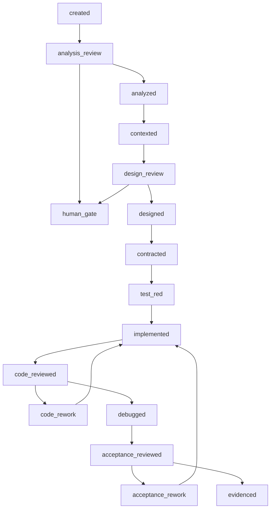

# Agent Factory Phase 2 Project-Aware ADU Development Implementation Plan

> **For agentic workers:** REQUIRED SUB-SKILL: Use superpowers:subagent-driven-development (recommended) or superpowers:executing-plans to implement this plan task-by-task. Steps use checkbox (`- [ ]`) syntax for tracking.

**Goal:** Build Phase 2 of the standalone Agent Factory so a user can create, review, execute, and monitor project-aware ADU development tasks based on the repository profile generated in Phase 1.

**Architecture:** Keep global scheduling metadata in `/Users/hill/open5gs/.ai-agent/registry/`, and keep all project-specific development artifacts under the selected target Git repository. Extend the existing standalone Dashboard backend, frontend, Python runner, Python orchestrator, prompts, and deterministic quality gates so every ADU is bound to a profiled project and every Agent receives the project profile and knowledge pack as first-class context.

**Tech Stack:** Standalone Agent Factory Dashboard (`agent-factory-dashboard`), Express + TypeScript backend, React + Vite + Zustand frontend, Python orchestration scripts, Hermes CLI executor, JSON registry files, local Git repositories, deterministic validators.

---

## 0. Scope And Non-Goals

This plan only targets the standalone Agent Factory implementation:

- Backend: `/Users/hill/open5gs/agent-factory-dashboard/backend`
- Frontend: `/Users/hill/open5gs/agent-factory-dashboard/frontend`
- Runtime scripts: `/Users/hill/open5gs/scripts`
- Global metadata: `/Users/hill/open5gs/.ai-agent/registry`
- Prompt and project artifacts: `/Users/hill/open5gs/.ai-agent`, `<target-repo>/.ai-agent`, `<target-repo>/.agent-factory`

Do not modify or validate the old NMS-integrated version.

Phase 1 must already provide:

- Project registration in `/Users/hill/open5gs/.ai-agent/registry/projects.json`
- Project status lifecycle: `registered`, `profiling`, `profiled`, `profile_failed`, `disabled`
- Project profile files under `<target-repo>/.agent-factory/project-profile.json`
- Project knowledge files under `<target-repo>/.agent-factory/knowledge/`
- Project-level path safety with `fs.realpath`, denylist, allowlist, and `git rev-parse --show-toplevel`

Phase 2 adds:

- Project-aware ADU creation
- Project-aware Agent context injection
- Project-aware artifact read/write isolation
- Project-aware orchestrator start, continue, single-step, pause, and cancel
- Project-aware quality gates and evidence collection
- Dashboard controls for selecting a profiled project, creating a requirement, reviewing analysis/design, and watching execution

## 1. Target User Journey

1. User registers and profiles a Git repository in the Projects page.
2. User opens that profiled project and clicks `Create ADU`.
3. User enters requirement title, business goal, constraints, preferred paths, and optional verification commands.
4. Backend creates a global ADU record with `project_id`, target repo root, safe default paths, and project-derived command policy.
5. User starts one step or the full pipeline from Dashboard.
6. Requirement Analyst reads the user requirement plus project profile and writes a Chinese analysis document.
7. User reviews and edits the analysis document on Dashboard, then approves or requests rework.
8. Detail Designer reads the approved analysis plus project knowledge and writes a Chinese detailed design.
9. User reviews and edits the design document, then approves or requests rework.
10. Contract Agent generates hard acceptance assertions and commands.
11. Test Writer, Developer, Code Reviewer, Buildfix Debugger, Acceptance Reviewer, and Evidence Agent execute against the target repository.
12. Dashboard shows state flow, Agent runs, token usage, quality gates, changed files, review findings, acceptance results, and evidence.

## 2. Data Model

### 2.1 Global Project Registry

Existing file:

`/Users/hill/open5gs/.ai-agent/registry/projects.json`

No schema migration is required for Phase 2 if Phase 1 already writes:

```json
{
  "project_id": "open5gs-main",
  "name": "Open5GS",
  "repo_path": "/Users/hill/open5gs",
  "git_root": "/Users/hill/open5gs",
  "status": "profiled",
  "profile_path": "/Users/hill/open5gs/.agent-factory/project-profile.json",
  "knowledge_dir": "/Users/hill/open5gs/.agent-factory/knowledge",
  "profile_summary": {
    "detected_stack": [],
    "project_type": "c-system",
    "risk_level": "high",
    "build_commands": ["meson compile -C build"],
    "test_commands": ["meson test -C build"]
  }
}
```

Phase 2 must treat `status !== "profiled"` as not runnable for ADU development.

### 2.2 Global ADU Registry

Existing file:

`/Users/hill/open5gs/.ai-agent/registry/adu.json`

Extend each ADU record with project-aware fields:

```json
{
  "id": "REQ-2026-0001",
  "project_id": "open5gs-main",
  "project_name": "Open5GS",
  "repo_path": "/Users/hill/open5gs",
  "artifact_root": ".ai-agent",
  "profile_path": ".agent-factory/project-profile.json",
  "knowledge_dir": ".agent-factory/knowledge",
  "title": "链路检测 ping 功能",
  "goal": "实现链路检测 ping 功能，并提供自动化验证证据。",
  "state": "created",
  "risk": "medium",
  "target_level": "mvp",
  "language": "zh",
  "allowed_read_paths": [
    ".agent-factory/project-profile.json",
    ".agent-factory/knowledge/",
    "src/",
    "lib/",
    "tests/",
    ".ai-agent/"
  ],
  "allowed_write_paths": [
    "src/",
    "lib/",
    "tests/",
    ".ai-agent/analysis/",
    ".ai-agent/designs/",
    ".ai-agent/contracts/",
    ".ai-agent/reviews/",
    ".ai-agent/acceptance/",
    ".ai-agent/evidence/",
    ".ai-agent/runs/"
  ],
  "required_commands": [
    "meson compile -C build",
    "meson test -C build"
  ],
  "required_evidence": [
    ".ai-agent/evidence/REQ-2026-0001.md"
  ],
  "review_policy": {
    "analysis_review_required": true,
    "design_review_required": true
  },
  "command_policy": {
    "mode": "allowlist",
    "allowed_commands": [
      "meson compile -C build",
      "meson test -C build",
      "npm run build",
      "npm test"
    ],
    "blocked_command_patterns": [
      "rm -rf",
      "sudo ",
      "curl ",
      "wget ",
      "ssh ",
      "scp ",
      "rsync ",
      "chmod -R 777",
      "> /dev/",
      "dd "
    ]
  },
  "created_at": "2026-06-09T00:00:00.000Z",
  "updated_at": "2026-06-09T00:00:00.000Z"
}
```

Compatibility rule:

- Existing ADUs without `project_id` are legacy ADUs.
- Dashboard must still display legacy ADUs.
- Project-aware execution controls must be disabled for legacy ADUs until they are migrated or recreated under a project.

### 2.3 Project-Level Artifact Layout

For a profiled target repository, Phase 2 must write development artifacts here:

```text
<target-repo>/.ai-agent/
├── analysis/<ADU_ID>.md
├── designs/<ADU_ID>.md
├── contracts/<ADU_ID>.json
├── runs/<ADU_ID>/<timestamp>-<agent>/
├── reviews/<ADU_ID>-code-review.json
├── reviews/<ADU_ID>-analysis-review.json
├── reviews/<ADU_ID>-design-review.json
├── acceptance/<ADU_ID>-acceptance-review.json
└── evidence/<ADU_ID>.md
```

Global files remain global:

```text
/Users/hill/open5gs/.ai-agent/registry/
├── projects.json
├── adu.json
└── runs.json
```

The global `runs.json` may store summary entries, but full run directories must be project-local for project ADUs.

## 3. State Machine

Use the existing expanded workflow:



Agent mapping:

| Current State | Agent | Success Next State | Blocking Rule |
| --- | --- | --- | --- |
| `created` | `requirement-analyst` | `analysis_review` | Output document missing or empty blocks |
| `analysis_review` | human approval | `analyzed` | Rework keeps state in `analysis_review` |
| `analyzed` | `context-pack` | `contexted` | Missing project profile/knowledge blocks |
| `contexted` | `detail-designer` | `design_review` | Output document missing or empty blocks |
| `design_review` | human approval | `designed` | Rework keeps state in `design_review` |
| `designed` | `contract` | `contracted` | Contract validator failure blocks |
| `contracted` | `testwriter` | `test_red` | Must create failing/target tests or verification checklist |
| `test_red` | `developer` | `implemented` | Production or test changes must stay inside allowed paths |
| `implemented` | `code-reviewer` | `code_reviewed` or `code_rework` | P1/P2 findings force `code_rework` |
| `code_rework` | `developer` | `implemented` | Rework repeats until limit or pass |
| `code_reviewed` | `buildfix-debugger` | `debugged` | Required commands must pass |
| `debugged` | `acceptance-reviewer` | `acceptance_reviewed` or `acceptance_rework` | Contract assertions must be covered |
| `acceptance_rework` | `developer` | `implemented` | Rework repeats until limit or pass |
| `acceptance_reviewed` | `evidence` | `evidenced` | Evidence file must include command outputs and quality report status |

Pause/cancel and active lock behavior from Phase 1 must remain unchanged.

## 4. Files To Create Or Modify

### Backend

Create:

- `/Users/hill/open5gs/agent-factory-dashboard/backend/src/application/project-adu-factory.ts`
  - Creates project-aware ADUs from profiled projects.
  - Derives safe defaults from project profile.
  - Validates user-supplied paths and commands.

- `/Users/hill/open5gs/agent-factory-dashboard/backend/tools/test-project-adu.js`
  - Integration tests for project-aware ADU creation and execution boundaries.

Modify:

- `/Users/hill/open5gs/agent-factory-dashboard/backend/src/domain/agent-factory.ts`
  - Add project-aware ADU fields.
  - Add command policy and review policy types.

- `/Users/hill/open5gs/agent-factory-dashboard/backend/src/domain/agent-factory-repository.ts`
  - Add `getAduById`, `saveAdu`, `listAdusByProject`, and `appendRunSummary` signatures if missing.

- `/Users/hill/open5gs/agent-factory-dashboard/backend/src/infrastructure/file-agent-factory-repository.ts`
  - Resolve project ADU artifacts against target repo root.
  - Keep global registry access under workspace root.
  - Add project artifact allowlist.

- `/Users/hill/open5gs/agent-factory-dashboard/backend/src/application/agent-factory-monitor.ts`
  - Join ADUs with project data.
  - Add project filters.
  - Show project profile/knowledge health.

- `/Users/hill/open5gs/agent-factory-dashboard/backend/src/interfaces/agent-factory-controller.ts`
  - Add project ADU creation endpoints.
  - Pass `--project` and `--repo-root` to orchestrator.
  - Enforce profiled project existence before every execution command.

- `/Users/hill/open5gs/agent-factory-dashboard/backend/package.json`
  - Add `test:project-adu`.

### Frontend

Create:

- `/Users/hill/open5gs/agent-factory-dashboard/frontend/src/components/projects/CreateProjectAduModal.tsx`
  - Project-scoped ADU creation modal.

- `/Users/hill/open5gs/agent-factory-dashboard/frontend/src/components/agent-factory/ProjectContextPanel.tsx`
  - Displays selected ADU's project profile, knowledge files, commands, and path policy.

Modify:

- `/Users/hill/open5gs/agent-factory-dashboard/frontend/src/types/agent-factory.ts`
  - Add project-aware ADU fields.

- `/Users/hill/open5gs/agent-factory-dashboard/frontend/src/api/agentFactory.ts`
  - Add project ADU API methods.

- `/Users/hill/open5gs/agent-factory-dashboard/frontend/src/stores/agentFactory.ts`
  - Add selected project filter, project ADU creation action, and refreshed dashboard loading.

- `/Users/hill/open5gs/agent-factory-dashboard/frontend/src/components/projects/ProjectsPage.tsx`
  - Add `Create ADU` action for profiled projects.

- `/Users/hill/open5gs/agent-factory-dashboard/frontend/src/components/agent-factory/AgentFactoryPage.tsx`
  - Add project filter and project context panel.

- `/Users/hill/open5gs/agent-factory-dashboard/frontend/src/components/agent-factory/OrchestratorControlPanel.tsx`
  - Ensure Start, Continue, Run Next Step, Pause, and Cancel include project-aware safety states.

### Python Scripts

Modify:

- `/Users/hill/open5gs/scripts/hermes_agent_orchestrator.py`
  - Require `--project` and `--repo-root` for project ADUs.
  - Reject disabled/unprofiled projects.
  - Use project-local locks for project ADUs.
  - Preserve current one-step and full-pipeline modes.

- `/Users/hill/open5gs/scripts/hermes_agent_run.py`
  - Load project profile and knowledge pack.
  - Construct a project context payload for every Agent.
  - Use target repo root as the execution root.
  - Write full run directories to `<target-repo>/.ai-agent/runs/<ADU_ID>/`.
  - Enforce command policy before running Hermes and before interpreting command outputs.

- `/Users/hill/open5gs/scripts/hermes_agent_next.py`
  - Support project-aware ADUs when users trigger a next step from CLI.

- `/Users/hill/open5gs/scripts/validate_agent_contract.py`
  - Validate project-root-relative `scope.allowed_write_paths`.
  - Validate command policy against project profile and ADU command policy.

- `/Users/hill/open5gs/scripts/validate_quality_report.py`
  - Read contract and evidence from project-local `.ai-agent`.
  - Keep final acceptance strict: no empty pass, full must-pass coverage, no invalid pass.

### Prompts

Modify existing prompt files under `/Users/hill/open5gs/.ai-agent/prompts/`:

- `requirement-analyst-agent.md`
- `context-pack-agent.md`
- `detail-designer-agent.md`
- `contract-agent.md`
- `testwriter-agent.md`
- `developer-agent.md`
- `code-reviewer-agent.md`
- `buildfix-debugger-agent.md`
- `acceptance-reviewer-agent.md`
- `evidence-agent.md`

Every prompt must:

- Default process documents to Chinese.
- Preserve technical identifiers, JSON keys, file paths, function names, command names, and protocol names in English.
- Treat project profile and knowledge pack as authoritative context.
- Refuse to modify or propose paths outside `allowed_write_paths`.
- Emit the existing machine-readable JSON result block unchanged.

## 5. API Design

### 5.1 Create Project ADU

Endpoint:

`POST /api/agent-factory/projects/:projectId/adus`

Request:

```json
{
  "aduId": "REQ-2026-0001",
  "title": "链路检测 ping 功能",
  "goal": "实现链路检测 ping 功能，并提供自动化验证证据。",
  "risk": "medium",
  "targetLevel": "mvp",
  "preferredReadPaths": ["src/", "lib/", "tests/"],
  "preferredWritePaths": ["src/", "tests/"],
  "requiredCommands": ["meson compile -C build", "meson test -C build"],
  "analysisReviewRequired": true,
  "designReviewRequired": true
}
```

Response `201`:

```json
{
  "adu": {
    "id": "REQ-2026-0001",
    "project_id": "open5gs-main",
    "state": "created",
    "language": "zh"
  }
}
```

Failure behavior:

- `400`: invalid `aduId`, empty title, empty goal, invalid path, invalid command, duplicate ADU id
- `404`: project not found
- `409`: project not `profiled`
- `403`: project path denied by security policy

### 5.2 List ADUs By Project

Endpoint:

`GET /api/agent-factory/projects/:projectId/adus`

Response:

```json
{
  "project_id": "open5gs-main",
  "adus": []
}
```

### 5.3 Project Context For ADU

Endpoint:

`GET /api/agent-factory/adus/:aduId/project-context`

Response:

```json
{
  "aduId": "REQ-2026-0001",
  "project": {
    "project_id": "open5gs-main",
    "name": "Open5GS",
    "repo_path": "/Users/hill/open5gs",
    "status": "profiled"
  },
  "profile": {
    "exists": true,
    "path": ".agent-factory/project-profile.json",
    "summary": {
      "project_type": "c-system",
      "risk_level": "high",
      "build_commands": ["meson compile -C build"],
      "test_commands": ["meson test -C build"]
    }
  },
  "knowledge": [
    {
      "name": "project-summary.md",
      "path": ".agent-factory/knowledge/project-summary.md",
      "exists": true
    }
  ],
  "policies": {
    "allowed_read_paths": [],
    "allowed_write_paths": [],
    "required_commands": []
  }
}
```

### 5.4 Start Or Continue Project ADU

Existing orchestration endpoints must support project ADUs:

- `POST /api/agent-factory/adus/:aduId/start`
- `POST /api/agent-factory/adus/:aduId/continue`
- `POST /api/agent-factory/adus/:aduId/run-next-step`
- `POST /api/agent-factory/adus/:aduId/pause`
- `POST /api/agent-factory/adus/:aduId/cancel`

Backend spawn command must include:

```bash
python3 /Users/hill/open5gs/scripts/hermes_agent_orchestrator.py \
  --adu REQ-2026-0001 \
  --project open5gs-main \
  --repo-root /Users/hill/open5gs \
  --mode start
```

Never build this command through shell string concatenation. Use `spawn("python3", args, ...)`.

## 6. Command Policy

Command policy is required because generic project onboarding can register any software project.

Default allowed commands are derived in this order:

1. User-supplied `requiredCommands`
2. `project.profile_summary.test_commands`
3. `project.profile_summary.build_commands`
4. Profile scanner detected package scripts
5. Empty command list if no safe commands are available

The backend must reject a project ADU if all of these are true:

- `requiredCommands` is empty
- Profile has no build commands
- Profile has no test commands
- User did not explicitly choose manual evidence mode

Blocked command fragments:

```json
[
  "rm -rf",
  "sudo ",
  "curl ",
  "wget ",
  "ssh ",
  "scp ",
  "rsync ",
  "chmod -R 777",
  "> /dev/",
  "dd ",
  "mkfs",
  "launchctl",
  "security ",
  "git push",
  "git clean",
  "git reset --hard"
]
```

Commands must run with `cwd=<target-repo>`.

Commands must not use shell execution unless the existing implementation already has a deterministic parser and allowlist for shell operators. Prefer argument-array execution.

## 7. Project Context Payload For Agents

`hermes_agent_run.py` must build one context object for all Agents:

```json
{
  "adu": {
    "id": "REQ-2026-0001",
    "title": "链路检测 ping 功能",
    "goal": "实现链路检测 ping 功能，并提供自动化验证证据。",
    "state": "created",
    "language": "zh"
  },
  "project": {
    "project_id": "open5gs-main",
    "name": "Open5GS",
    "repo_path": "/Users/hill/open5gs",
    "git_root": "/Users/hill/open5gs",
    "profile_path": ".agent-factory/project-profile.json",
    "knowledge_dir": ".agent-factory/knowledge"
  },
  "project_profile": {},
  "knowledge_pack": {
    "project-summary.md": "...",
    "module-map.md": "...",
    "test-strategy.md": "...",
    "risk-map.md": "..."
  },
  "policies": {
    "allowed_read_paths": [],
    "allowed_write_paths": [],
    "required_commands": [],
    "command_policy": {}
  },
  "artifact_paths": {
    "analysis": ".ai-agent/analysis/REQ-2026-0001.md",
    "design": ".ai-agent/designs/REQ-2026-0001.md",
    "contract": ".ai-agent/contracts/REQ-2026-0001.json",
    "code_review": ".ai-agent/reviews/REQ-2026-0001-code-review.json",
    "acceptance": ".ai-agent/acceptance/REQ-2026-0001-acceptance-review.json",
    "evidence": ".ai-agent/evidence/REQ-2026-0001.md"
  }
}
```

Payload size control:

- Include full `project-profile.json`.
- Include all four knowledge files if each file is <= 80 KB.
- If a knowledge file is larger than 80 KB, include the first 60 KB plus a truncation marker and list the file path for direct read.
- Do not include `.git`, `node_modules`, build outputs, or binary files.

## 8. Detailed Tasks

### Task 1: Add Project-Aware ADU Domain Types

**Files:**

- Modify: `/Users/hill/open5gs/agent-factory-dashboard/backend/src/domain/agent-factory.ts`
- Modify: `/Users/hill/open5gs/agent-factory-dashboard/frontend/src/types/agent-factory.ts`

- [ ] **Step 1: Add backend types**

Add these interfaces to the backend domain file:

```ts
export interface AgentFactoryCommandPolicy {
  mode: 'allowlist';
  allowed_commands: string[];
  blocked_command_patterns: string[];
}

export interface AgentFactoryReviewPolicy {
  analysis_review_required: boolean;
  design_review_required: boolean;
}

export interface CreateProjectAduInput {
  aduId?: string;
  title: string;
  goal: string;
  risk?: string;
  targetLevel?: string;
  preferredReadPaths?: string[];
  preferredWritePaths?: string[];
  requiredCommands?: string[];
  analysisReviewRequired?: boolean;
  designReviewRequired?: boolean;
  manualEvidenceMode?: boolean;
}
```

Extend `AgentFactoryAdu` with:

```ts
project_id?: string;
project_name?: string;
repo_path?: string;
artifact_root?: string;
profile_path?: string;
knowledge_dir?: string;
review_policy?: AgentFactoryReviewPolicy;
command_policy?: AgentFactoryCommandPolicy;
created_at?: string;
updated_at?: string;
```

- [ ] **Step 2: Mirror frontend types**

Add matching frontend types to `/Users/hill/open5gs/agent-factory-dashboard/frontend/src/types/agent-factory.ts`.

- [ ] **Step 3: Verify TypeScript build**

Run:

```bash
cd /Users/hill/open5gs/agent-factory-dashboard/backend
npm run build
cd /Users/hill/open5gs/agent-factory-dashboard/frontend
npm run build
```

Expected:

- Backend `tsc` completes.
- Frontend `tsc && vite build` completes.

### Task 2: Create Project ADU Factory Use Case

**Files:**

- Create: `/Users/hill/open5gs/agent-factory-dashboard/backend/src/application/project-adu-factory.ts`
- Modify: `/Users/hill/open5gs/agent-factory-dashboard/backend/src/domain/agent-factory-repository.ts`
- Modify: `/Users/hill/open5gs/agent-factory-dashboard/backend/src/infrastructure/file-agent-factory-repository.ts`

- [ ] **Step 1: Add repository methods**

Add or confirm these repository methods:

```ts
listAdus(): Promise<AgentFactoryAdu[]>;
getAduById(aduId: string): Promise<AgentFactoryAdu | null>;
saveAdu(adu: AgentFactoryAdu): Promise<void>;
listAdusByProject(projectId: string): Promise<AgentFactoryAdu[]>;
```

`saveAdu` must update an existing ADU by `id` or append a new record.

- [ ] **Step 2: Implement ADU id validation**

Use this validation rule:

```ts
const ADU_ID_PATTERN = /^[A-Za-z0-9_.-]+$/;
```

Reject:

- Empty id
- `/`
- `\`
- `..`
- whitespace
- shell metacharacters

- [ ] **Step 3: Implement path normalization**

Project ADU paths must be repo-relative. Normalize user input with:

```ts
function normalizeRepoRelativePath(input: string): string {
  const value = input.trim().replaceAll('\\', '/');
  if (!value || value.startsWith('/') || value.includes('..') || value.includes('\0')) {
    throw new Error(`Invalid repository-relative path: ${input}`);
  }
  return value.endsWith('/') ? value : value;
}
```

Reject absolute paths from the ADU form. The backend already knows `repo_path`.

- [ ] **Step 4: Implement command validation**

Use this blocked pattern list:

```ts
const BLOCKED_COMMAND_PATTERNS = [
  'rm -rf',
  'sudo ',
  'curl ',
  'wget ',
  'ssh ',
  'scp ',
  'rsync ',
  'chmod -R 777',
  '> /dev/',
  'dd ',
  'mkfs',
  'launchctl',
  'security ',
  'git push',
  'git clean',
  'git reset --hard',
];
```

Reject any required command containing one of these fragments.

- [ ] **Step 5: Create `ProjectAduFactory`**

Constructor dependencies:

```ts
constructor(
  private readonly projectRepository: ProjectRepository,
  private readonly agentFactoryRepository: AgentFactoryRepository,
) {}
```

Core method:

```ts
async createForProject(projectId: string, input: CreateProjectAduInput): Promise<AgentFactoryAdu>
```

Behavior:

- Load project by `projectId`.
- Return `404` semantics if missing.
- Reject unless `project.status === "profiled"`.
- Reject if `profile_path` or `knowledge_dir` is missing.
- Reject duplicate ADU id.
- Build safe `allowed_read_paths` from:
  - `.agent-factory/project-profile.json`
  - `.agent-factory/knowledge/`
  - user preferred read paths
  - `.ai-agent/`
- Build safe `allowed_write_paths` from:
  - user preferred write paths
  - `.ai-agent/analysis/`
  - `.ai-agent/designs/`
  - `.ai-agent/contracts/`
  - `.ai-agent/reviews/`
  - `.ai-agent/acceptance/`
  - `.ai-agent/evidence/`
  - `.ai-agent/runs/`
- Build required commands from user input, profile test commands, and profile build commands.
- If no commands exist and `manualEvidenceMode !== true`, reject with `400`.
- Save the ADU globally.

- [ ] **Step 6: Write integration test skeleton**

Create `/Users/hill/open5gs/agent-factory-dashboard/backend/tools/test-project-adu.js` with test cases listed in section 11.

- [ ] **Step 7: Run the new failing test**

Run:

```bash
cd /Users/hill/open5gs/agent-factory-dashboard/backend
npm run test:project-adu
```

Expected before controller wiring:

- Test fails because route does not exist or use case is not registered.

### Task 3: Add Project ADU API Routes

**Files:**

- Modify: `/Users/hill/open5gs/agent-factory-dashboard/backend/src/interfaces/agent-factory-controller.ts`
- Modify: `/Users/hill/open5gs/agent-factory-dashboard/backend/src/index.ts`
- Modify: `/Users/hill/open5gs/agent-factory-dashboard/backend/package.json`

- [ ] **Step 1: Register the use case in backend index**

Instantiate `ProjectAduFactory` with the existing project repository and agent factory repository.

- [ ] **Step 2: Add routes**

Add:

```ts
router.post('/projects/:projectId/adus', async (req, res) => { ... });
router.get('/projects/:projectId/adus', async (req, res) => { ... });
router.get('/adus/:aduId/project-context', async (req, res) => { ... });
```

All route params must use the existing safe id regex:

```ts
/^[A-Za-z0-9_.-]+$/
```

- [ ] **Step 3: Add `test:project-adu` script**

Add to package scripts:

```json
"test:project-adu": "node tools/test-project-adu.js"
```

- [ ] **Step 4: Run backend build**

Run:

```bash
cd /Users/hill/open5gs/agent-factory-dashboard/backend
npm run build
```

Expected: build passes.

### Task 4: Make Artifact Repository Project-Aware

**Files:**

- Modify: `/Users/hill/open5gs/agent-factory-dashboard/backend/src/infrastructure/file-agent-factory-repository.ts`
- Modify: `/Users/hill/open5gs/agent-factory-dashboard/backend/src/application/agent-factory-monitor.ts`

- [ ] **Step 1: Resolve project ADU artifact root**

For ADUs with `project_id`, artifact paths must resolve under `adu.repo_path`.

Allowed prefixes:

```ts
const PROJECT_ARTIFACT_PREFIXES = [
  '.agent-factory/project-profile.json',
  '.agent-factory/knowledge/',
  '.ai-agent/analysis/',
  '.ai-agent/designs/',
  '.ai-agent/contracts/',
  '.ai-agent/runs/',
  '.ai-agent/reviews/',
  '.ai-agent/acceptance/',
  '.ai-agent/evidence/',
];
```

Use `fs.realpath` for both the candidate file and the allowed directory before comparison.

- [ ] **Step 2: Keep global artifact compatibility**

Legacy ADUs without `project_id` continue using the existing global workspace artifact allowlist.

- [ ] **Step 3: Update monitor artifact status**

For project ADUs, `artifact_status` paths must point to project-local artifacts:

```text
.ai-agent/analysis/<ADU_ID>.md
.ai-agent/designs/<ADU_ID>.md
.ai-agent/contracts/<ADU_ID>.json
.ai-agent/reviews/<ADU_ID>-code-review.json
.ai-agent/acceptance/<ADU_ID>-acceptance-review.json
.ai-agent/evidence/<ADU_ID>.md
```

- [ ] **Step 4: Add tests**

Add tests that verify:

- Allowed project artifact can be read.
- A symlink inside `.ai-agent/evidence/` pointing outside repo is denied.
- Global registry files cannot be read through project artifact API.
- Project A cannot read Project B artifacts.

### Task 5: Make Orchestrator Project-Aware

**Files:**

- Modify: `/Users/hill/open5gs/scripts/hermes_agent_orchestrator.py`
- Modify: `/Users/hill/open5gs/agent-factory-dashboard/backend/src/interfaces/agent-factory-controller.ts`

- [ ] **Step 1: Enforce project lookup before spawn**

Before spawning Python:

- Load ADU.
- If ADU has `project_id`, load project.
- Reject if project missing.
- Reject if project status is not `profiled`.
- Reject if `project.repo_path !== adu.repo_path`.
- Reject if active lock exists.

- [ ] **Step 2: Spawn Python with project args**

Use:

```ts
const args = [
  scriptPath,
  '--adu', aduId,
  '--mode', mode,
];

if (adu.project_id && adu.repo_path) {
  args.push('--project', adu.project_id, '--repo-root', adu.repo_path);
}
```

- [ ] **Step 3: Enforce project args in Python**

In `hermes_agent_orchestrator.py`:

- If ADU has `project_id`, require `--project` and `--repo-root`.
- Resolve `--repo-root`.
- Compare it to ADU `repo_path`.
- Refuse to run if project disabled or not profiled.

- [ ] **Step 4: Preserve single-step mode**

`--mode next` must run exactly one Agent step and stop.

`--mode start` and `--mode continue` must run until:

- Evidence complete
- Human review gate
- Failed quality gate
- Pause
- Cancel
- Token hard stop
- Retry limit reached

### Task 6: Inject Project Profile And Knowledge Into Agents

**Files:**

- Modify: `/Users/hill/open5gs/scripts/hermes_agent_run.py`

- [ ] **Step 1: Add project context loader**

Implement helper functions:

```python
def load_json_file(path: Path) -> dict:
    with path.open("r", encoding="utf-8") as f:
        return json.load(f)

def load_text_file_limited(path: Path, max_bytes: int = 80000) -> dict:
    data = path.read_bytes()
    truncated = len(data) > max_bytes
    text = data[:max_bytes].decode("utf-8", errors="replace")
    if truncated:
        text += "\n\n[TRUNCATED: read file directly if more context is required]\n"
    return {"path": str(path), "text": text, "truncated": truncated, "bytes": len(data)}
```

- [ ] **Step 2: Load project profile**

For project ADUs:

- `project_profile_path = project_repo_path / ".agent-factory/project-profile.json"`
- Refuse to run if missing.

- [ ] **Step 3: Load knowledge pack**

Read:

- `.agent-factory/knowledge/project-summary.md`
- `.agent-factory/knowledge/module-map.md`
- `.agent-factory/knowledge/test-strategy.md`
- `.agent-factory/knowledge/risk-map.md`

If one file is missing, include an empty entry and mark it missing. Missing knowledge should block `context-pack`, `detail-designer`, `contract`, and downstream Agents.

- [ ] **Step 4: Include context payload in prompt**

Add a clear section to the Agent prompt:

```text
## Project Context Payload
The following JSON is authoritative. Use it when analyzing, designing, coding, testing, and reviewing.

```json
{PROJECT_CONTEXT_JSON}
```
```

Keep JSON response schema unchanged.

- [ ] **Step 5: Write run directory project-locally**

For project ADUs:

```python
run_dir = project_repo_path / ".ai-agent" / "runs" / adu_id / run_id
```

For legacy ADUs, keep current behavior.

### Task 7: Update Prompts For Project-Aware Chinese Documents

**Files:**

- Modify all prompt files listed in section 4.

- [ ] **Step 1: Add global language rule**

Add this rule to every prompt:

```text
Default language for process documents is Simplified Chinese. Keep JSON keys, file paths, protocol names, CLI commands, function names, class names, constants, and external API names in their original technical English.
```

- [ ] **Step 2: Add project context rule**

Add this rule to every prompt:

```text
Treat Project Context Payload as authoritative. Do not invent repository structure if it conflicts with project-profile.json or knowledge files. If context is insufficient, report the missing information in risks and stop before modifying code.
```

- [ ] **Step 3: Add artifact path rule**

Each Agent must write only to the artifact path assigned for its stage:

- Requirement Analyst: `.ai-agent/analysis/<ADU_ID>.md`
- Detail Designer: `.ai-agent/designs/<ADU_ID>.md`
- Contract Agent: `.ai-agent/contracts/<ADU_ID>.json`
- Code Reviewer: `.ai-agent/reviews/<ADU_ID>-code-review.json`
- Acceptance Reviewer: `.ai-agent/acceptance/<ADU_ID>-acceptance-review.json`
- Evidence Agent: `.ai-agent/evidence/<ADU_ID>.md`

- [ ] **Step 4: Keep JSON result schema stable**

Every prompt must still return:

```json
{
  "result": "success",
  "next_state": "analysis_review",
  "changed_files": [],
  "commands_run": [],
  "artifacts": [],
  "risks": [],
  "next_agent": null
}
```

The `next_state` changes by Agent stage.

### Task 8: Strengthen Project-Aware Quality Gates

**Files:**

- Modify: `/Users/hill/open5gs/scripts/validate_agent_contract.py`
- Modify: `/Users/hill/open5gs/scripts/validate_quality_report.py`
- Modify: `/Users/hill/open5gs/agent-factory-dashboard/backend/tools/test-quality-gates.js`
- Modify: `/Users/hill/open5gs/agent-factory-dashboard/backend/tools/test-project-adu.js`

- [ ] **Step 1: Contract validator must use repo root**

For `--repo-root /path/to/project`, all contract paths are interpreted relative to that repo root.

Reject:

- Absolute paths
- `..`
- Paths outside `adu.allowed_write_paths`
- Commands outside ADU `command_policy.allowed_commands`
- Commands containing blocked fragments

- [ ] **Step 2: Acceptance validator must use project artifacts**

For project ADUs, load:

- Contract: `<repo-root>/.ai-agent/contracts/<ADU_ID>.json`
- Evidence: `<repo-root>/.ai-agent/evidence/<ADU_ID>.md`
- Acceptance: `<repo-root>/.ai-agent/acceptance/<ADU_ID>-acceptance-review.json`

- [ ] **Step 3: Reject cross-project evidence**

Acceptance report is invalid if it references an evidence path outside the ADU project repo.

- [ ] **Step 4: Add negative tests**

Add tests for:

- Contract writes to Project B path.
- Contract command contains `curl`.
- Acceptance report says pass but omits a must-pass assertion.
- Evidence path points to global workspace artifact instead of project artifact.

### Task 9: Add Frontend Project ADU Creation Flow

**Files:**

- Create: `/Users/hill/open5gs/agent-factory-dashboard/frontend/src/components/projects/CreateProjectAduModal.tsx`
- Modify: `/Users/hill/open5gs/agent-factory-dashboard/frontend/src/api/agentFactory.ts`
- Modify: `/Users/hill/open5gs/agent-factory-dashboard/frontend/src/stores/agentFactory.ts`
- Modify: `/Users/hill/open5gs/agent-factory-dashboard/frontend/src/components/projects/ProjectsPage.tsx`

- [ ] **Step 1: Add API method**

Add:

```ts
export async function createProjectAdu(projectId: string, payload: CreateProjectAduPayload): Promise<{ adu: AgentFactoryAduView }> {
  return request(`/projects/${encodeURIComponent(projectId)}/adus`, {
    method: 'POST',
    body: JSON.stringify(payload),
  });
}
```

- [ ] **Step 2: Add modal fields**

Modal fields:

- ADU ID
- Title
- Goal
- Risk: `low`, `medium`, `high`
- Target level: `mvp`, `production`
- Preferred read paths
- Preferred write paths
- Required commands
- Analysis review required
- Design review required
- Manual evidence mode

- [ ] **Step 3: Disable modal for non-profiled projects**

Button state:

- `profiled`: enabled
- `registered`: disabled with label `画像未完成`
- `profiling`: disabled with label `画像生成中`
- `profile_failed`: disabled with label `画像失败`
- `disabled`: disabled with label `项目已停用`

- [ ] **Step 4: After creation**

After a successful create:

- Close modal.
- Refresh dashboard.
- Navigate user to Agent Factory page.
- Select the new ADU.

### Task 10: Add Project Context Panel To Dashboard

**Files:**

- Create: `/Users/hill/open5gs/agent-factory-dashboard/frontend/src/components/agent-factory/ProjectContextPanel.tsx`
- Modify: `/Users/hill/open5gs/agent-factory-dashboard/frontend/src/components/agent-factory/AgentFactoryPage.tsx`
- Modify: `/Users/hill/open5gs/agent-factory-dashboard/frontend/src/api/agentFactory.ts`

- [ ] **Step 1: Add context API method**

Add:

```ts
export async function getAduProjectContext(aduId: string): Promise<AduProjectContext> {
  return request(`/adus/${encodeURIComponent(aduId)}/project-context`);
}
```

- [ ] **Step 2: Render project context**

Panel sections:

- Project identity
- Profile status
- Build/test commands
- Knowledge files
- Allowed read paths
- Allowed write paths
- Blocked command patterns

- [ ] **Step 3: Highlight blockers**

Show blocked status when:

- ADU has no `project_id`
- Project is not `profiled`
- Profile file missing
- Knowledge directory missing
- No commands and manual evidence mode is false

### Task 11: Integration Tests

**Files:**

- Create: `/Users/hill/open5gs/agent-factory-dashboard/backend/tools/test-project-adu.js`
- Modify: `/Users/hill/open5gs/agent-factory-dashboard/backend/package.json`

`test-project-adu.js` must create an isolated temporary workspace. It must set:

```bash
AGENT_FACTORY_WORKSPACE=<temp-workspace>
AGENT_FACTORY_REGISTRY_DIR=<temp-workspace>/.ai-agent-test/registry
AGENT_FACTORY_PROJECTS_REGISTRY=<temp-workspace>/.ai-agent-test/registry/projects.json
AGENT_FACTORY_ALLOWED_PROJECT_ROOTS=<temp-workspace>
```

Test cases:

1. Register and profile a mock Git project.
2. Create a project ADU only after project status is `profiled`.
3. Reject create for missing project.
4. Reject create for `registered`, `profile_failed`, and `disabled` projects.
5. Reject unsafe ADU id.
6. Reject absolute preferred paths.
7. Reject `..` preferred paths.
8. Reject blocked command fragments.
9. Create ADU with project_id, repo_path, profile_path, knowledge_dir, Chinese language default, review policy, and command policy.
10. Read project-local artifact and deny cross-project artifact.
11. Deny symlink artifact escape.
12. Start project ADU passes `--project` and `--repo-root` to orchestrator.
13. Disabled project blocks orchestrator start.
14. Project ADU run directory is created under `<target-repo>/.ai-agent/runs/<ADU_ID>/`.
15. No Phase 2 test writes to `/Users/hill/open5gs/.ai-agent/registry` unless explicitly running against the real workspace.

Run:

```bash
cd /Users/hill/open5gs/agent-factory-dashboard/backend
npm run test:project-adu
```

Expected: all tests pass.

### Task 12: End-To-End Smoke Scenario

**Files:**

- Runtime only; no production files should be changed by the smoke scenario.

- [ ] **Step 1: Create mock repo**

Create a temporary Git repo with:

- `package.json`
- `src/math.ts`
- `test/math.test.ts`
- `.agent-factory/project-profile.json`
- `.agent-factory/knowledge/project-summary.md`
- `.agent-factory/knowledge/module-map.md`
- `.agent-factory/knowledge/test-strategy.md`
- `.agent-factory/knowledge/risk-map.md`

- [ ] **Step 2: Register it in isolated registry**

Use the existing project onboarding route or repository directly in the test harness.

- [ ] **Step 3: Create ADU**

Use:

```json
{
  "aduId": "REQ-PHASE2-SMOKE",
  "title": "为加法函数增加负数用例",
  "goal": "根据项目画像，为 math 模块增加负数加法测试并保证 npm test 通过。",
  "risk": "low",
  "targetLevel": "mvp",
  "preferredReadPaths": ["src/", "test/", "package.json"],
  "preferredWritePaths": ["test/"],
  "requiredCommands": ["npm test"],
  "analysisReviewRequired": true,
  "designReviewRequired": true
}
```

- [ ] **Step 4: Run one step**

Trigger `run-next-step`.

Expected:

- State moves from `created` to `analysis_review`.
- `.ai-agent/analysis/REQ-PHASE2-SMOKE.md` exists in the target repo.
- Document is Chinese.

- [ ] **Step 5: Approve analysis and run to design review**

Expected:

- State moves to `design_review`.
- `.ai-agent/designs/REQ-PHASE2-SMOKE.md` exists in the target repo.
- Document cites project profile or knowledge pack.

- [ ] **Step 6: Full pipeline with mock Hermes**

Use mock Hermes responses to avoid real token spend.

Expected:

- Final state is `evidenced`.
- Contract, test, code review, acceptance, and evidence artifacts exist under target repo `.ai-agent`.
- Global `runs.json` stores summary entries with `project_id`.

## 9. Acceptance Criteria

Phase 2 is complete only when all criteria are true:

- A profiled project can create a project-aware ADU from the Dashboard.
- Non-profiled and disabled projects cannot create or execute ADUs.
- Every project ADU has `project_id`, `repo_path`, `profile_path`, `knowledge_dir`, `language: "zh"`, `review_policy`, and `command_policy`.
- Requirement analysis and detailed design documents are generated in Chinese.
- Analysis and design review gates support manual edit, approve, and rework exactly as the existing review system does.
- Single-step execution and full-pipeline execution both work for project ADUs.
- Agent run directories are project-local.
- Contract, review, acceptance, and evidence files are project-local.
- Deterministic validators use `--repo-root` and do not read or write legacy global artifact directories for project ADUs.
- Dashboard displays project identity, project context, profile health, knowledge health, workflow state, Agent state, token usage, quality reports, and artifacts.
- Tests prove symlink escape, cross-project reads, blocked commands, disabled projects, and invalid ADU ids are rejected.
- Old NMS implementation is not modified.

## 10. Verification Commands

Run these from a clean working tree or an intentionally isolated worktree:

```bash
cd /Users/hill/open5gs/agent-factory-dashboard/backend
npm run build
npm run test:onboarding
npm run test:project-adu
npm run test:quality-gates
```

If the review gate test requires a running backend, start the standalone backend and run:

```bash
cd /Users/hill/open5gs/agent-factory-dashboard/backend
npm run test:review-gate
```

Run frontend build:

```bash
cd /Users/hill/open5gs/agent-factory-dashboard/frontend
npm run build
```

Run Python syntax checks:

```bash
cd /Users/hill/open5gs
python3 -m py_compile \
  scripts/hermes_agent_run.py \
  scripts/hermes_agent_orchestrator.py \
  scripts/hermes_agent_next.py \
  scripts/validate_agent_contract.py \
  scripts/validate_quality_report.py
```

Expected:

- All commands pass.
- No test writes mock project data into `/Users/hill/open5gs/.ai-agent/registry`.
- `rg "mock-project|REQ-PHASE2-SMOKE|my-mock-project" /Users/hill/open5gs/.ai-agent/registry` returns no output after isolated tests.

## 11. Rollout Strategy

1. Implement backend domain and ADU factory.
2. Add isolated integration tests before wiring UI.
3. Wire API routes and orchestrator args.
4. Update Python runner/orchestrator and validators.
5. Update prompts.
6. Add frontend ADU creation and project context panel.
7. Run isolated smoke scenario with mock Hermes.
8. Run one real low-risk ADU on a small registered project.
9. Keep NMS version frozen.

## 12. Risks And Controls

| Risk | Control |
| --- | --- |
| Agent writes to wrong repository | Store `repo_path` in ADU, compare with project registry before every run, resolve real paths before artifact access |
| Test pollution in main registry | Require isolated env vars in `test-project-adu.js`, assert production registry has no mock ids |
| Project profile stale | Show `last_profiled_at`, warn if Git HEAD changed since profile |
| Commands too permissive | Use allowlist plus blocked fragments, reject network/destructive commands |
| User bypasses review gates | Backend approval must read non-empty, non-truncated analysis/design docs |
| Token cost spike | Keep hardStop preflight and show project ADU token summary |
| Existing legacy ADUs break | Keep legacy path behavior for ADUs without `project_id` |

## 13. Execution Notes For Antigravity

- Work only in the standalone Agent Factory paths.
- Do not modify `/Users/hill/open5gs/open5gs-nms`.
- Use isolated temp registries in tests.
- Prefer adding new focused files rather than expanding controller logic excessively.
- Keep process documents in Chinese by default.
- Keep JSON response keys and schema in English.
- Keep all subprocess calls shell-safe with argument arrays.
- Preserve existing working behavior for:
  - model selection
  - token budget display
  - review gate edit/approve/rework
  - pause/cancel lock handling
  - quality report invalid-pass detection

