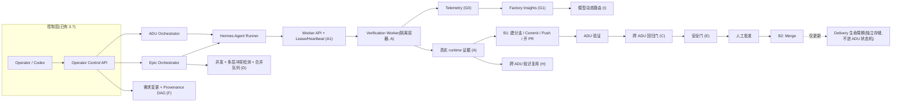

# Agent Factory 功能补全 Roadmap(Tier 1–3 全量)

日期：2026-06-22(2026-06-22 架构审查后修订)

适用项目：`<workspace-root>` 下的独立 Agent Factory Dashboard 与 Agent Factory Runtime

目标读者：Agent Factory 开发者 / Operator / 后续接手的新 Agent

## 0. 修订说明

本文为战略级 Roadmap,经 2026-06-22 架构审查后修订。审查指出的关键问题已并入:交付与回归门顺序、跨主机任务队列、Worker 安全隔离、Recipe 确定性、SCM 抽象、交付状态与核心状态机解耦、回归目录治理、并发冲突检测、变更溯源、遥测前置、H/I 依赖、未提交代码描述等。

本文保持 A–I 结构与战略altitude;`Phase A0/A1` 的可实施细节另见单独的详细设计文档(待编写)。

## 1. 本文目的

本文不是继续堆迭代号(3.8 / 3.9),而是从"作为一个自动化需求开发工厂,它到底缺什么"出发,给出一份**面向自动化能力补全的完整 Roadmap**。

设计前提(已确认):

- **覆盖范围**：Tier 1 + Tier 2 + Tier 3 全量。
- **目标项目**：通用任意 Git 项目(保持 README 的通用定位,验证逻辑由项目画像里的执行配方驱动,不写死任何技术栈)。
- **执行环境**：自建 CI / 常驻 Linux worker(**可能多主机、多 Worker**)。

## 2. 当前版本画像与评估结论

当前主线(Phase 1 至 3.7)已经把**"需求 → 代码 → 静态校验 → 证据归档"**这条流水线做得相当完整:

- 16 个 Agent:`project-profiler / adu-intake / requirement-analyst / context-pack / detail-designer / contract / testwriter / developer / buildfix-debugger / code-reviewer / acceptance-reviewer / evidence / rework-planner` 以及 Epic 三件套 `adu-splitter / system-flow-designer / epic-acceptance-reviewer`。
- 确定性质量门:`scripts/validate_*.py` + `scripts/code_review_fact_gate.py` + `scripts/run_trusted_verification.py`(可信命令由 Runner 执行,Agent 自报不算独立证据)。
- 上下文与 Token 控制其实已存在:`scripts/context_payload_builder.py` 的 `build_focused_payload` 已接入 Runner(超限抛 `CONTEXT_BUDGET_EXCEEDED`),`scripts/token_ledger.py` 已做聚合。
- 安全与移植:write-path policy、`scripts/registry_lock.py`、`scripts/check_tracked_path_leaks.py`、doctor / bootstrap,以及危险命令禁令清单(`git push` 等被禁)。

**结论**:它已经是一个"会写、会静态把关、会归档"的工厂,但还不是"会运行验证、会交付、能规模化"的工厂。最关键的三个缺口恰好都不在现有 3.7–3.9 roadmap 内:

1. **运行时验证环境**:`run_trusted_verification.py` 只在本地执行命令,没有隔离 worker / 集成环境编排,导致大量 runtime 断言落到 `human_gate`。
2. **交付闭环**:流水线止于 `evidenced`,`git push` 在禁令清单里,产出停留在 worktree + 证据包,没有进入真实仓库历史。
3. **跨 ADU 回归门**:每个 ADU 自证,没有工厂级"历史测试全绿"的保证,ADU-N 可能悄悄打破 ADU-M。

> 相关改动**已提交至 PR #1,尚未合并**:evidence 证据策略中的 runtime 断言假通过漏洞已在 `scripts/validate_evidence_package.py` 修复(`acceptance` 格式恒判 static、整包自报 status 旁路、runtime 证据以自报 status 顶替 exitCode、空内容证据 等多个假通过向量),并新增 `scripts/test_validate_evidence_package.py`。legacy `acceptance` 合约的兼容迁移作为**已知局限延后处理,不阻塞 PR #1 合并**。

## 3. 与现有 3.7–3.9 设计的关系

参见 `docs/superpowers/specs/2026-06-17-agent-factory-phase3-7-to-3-9-design.md`。

- **Phase 3.7(Operator Control Layer)**：保留,已在主线。
- **Phase 3.8(Cost & Context Governance)**：整体降级。其"省 Token"的核心机制大半已由 focused payload + per-agent 预算 + token ledger 覆盖;真正有用的"每 run 持久化 context manifest"并入 **Phase G**,复杂的缓存重建机器暂不做。
- **Phase 3.9(Quality Gate Intelligence)**：砍到只留"环境能力探测",且必须由真实 worker 上报(并入 **Phase A**),而非手维护注册表。其余(独立 ReworkChain 数据结构、quality_gate_explainer 额外 LLM 调用、独立 Quality Center 页面)不做;返工可追溯性由现有状态机 + audit log + **Phase G** 的分析页覆盖。

## 4. 总体架构

交付链路必须是"先验证、再合并":



## 5. Roadmap 总览

| 阶段 | Tier | 目标 | 依赖 | 规模 |
|---|---|---|---|---|
| A0. 单机 Verification Worker MVP | 1 | 单机单 worker,JSON 队列,容器内跑 unit_test,产出真实证据 | — | 中(基石) |
| G0. 遥测基础(Telemetry Schema) | 3 | job/run/worker 指标 schema 与埋点,**与 A 同期** | A0 | 小 |
| A1. Worker API + Lease/Heartbeat | 1 | HTTP 任务接口、租约心跳、取消、重试;跨主机可靠 | A0 | 中 |
| A2. 持久化队列 + 多 Worker | 1 | 持久队列、多 worker 抢占安全、崩溃回收、幂等去重 | A1 | 中 |
| C. 跨 ADU 回归门 | 1 | 版本化 Regression Catalog,合并前全绿 | A1 | 中 |
| E. 专职安全门 | 1 | SAST + 依赖审计 + secret 扫描,确定性事实门 | A1 | 中 |
| B1. PR 发布 | 1 | ScmProvider 抽象,建分支 / commit / push / 开 PR | A1 | 中 |
| B2. 受控 Merge | 1 | C/E/CI 通过 + 人工批准后合并;delivery 独立生命周期 | B1, C, E | 中 |
| F. 需求变更增量重跑 | 2 | Artifact Provenance DAG,只重跑 stale 节点 | A1 | 中 |
| D. 并发与冲突域 | 2 | 多层冲突检测 + 合并队列 | A2 | 中 |
| G1. Factory Insights | 3 | 返工率 / gate 命中 / 成本时长 / 失败热点分析页 | G0 有数据 | 中 |
| H. 跨 ADU 知识复用 | 3 | 检索历史相似 ADU 喂 context-pack | context manifest + provenance + 项目隔离 | 中 |
| I. 模型动态路由 | 3 | 基于真实成本 / 成功率 / 重试数据选模型 | G1 | 小 |

**推荐执行顺序**(审查采纳):

```
A0 → G0 → A1 → C → E → B1 → B2 → F → D → G1 → H → I
```

要点:Worker MVP 与遥测先行;**回归门(C)与安全门(E)必须在允许 Merge(B2)之前就位**;数据驱动的 H / I 放最后。

## 6. Tier 1:让工厂"真正自动"

### Phase A — 运行时验证环境(基石,分层落地)

**目标**:把"runtime 断言只能走人工门"变成"worker 自动跑出真实证据"。

**分层(不可一步到位为跨主机分布式)**:

- **A0 单机 MVP**:单主机、单 Worker,沿用 `.ai-agent/registry/verification-jobs.json` 作为队列**仅限单机**。`scripts/verification_worker.py` 拉一个作业 → 容器内跑 `execution_recipe.unit_test` → 写回 `verification-results.json`。打通真实证据闭环。
- **A1 Worker API + 租约**:JSON 文件不适合跨主机队列(Worker 无法直接访问控制端文件系统;NFS 锁语义不可靠;多 Worker 抢任务;崩溃回收;重复执行;日志并发写)。改为 HTTP Worker API + lease/heartbeat + 取消 + 重试。任务模型至少含:`job_id / status / lease_owner / lease_expires_at / attempt / idempotency_key / cancel_requested / created_at / started_at / finished_at`。
- **A2 持久化队列 + 多 Worker**:持久队列后端,多 Worker 抢占安全、崩溃回收、幂等去重、日志分流。

**Worker 安全隔离(执行不可信仓库代码,必须满足)**:

- 临时 checkout/快照,**而非直接挂载原仓库**;rootless container;`cap-drop=ALL`;`no-new-privileges`;seccomp / AppArmor profile。
- CPU / 内存 / PID / 磁盘 / 执行时长限额;默认禁网,按任务声明开放;禁止挂载 Docker socket。
- 密钥按任务最小授权;容器执行后销毁;基础镜像来自 allowlist 且固定 digest。
- **只读源码快照 + 可写临时工作目录**(纯只读会导致编译 / 测试无法生成中间文件)。

**通用执行配方(Recipe)的确定性校验(LLM 生成不能直接执行)**:

- 由 `project-profiler-agent` + `scripts/hermes_project_profile.py` 产出语言无关的 `execution_recipe`(`base_image / setup / build / unit_test / integration_test / lint / run / capabilities[]`)。
- 必须有:Recipe JSON Schema;镜像 allowlist;命令策略校验(禁 shell 拼接、提权、宿主路径访问);初次生成**人工确认**;Recipe 版本 / hash / 审批记录。
- 优先使用确定性 Adapter(Node / Python / CMake / Meson 等),LLM 只补充未知部分。

**环境能力探测(并入自 3.9 的唯一保留项)**:worker 上报真实能力(docker / 服务 / 网络),与断言 `required_capabilities` 匹配,缺失才进 `human_gate` 并给精确原因。

**真实证据回填**:`scripts/run_trusted_verification.py` 改造为"派发 worker 作业 → 成功后写 `runtime_evidence_records`",喂给 `scripts/validate_evidence_package.py`。

**backend**:`application/runtime/verification-job-service.ts` + 入队 / 查询 / 取消 REST 接口。

**验收**:某通用项目(Node / Python 样例)的 runtime 断言,无人工介入即拿到 `exitCode 0` + stdout 证据并通过 evidence 门;A1 后单作业可被另一主机的 Worker 领取并完成。

### Phase B — 交付闭环(拆为 B1 发布 / B2 合并)

**目标**:工厂终点从"证据包"变成"已合并的变更",且**先过门禁再合并**。

**SCM 抽象(不能写死 GitHub / `gh`)**:定义 `ScmProvider` 领域接口,实现 `GitHubProvider / GitLabProvider / GiteaProvider / GenericGitProvider`。第一版只实现 `GitHubProvider`,但领域模型不绑定 `gh`。

**B1 — PR 发布**:`scripts/agent_factory_deliver.py` 从 developer worktree 建分支、结构化 commit、push、经 ScmProvider 开 PR,PR body 附证据矩阵。受控 push 仅在该步骤、`AGENT_FACTORY_ENABLE_DELIVERY=true` + 人工批准时放行,全程审计。

**B2 — 受控 Merge**:仅当 **C(跨 ADU 回归)+ E(安全门)+ CI 绿 + 人工 approve** 全部通过才 merge。只走 PR,不直推主干,revert 路径文档化。

**交付状态与核心状态机解耦(关键)**:`adu.state` 保持 `evidenced` 为终态(现有 Runner / Orchestrator / Monitor / `next-action-advisor` 等约 46 处把 `evidenced` 视为终点,扩状态机会波及大量判断)。交付生命周期**独立存储**:

```
adu.state       = evidenced            # 不变
delivery.status = pending | publishing | pr_open | ci_running |
                  merge_ready | merged | failed | reverted
```

**验收**:一条需求跑到出现"带证据、过 CI 与回归 / 安全门、经人工批准"的合并;`evidenced` 语义不被破坏。

### Phase C — 跨 ADU 回归门(版本化目录,而非全量堆叠)

**目标**:新 ADU 不许悄悄打破旧 ADU,且回归集可治理。

"汇总所有历史测试"会遇到:历史测试失效、文件重命名、旧断言不再适用、数量无限增长、依赖已不存在。改为**版本化 Regression Catalog**,仅纳入:已合并 ADU、当前主干仍有效、明确标记为 regression、具备 owner / 命令 / 超时 / 适用范围 的条目。

- `scripts/run_regression_suite.py`:按 Catalog 在 worker 跑全量(分层:PR 跑增量,夜间跑全量)。
- `scripts/validate_regression.py`:Catalog 内 must-pass 全绿才放行;接入 B2 与 `epic-acceptance`。
- Quarantine 必须带 **负责人 / 原因 / 失效日期**,不得永久豁免。

**验收**:制造一个会打破既有测试的改动,B2 合并前被回归门拦下;失效测试可被显式退役而非永久挂起。

## 7. Tier 2:让工厂"可规模化"

### Phase D — 并发与冲突域(多层冲突检测 + 合并队列)

写路径只是第一层判断,不足以判定可并行:

- 改 `scripts/hermes_epic_orchestrator.py`:`find_first_runnable_child`(serial MVP)→ `find_runnable_batch`,先按 DAG + 互不重叠的 `allowed_write_paths` 粗筛。
- 再叠加:实际 `changed_files` 交集;`git merge` dry-run;API / Schema / 数据库迁移冲突;共享构建文件冲突;子 ADU 合并后回归测试。
- 合并队列:并行分支经串行 merge queue(rebase + 重跑回归)落地。worker 池由 A2 提供,`registry_lock.py` 可复用。

### Phase E — 专职安全门

- 新 Agent:`security-reviewer-agent`(+ `.ai-agent/prompts/security-reviewer-agent.md`),在 worker 跑 SAST(如 semgrep)、依赖审计(npm / pip audit)、secret 扫描(gitleaks)。
- `scripts/validate_security_report.py` 确定性事实门:P0 / P1 阻断。
- 接入 B2 之前;交付前对 diff 强制 secret 扫描。

### Phase F — 需求变更增量重跑(Provenance DAG)

只靠文件 hash 不够。建立 **Artifact Provenance DAG**,节点溯源至少含:原始需求版本、用户澄清、项目画像版本、源代码基线 commit、prompt 版本、contract 版本、policy 与模型版本。

- `scripts/adu_amend.py`:输入变更 → 沿 DAG 计算 stale 节点 → 只重置受影响状态,从最早 stale 阶段重跑;operator 动作 `amend`。

## 8. Tier 3:让工厂"能自我改进"

### Phase G — 遥测与可观测(拆为 G0 / G1,G0 与 A 同期)

可观测性不能等 A–F 全做完。**Phase A 起就需最小遥测。**

- **G0 — Telemetry Schema**(与 Phase A 同期):统一 job / run / worker 指标 schema 与埋点:`job latency / queue wait / execution duration / retry count / worker utilization / failure reason / artifact size / token usage`。
- **G1 — Factory Insights**:聚合 `token_ledger` + run log + quality decision + G0 指标:返工率、各 gate 命中率、单 ADU 成本与时长、Agent 失败热点、缓存命中。`application/analytics/factory-metrics-service.ts` + **一个**合并的 Factory Insights 页(不拆 Cost / Quality 两页)。
- Token 治理:保留 focused payload + budget + ledger;补"每 run 持久化 context manifest 供排查"。

### Phase H — 跨 ADU 知识复用

依赖 **context manifest + provenance(F)+ 项目隔离**,否则检索会跨项目串味。`scripts/adu_knowledge_index.py` 对历史 ADU(需求 → 设计 → diff → 结果)建检索;新 ADU intake 时取 top-k 相似喂 `context-pack`,并对冲突 / 重复告警。

### Phase I — 模型动态路由

依赖 **G1 的真实成本 / 成功率 / 重试数据**,否则只是人为规则而非数据驱动。`scripts/model_router.py` + `.ai-agent/policies/model-routing-policy.json`:按 `(agent, 重试次数, 风险, 预算)` 选模型——重试升级、确定性廉价 Agent 降级。建立在现有 `agent-model-settings` + `scripts/agent_run_policy.py` 之上。

## 9. 贯穿性要求(每个阶段都要守)

- 新注册表必须:加入 `.gitignore`、doctor staged 拦截、bootstrap 默认初始化、portability scan 白名单 / 黑名单。
- 控制 / 交付类 API 一律走 env flag(`AGENT_FACTORY_ENABLE_CONTROL` / `AGENT_FACTORY_ENABLE_DELIVERY`)+ 幂等 key + active operation 锁。
- 所有测试提供 mock 模式,CI 不因缺 LLM API key 或 worker 不可用而失败。
- 子进程调用使用 `spawn` / `execFile` 参数数组,不拼接 shell 字符串;`project_id` / `adu_id` / `epic_id` / `job_id` 走白名单正则。
- 镜像 allowlist + 固定 digest;密钥最小授权;容器即用即毁。
- 过程文档默认中文;代码标识符、JSON key、协议名、函数名、路径、命令保持英文。

## 10. 建议第一步(vibe 起步)

并行启动两件最小事:

1. **A0**:`verification_worker.py` 单机 MVP——从 `verification-jobs.json` 拉一个作业、容器内跑 `execution_recipe.unit_test`、写回 `verification-results.json`。
2. **G0**:在 A0 的作业 / 运行 / worker 上埋最小遥测 schema。

打通后 runtime 证据闭环激活,再按 `A1 → C → E → B1 → B2 → …` 推进。

## 11. 风险与规避

| 风险 | 影响 | 规避 |
|---|---|---|
| worker 执行不可信代码 | 主机被污染 / 逃逸 | 临时快照(非挂原仓)+ rootless + `cap-drop=ALL` + `no-new-privileges` + seccomp/AppArmor + CPU/内存/PID/磁盘/时长限额 + 默认禁网 + 禁挂 docker socket + 镜像 allowlist 固定 digest + 用完销毁 |
| 纯只读源码 | 编译 / 测试无法生成中间文件 | 只读源码快照 + 可写临时工作目录 |
| LLM 生成 recipe 直接执行 | 任意命令注入 | Recipe Schema + 命令策略 + 镜像 allowlist + 初次人工确认 + 版本/hash/审批 + 确定性 Adapter 优先 |
| JSON 文件当跨主机队列 | 抢占 / 丢任务 / 重复执行 | A1 起改 Worker API + lease/heartbeat;A2 持久化队列 + 幂等去重 + 崩溃回收 |
| 交付先于门禁 | 未验证代码进主干 | B2 仅在 C + E + CI + 人工批准后 merge;只走 PR |
| 交付状态污染 ADU 状态机 | 波及约 46 处 evidenced 判断 | adu.state 保持 evidenced;delivery 生命周期独立存储 |
| 绑定 GitHub | 违背通用定位 | ScmProvider 抽象,domain 不绑 `gh` |
| 回归集无限膨胀 / 失效 | 吞吐下降 / 误判 | 版本化 Regression Catalog + 分层运行 + quarantine(owner/原因/失效日期) |
| 并发仅看写路径 | 并行 ADU 互踩 | changed_files 交集 + merge dry-run + schema/迁移冲突 + 共享构建文件 + 合并队列重跑回归 |
| 受控 push 被滥用 | 误推 / 污染主干 | 仅 B1 放行 + env flag + 人工批准 + 只走 PR + 审计 |
| 运行态文件进 Git | 隐私泄漏 | gitignore + doctor staged 拦截 + portability scan |

## 12. 交付物清单

- A0:单机 verification worker、execution recipe(含 schema/校验)、真实证据回填、能力探测、verification 注册表与 service。
- G0:遥测 schema 与埋点(与 A 同期)。
- A1:Worker API、lease/heartbeat、取消、重试、任务模型。
- A2:持久化队列、多 worker 抢占安全、崩溃回收、幂等去重。
- C:Regression Catalog、regression 运行器与 validator、quarantine 治理。
- E:security-reviewer agent 与 prompt、security 事实门。
- B1:ScmProvider 抽象 + GitHubProvider、deliver 脚本、受控 push、PR 发布。
- B2:门禁聚合(C/E/CI/人工)、受控 merge、delivery 独立生命周期存储、回滚路径。
- F:Artifact Provenance DAG、adu amend 与增量重跑、operator 动作。
- D:多层冲突检测、并发批调度、合并队列。
- G1:factory metrics service、Factory Insights 页、context manifest 持久化。
- H:adu knowledge index、context-pack 检索接入(依赖 provenance + 隔离)。
- I:model router、model routing policy(依赖 G1 数据)。
- 每阶段配套:mock 模式测试、doctor / bootstrap / gitignore / portability 接入、中文过程文档。

## 13. 下一步

按审查建议,本 Roadmap 保持 A–I 战略结构;进入实施前,**单独编写 `Phase A0/A1` 详细设计文档**(Worker 执行模型、任务状态机、隔离 profile、Recipe schema 与命令策略、Worker API 契约),再开工。
