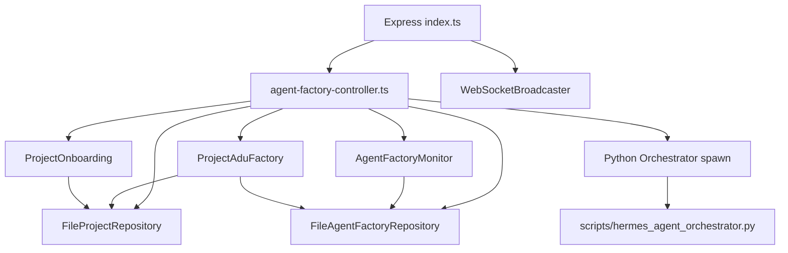
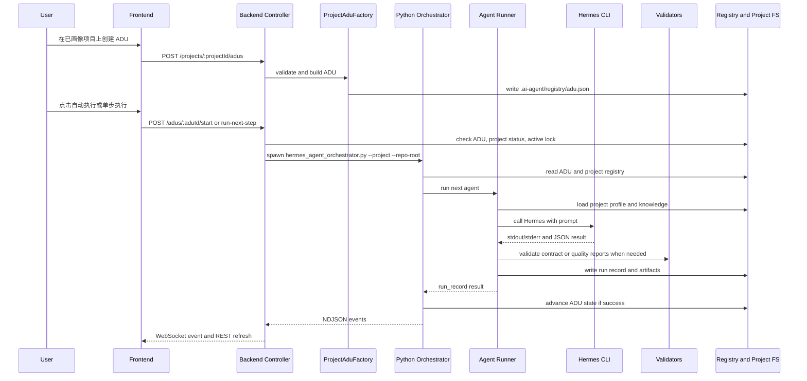

# Agent Factory Phase 2 代码架构与功能详解

**日期:** 2026-06-10  
**主题:** Phase 2 Project-Aware ADU Development 代码架构导读  
**适用范围:** 独立版 Agent Factory Dashboard，不包含历史 NMS 集成版本  
**目标读者:** 后端、前端、Agent Runtime、QA、接手维护的开发人员  
**相关设计文档:**
- `docs/superpowers/specs/2026-06-09-agent-factory-phase2-design.md`
- `docs/superpowers/plans/2026-06-09-agent-factory-phase2-project-aware-adu-development.md`
- `docs/superpowers/specs/2026-06-10-agent-factory-adu-intake-agent-design.md`

---

## 1. Phase 2 的核心定位

Phase 1 解决的是“任意 Git 仓库注册与项目画像”问题。Phase 2 在此基础上解决“基于已画像项目执行需求开发”问题。

Phase 2 的关键变化是：ADU 不再只是全局任务，而是可以绑定到某个已完成画像的 Git 项目。绑定之后，Agent Factory 会把该项目的画像、知识包、路径边界、命令策略和人工审核策略一起注入到 Agent 执行上下文中，让 Agent 在目标仓库内完成需求分析、详细设计、契约生成、测试编写、代码实现、代码审查、构建修复、验收审查和证据归档。

Phase 2 当前已经具备以下能力：

- 为已画像项目创建 Project-Aware ADU。
- 在看板中按项目查看 ADU、运行状态、Agent 日志、产物、质量报告和 Token 使用情况。
- 通过页面一键执行、继续执行、暂停、取消、单步执行。
- 在需求分析和详细设计两个关键节点进入人工审核门。
- 在页面编辑审核产物，并通过审核或打回重做。
- 根据项目画像和知识包为 Agent 提供项目上下文。
- 使用契约校验、代码审查校验、验收审查校验阻断错误流转。
- 使用路径白名单、真实路径解析、命令白名单和项目状态门禁保护执行边界。

---

## 2. 进程与运行时组成

Phase 2 由三类进程组成。

| 进程 | 代码位置 | 默认端口/入口 | 主要职责 |
|---|---|---|---|
| Dashboard Backend | `agent-factory-dashboard/backend/src/index.ts` | HTTP `3011`，WS `3012` | REST API、WebSocket、项目/ADU 元数据读写、调用 Python 编排器 |
| Dashboard Frontend | `agent-factory-dashboard/frontend/src` | Vite 默认 `5175` 或当前启动端口 | 项目管理、ADU 创建、编排控制、审核、产物查看和编辑 |
| Python Agent Runtime | `scripts/*.py` | 后端通过 `spawn("python3", ...)` 启动 | 项目画像、Agent 执行、状态机编排、质量门校验 |

典型启动环境变量：

```bash
AGENT_FACTORY_ENABLE_CONTROL=true
AGENT_FACTORY_WORKSPACE=/Users/hill/open5gs
HERMES_CONFIG_PATH=/Users/hill/.hermes/profiles/coding/config.yaml
PORT=3011
WS_PORT=3012
```

其中 `AGENT_FACTORY_ENABLE_CONTROL=true` 是变更类接口的总开关。未开启时，注册项目、创建 ADU、启动编排、审批、编辑产物等接口应拒绝执行。

---

## 3. 目录与数据布局

Phase 2 使用“全局注册表 + 项目本地产物”的混合存储模式。

### 3.1 全局注册表

全局注册表位于：

```text
/Users/hill/open5gs/.ai-agent/registry/
```

主要文件：

| 文件 | 含义 |
|---|---|
| `projects.json` | 已注册 Git 项目列表、项目状态、画像摘要 |
| `adu.json` | 全局 ADU 注册表，Project-Aware ADU 也登记在这里 |
| `runs.json` | Agent 执行历史汇总 |
| `agents.json` | Agent 定义、角色、状态 |
| `reviews.json` | 人工审核门记录 |
| `token-budget.json` | Token 预算配置 |
| `agent-model-settings.json` | 每个 Agent 的模型选择配置 |

全局注册表负责“看板统一视图”和“跨项目调度索引”，但不承载项目开发产物正文。

### 3.2 项目本地产物

已注册项目的画像产物位于目标仓库内：

```text
<target-repo>/.agent-factory/project-profile.json
<target-repo>/.agent-factory/knowledge/*.md
```

ADU 执行产物位于目标仓库内：

```text
<target-repo>/.ai-agent/analysis/
<target-repo>/.ai-agent/context-packs/
<target-repo>/.ai-agent/designs/
<target-repo>/.ai-agent/contracts/
<target-repo>/.ai-agent/runs/
<target-repo>/.ai-agent/reviews/
<target-repo>/.ai-agent/acceptance/
<target-repo>/.ai-agent/evidence/
```

这样做的好处是：

- 多项目之间产物天然隔离。
- 项目开发证据可以跟随目标仓库保存。
- Validator 可以基于 `--repo-root` 做跨项目路径校验。
- 看板仍可通过全局 ADU 索引聚合所有项目的任务状态。

---

## 4. 后端代码架构

后端位于：

```text
agent-factory-dashboard/backend/src/
```

整体分层如下：



### 4.1 配置入口

文件：

```text
agent-factory-dashboard/backend/src/config.ts
agent-factory-dashboard/backend/src/index.ts
```

`config.ts` 负责读取运行时环境变量，形成后端统一配置。重点字段包括：

- `workspaceRoot`: Agent Factory 主工作区，默认 `/Users/hill/open5gs`。
- `agentFactoryWorkspace`: `.ai-agent/registry` 的根参考。
- `projectsRegistryPath`: `projects.json` 路径，可通过环境变量覆盖。
- `hermesConfigPath`: Hermes 模型配置路径。
- `enableControl`: 是否允许变更类操作。
- `allowedProjectRoots`: 允许注册项目的根目录范围。

`index.ts` 负责实例化：

- `FileProjectRepository`
- `FileAgentFactoryRepository`
- `ProjectOnboarding`
- `ProjectAduFactory`
- `AgentFactoryMonitor`
- `WebSocketBroadcaster`
- REST 路由

开发人员排查“接口读的是不是正确目录”时，应先看 `config.ts` 和 `index.ts` 的实例化参数。

### 4.2 Domain 类型

文件：

```text
agent-factory-dashboard/backend/src/domain/project.ts
agent-factory-dashboard/backend/src/domain/agent-factory.ts
```

核心类型：

- `ProjectRecord`: 项目注册信息。
- `AgentFactoryAdu`: ADU 记录。
- `AgentFactoryRun`: 单次 Agent 执行记录。
- `AgentFactoryReview`: 人工审核门记录。
- `AgentFactoryCommandPolicy`: 命令策略。
- `AgentFactoryReviewPolicy`: 审核策略。

Project-Aware ADU 会在普通 ADU 基础上增加：

- `project_id`
- `project_name`
- `repo_path`
- `artifact_root`
- `profile_path`
- `knowledge_dir`
- `review_policy`
- `command_policy`

### 4.3 项目注册与画像

文件：

```text
agent-factory-dashboard/backend/src/application/project-onboarding.ts
agent-factory-dashboard/backend/src/infrastructure/file-project-repository.ts
scripts/project_profile_scan.py
scripts/hermes_project_profile.py
```

职责拆分：

- `FileProjectRepository` 负责项目注册表读写、路径安全校验、Git 顶级根校验、状态保存。
- `ProjectOnboarding` 负责注册项目、触发画像、更新项目状态。
- `project_profile_scan.py` 做确定性仓库扫描。
- `hermes_project_profile.py` 调用项目画像 Agent，生成 `project-profile.json` 和知识包。

项目状态流转：

```text
registered -> profiling -> profiled
                       -> profile_failed
profiled -> disabled
```

Phase 2 执行 ADU 的前置条件是项目必须为 `profiled`。后端控制层和 Python 编排器都会检查该条件。

### 4.4 Project-Aware ADU 创建

文件：

```text
agent-factory-dashboard/backend/src/application/project-adu-factory.ts
agent-factory-dashboard/backend/src/interfaces/agent-factory-controller.ts
```

主要接口：

```http
POST /api/agent-factory/projects/:projectId/adus
GET  /api/agent-factory/projects/:projectId/adus
GET  /api/agent-factory/adus/:aduId/project-context
```

`ProjectAduFactory` 是 Phase 2 的关键业务对象，负责把用户输入转换为系统可执行 ADU。

它会做以下事情：

- 校验项目存在且状态为 `profiled`。
- 校验项目画像文件和知识包目录存在。
- 校验 ADU ID 合法且不重复。
- 校验 title、goal、requirement_text 等必填字段。
- 校验 read/write 路径必须是项目内相对路径。
- 校验命令不得包含阻断片段，如 `rm -rf`、`sudo`、重定向到危险设备等。
- 合并项目画像中的 build/test 命令，形成命令白名单。
- 默认补齐中文文档语言、人工审核策略、命令策略、允许读写路径和执行状态。

创建后的 ADU 会写入全局：

```text
.ai-agent/registry/adu.json
```

但它的后续产物会写入目标项目：

```text
<target-repo>/.ai-agent/
```

### 4.5 Dashboard 聚合与工作流状态

文件：

```text
agent-factory-dashboard/backend/src/application/agent-factory-monitor.ts
```

`AgentFactoryMonitor` 负责把底层注册表转换为看板可用的数据模型，包括：

- ADU 队列。
- 当前选中 ADU 的工作流状态。
- Agent 状态。
- 最近运行记录。
- 产物列表。
- 健康状态。
- Token 统计。
- 质量报告摘要。

工作流 Timeline 中，Phase 2 主要状态如下：

| 状态 | Agent/门禁 | 含义 |
|---|---|---|
| `created` | `requirement-analyst` | 需求分析前 |
| `analysis_review` | 人工审核门 | 需求分析待审核 |
| `analyzed` | `context-pack` | 需求分析通过 |
| `contexted` | `detail-designer` | 上下文包完成 |
| `design_review` | 人工审核门 | 详细设计待审核 |
| `designed` | `contract` | 详细设计通过 |
| `contracted` | `testwriter` | 契约已生成 |
| `test_red` | `developer` | 测试已写，等待实现 |
| `implemented` | `code-reviewer` | 代码已实现，等待代码审查 |
| `code_reviewed` | `buildfix-debugger` | 代码审查通过 |
| `debugged` | `acceptance-reviewer` | 构建/测试修复完成 |
| `acceptance_reviewed` | `evidence` | 最终验收通过 |
| `evidenced` | 终态 | 证据归档完成 |
| `code_rework` | `developer` | 代码审查打回 |
| `acceptance_rework` | `developer` | 验收审查打回 |
| `human_gate` | 人工处理 | 兼容旧状态 |
| `failed` | 失败终止 | 编排失败 |
| `paused` | 暂停 | 用户暂停 |
| `canceled` | 取消 | 用户取消 |

### 4.6 REST Controller

文件：

```text
agent-factory-dashboard/backend/src/interfaces/agent-factory-controller.ts
```

这是后端最重要的集成点。它负责：

- 暴露所有 Dashboard API。
- 做 `AGENT_FACTORY_ENABLE_CONTROL` 变更接口保护。
- 对 Project-Aware ADU 做项目状态门禁。
- 检查活跃 lock，避免同一 ADU 并发启动。
- 调用 Python 编排器。
- 解析 Python NDJSON 事件，并通过 WebSocket 广播。
- 处理审核门批准、打回、产物编辑和质量报告读取。

常见编排接口：

```http
POST /api/agent-factory/adus/:aduId/start
POST /api/agent-factory/adus/:aduId/continue
POST /api/agent-factory/adus/:aduId/run-next-step
POST /api/agent-factory/adus/:aduId/pause
POST /api/agent-factory/adus/:aduId/cancel
```

常见审核和产物接口：

```http
GET  /api/agent-factory/adus/:aduId/reviews
POST /api/agent-factory/adus/:aduId/reviews/:gate/approve
POST /api/agent-factory/adus/:aduId/reviews/:gate/request-rework
GET  /api/agent-factory/artifacts?path=...
GET  /api/agent-factory/adus/:aduId/editable-artifacts
PUT  /api/agent-factory/adus/:aduId/editable-artifacts
GET  /api/agent-factory/adus/:aduId/quality-reports
```

Controller 中对 Project-Aware ADU 启动编排时，会追加：

```text
--project <projectId>
--repo-root <repoPath>
```

如果目标 ADU 绑定项目但缺少这两个参数，Python 编排器会拒绝运行。

### 4.7 文件仓储与安全边界

文件：

```text
agent-factory-dashboard/backend/src/infrastructure/file-agent-factory-repository.ts
agent-factory-dashboard/backend/src/infrastructure/file-project-repository.ts
```

`FileAgentFactoryRepository` 负责：

- 读取/写入 `adu.json`、`runs.json`、`reviews.json`。
- 根据 ADU 的 `repo_path` 解析项目本地产物。
- 对 artifact 读取执行 allowlist。
- 对路径执行 `realpath` 校验，防止符号链接逃逸。
- 对大文件读取执行截断和编辑阻断。

当前允许读取的项目产物目录包括：

```text
.agent-factory/project-profile.json
.agent-factory/knowledge/
.ai-agent/context-packs/
.ai-agent/analysis/
.ai-agent/designs/
.ai-agent/contracts/
.ai-agent/runs/
.ai-agent/reviews/
.ai-agent/acceptance/
.ai-agent/evidence/
tests/ai-agent-mvp/
```

如果看板某个 artifact 面板报 500，且后端日志出现 `Access denied`，优先检查该产物目录是否被仓储 allowlist 覆盖。

`FileProjectRepository` 负责：

- 校验项目路径位于允许根目录内。
- 校验路径不是危险目录。
- 校验 Git 顶级根与注册路径一致。
- 处理 macOS `/tmp` 与 `/private/tmp` 真实路径差异。
- 维护 `projects.json`。

---

## 5. Python Runtime 架构

Python Runtime 位于：

```text
scripts/
```

### 5.1 项目画像脚本

文件：

```text
scripts/project_profile_scan.py
scripts/hermes_project_profile.py
```

`project_profile_scan.py` 是确定性扫描器，负责识别：

- 语言栈。
- 包管理器。
- 构建命令。
- 测试命令。
- 目录结构。
- 关键配置文件。

`hermes_project_profile.py` 在确定性扫描基础上调用 Hermes Agent 生成项目画像和知识包，输出到：

```text
<target-repo>/.agent-factory/project-profile.json
<target-repo>/.agent-factory/knowledge/*.md
```

### 5.2 编排器

文件：

```text
scripts/hermes_agent_orchestrator.py
```

编排器负责 ADU 状态机推进。它不直接调用大模型，而是按状态选择下一个 Agent，再调用 `hermes_agent_run.py`。

核心能力：

- 支持 `start`、`continue`、`step`、`pause`、`cancel`。
- 读取 `adu.json` 中当前状态。
- 对 Project-Aware ADU 校验 `--project` 和 `--repo-root`。
- 校验项目状态必须为 `profiled`。
- 使用 lock 防止并发执行同一个 ADU。
- 在每一步执行前后重新读取 ADU，避免暂停/取消被旧内存覆盖。
- 进入 `analysis_review` 和 `design_review` 时创建 pending review。
- 如果 `review_policy` 关闭对应审核门，则自动推进。
- Agent 失败时广播 `agent_failed` 并停止推进。
- 输出 NDJSON 事件供后端 WebSocket 转发。

编排状态机核心映射：

| 当前状态 | Agent | 成功后状态 |
|---|---|---|
| `created` | `requirement-analyst` | `analysis_review` |
| `analysis_review` | 无 | 等待审核或自动推进到 `analyzed` |
| `analyzed` | `context-pack` | `contexted` |
| `contexted` | `detail-designer` | `design_review` |
| `design_review` | 无 | 等待审核或自动推进到 `designed` |
| `designed` | `contract` | `contracted` |
| `contracted` | `testwriter` | `test_red` |
| `test_red` | `developer` | `implemented` |
| `code_rework` | `developer` | `implemented` |
| `acceptance_rework` | `developer` | `implemented` |
| `implemented` | `code-reviewer` | `code_reviewed` |
| `code_reviewed` | `buildfix-debugger` | `debugged` |
| `debugged` | `acceptance-reviewer` | `acceptance_reviewed` |
| `acceptance_reviewed` | `evidence` | `evidenced` |

### 5.3 Agent Runner

文件：

```text
scripts/hermes_agent_run.py
```

Runner 负责执行单个 Agent。它的职责比编排器更靠近“Agent 调用现场”。

执行流程：

1. 读取 ADU、Agent 定义、模型配置和项目记录。
2. 如果是 Project-Aware ADU，加载项目画像和知识包。
3. 组装 payload，包括：
   - ADU 基本信息。
   - 当前状态。
   - 允许读写路径。
   - 命令策略。
   - 审核策略。
   - 项目画像。
   - 项目知识包。
   - 最近运行记录。
   - Token 预算。
4. 渲染对应 Agent Prompt。
5. 注入中文输出约束。
6. 调用 Hermes CLI。
7. 解析 Agent 输出中的 JSON。
8. 根据 Agent 类型执行本地 Validator。
9. 只有 `run_result == "success"` 时才推进 ADU 状态。
10. 写入 run record 和 Token 使用记录。

一个容易误解的点是：Agent stdout 中返回 `status: "success"` 不代表最终 run 一定成功。Runner 还会执行本地质量门校验。如果 Validator 不通过，最终 `run_record.result` 会是 `failed`，看板日志也会显示 failed。

这就是“contract stdout 显示 success，但 Agent Execution Logs 显示 failed”的根本原因：大模型认为自己成功了，但本地规则认为它生成的契约不合格。

### 5.4 Validator

文件：

```text
scripts/validate_agent_contract.py
scripts/validate_quality_report.py
```

`validate_agent_contract.py` 校验 contract Agent 生成的契约，包括：

- 契约版本和基础字段。
- acceptance assertions。
- negative assertions。
- evidence requirements。
- 每个 must-pass 断言必须可验证。
- 契约授权写路径不得超出 ADU 的 `allowed_write_paths`。
- `verification_command` 必须符合 ADU 的 `command_policy`。
- 命令不得命中 `blocked_command_patterns`。

`validate_quality_report.py` 校验代码审查和最终验收报告，包括：

- code-review 报告不能在 `pass` 状态下夹带 P1/P2 finding。
- code-review `pass` 时不能存在 required fixes/actions。
- acceptance 报告必须覆盖 contract 中所有 must-pass assertion。
- acceptance 报告必须覆盖 negative assertions。
- evidence 路径必须位于当前项目内，禁止跨项目引用。

Validator 是 Phase 2 防止“看起来成功但实际偏离预期”的关键质量门。

---

## 6. 前端代码架构

前端位于：

```text
agent-factory-dashboard/frontend/src/
```

### 6.1 API 层

文件：

```text
agent-factory-dashboard/frontend/src/api/agentFactory.ts
```

该文件封装所有后端接口，包括：

- dashboard 获取。
- 项目列表、注册、画像、禁用。
- 创建 Project-Aware ADU。
- 获取项目上下文。
- 编排控制。
- 审核批准/打回。
- 可编辑产物读取/保存。
- 质量报告读取。
- 模型配置和 Token 预算读取。

如果后端新增接口，应优先在这里补 API 封装，再进入 Zustand store。

### 6.2 状态管理

文件：

```text
agent-factory-dashboard/frontend/src/stores/agentFactory.ts
```

Zustand store 是前端状态中心，负责：

- 保存 dashboard 快照。
- 保存项目列表。
- 保存当前选中项目和 ADU。
- 保存项目上下文。
- 保存审核记录。
- 保存可编辑产物。
- 保存质量报告。
- 封装 start/continue/step/pause/cancel 等 action。
- 接收 WebSocket 事件后触发刷新。

看板大部分组件不直接调用 fetch，而是通过 store action 间接访问后端。

### 6.3 项目页面

文件：

```text
agent-factory-dashboard/frontend/src/components/projects/
```

核心组件：

| 组件 | 作用 |
|---|---|
| `ProjectsPage.tsx` | 项目列表、状态展示、画像入口、创建 ADU 入口 |
| `RegisterProjectModal.tsx` | 注册 Git 项目 |
| `ProjectProfilePanel.tsx` | 展示项目画像 |
| `KnowledgePackPanel.tsx` | 展示知识包 |
| `CreateProjectAduModal.tsx` | 手工创建 Project-Aware ADU |

当前手工创建 ADU 仍然偏工程化，需要用户填写较多字段。后续 ADU Intake Agent 会在此基础上提供“自然语言/文档上传 -> ADU 草稿 -> 人工确认 -> 注册”的入口。

### 6.4 Agent Factory 执行页面

文件：

```text
agent-factory-dashboard/frontend/src/components/agent-factory/
```

核心组件：

| 组件 | 作用 |
|---|---|
| `AgentFactoryPage.tsx` | 看板主页面布局 |
| `AduQueuePanel.tsx` | ADU 队列 |
| `WorkflowTimeline.tsx` | Requirement Progress Pipeline |
| `AgentLanePanel.tsx` | Agent 角色和运行状态 |
| `RunHistoryTable.tsx` | Agent Execution Logs |
| `OrchestratorControlPanel.tsx` | 一键执行、继续、单步、暂停、取消 |
| `ReviewGatePanel.tsx` | 需求分析/详细设计审核 |
| `EditableArtifactTabs.tsx` | 可编辑文档 tab |
| `MarkdownArtifactEditor.tsx` | Markdown 产物编辑器 |
| `ProjectContextPanel.tsx` | 项目画像、知识包、策略上下文 |
| `QualityReportPanel.tsx` | 契约、代码审查、验收报告 |
| `QualityReportBadge.tsx` | 质量门状态徽章 |
| `TokenBudgetChart.tsx` | Token 使用情况 |
| `ModelSelectionCard.tsx` | Agent 模型选择 |
| `ArtifactDrawer.tsx` | 右侧产物抽屉 |

`OrchestratorControlPanel.tsx` 有本地 pending action 状态，用于防止用户点击后后端尚未刷新时重复点击。后端仍然以 lock 作为最终并发保护。

---

## 7. 一次 Project-Aware ADU 的完整数据流

下面是一条典型 Phase 2 执行链路。



人工审核门出现在：

```text
analysis_review
design_review
```

如果审核通过：

- `analysis_review -> analyzed`
- `design_review -> designed`

如果审核打回：

- 当前状态回到上一个可重新生成文档的阶段。
- 对应 Agent 后续重新执行。

---

## 8. 质量门如何防止“实现结果与预期不一致”

Phase 2 质量体系由三层组成。

### 8.1 Contract 是机器可校验的验收标准

Contract Agent 生成的契约不是普通说明文，而是后续开发和验收的硬约束。

契约至少应表达：

- 本需求允许修改哪些路径。
- 必须满足哪些 acceptance assertions。
- 必须禁止哪些 negative assertions。
- 每个 assertion 如何验证。
- 需要归档哪些 evidence。

如果契约缺少验证命令或人工验证步骤，Validator 会阻断。

### 8.2 Code Reviewer 防止低质量实现进入调试阶段

`code-reviewer` 负责审查 developer 的实现结果。它的报告会被 `validate_quality_report.py --kind code-review` 校验。

如果报告声称 `pass`，但仍包含 P1/P2 缺陷或 required fixes/actions，本地 Validator 会判定无效。

失败后状态不应进入 `code_reviewed`，而应停留或进入 rework 路径，等待 developer 重新实现。

### 8.3 Acceptance Reviewer 防止偏离需求进入 evidenced

`acceptance-reviewer` 负责把最终实现结果与 Contract 做逐项对照。

Validator 会强制检查：

- must-pass assertion 是否全部覆盖。
- negative assertion 是否全部覆盖。
- 覆盖结果是否都是 pass。
- evidence 是否位于当前项目范围内。

如果验收报告空泛地写 `pass`，但没有逐项覆盖 Contract，系统应阻断进入 `evidenced`。

---

## 9. 安全模型

Phase 2 的安全模型不是只靠 Prompt，而是由后端、Python 和 Validator 多层防护组成。

### 9.1 项目状态门禁

只有 `profiled` 项目可以执行 ADU。

门禁位置：

- 后端 Controller 在 spawn 前检查。
- Python Orchestrator 在运行前检查。
- ProjectAduFactory 在创建 ADU 时检查。

### 9.2 路径隔离

路径隔离原则：

- 项目注册路径必须是 Git 顶级根。
- Project-Aware ADU 的读写路径必须是 repo-relative。
- Artifact 读取必须落在 allowlist 内。
- 真实路径通过 `realpath` 解析，防止 symlink 绕过。
- Validator 使用 `--repo-root` 判断 evidence 和写路径是否跨项目。

### 9.3 命令策略

ADU 中的 `command_policy` 是执行命令的硬边界。

典型结构：

```json
{
  "mode": "allowlist",
  "allowed_commands": [
    "ctest --test-dir build --output-on-failure",
    "cmake --build build"
  ],
  "blocked_command_patterns": [
    "rm -rf",
    "sudo",
    "> /dev/"
  ]
}
```

Contract 中的 `verification_command` 必须匹配 allowlist，且不能命中 blocked patterns。

### 9.4 并发锁

同一个 ADU 不能同时启动多个编排进程。

锁文件位于：

```text
.ai-agent/locks/<aduId>.lock
```

后端在 spawn 前检查锁，编排器运行期间维护锁。前端按钮置灰只是用户体验保护，真正的并发保护在后端和 Python 层。

### 9.5 Token 预算与模型选择

Token 相关文件：

```text
.ai-agent/registry/token-budget.json
.ai-agent/registry/agent-model-settings.json
```

相关后端文件：

```text
agent-factory-dashboard/backend/src/infrastructure/token-budget-repository.ts
agent-factory-dashboard/backend/src/infrastructure/agent-model-settings-repository.ts
agent-factory-dashboard/backend/src/infrastructure/hermes-config-repository.ts
```

Runner 会记录每一步真实 Token 使用。Token 看板按 ADU 聚合 runs 数据。

模型选择从 Hermes 配置中读取可用 provider/model，并保存每个 Agent 的选择。高推理难度 Agent 通常适合更强模型，例如 requirement-analyst、detail-designer、contract、code-reviewer、acceptance-reviewer；执行性较强或格式化较多的 Agent 可以用性价比模型，例如 context-pack、testwriter、buildfix-debugger、evidence。

---

## 10. 常见开发和排障入口

### 10.1 看板某个接口 500

先看后端日志。常见原因：

- Artifact 目录未加入 `FileAgentFactoryRepository` allowlist。
- ADU 绑定的项目路径不存在。
- 项目画像文件缺失。
- JSON 注册表损坏。
- 后端 `dist` 未重新 build，运行的还是旧代码。

重点文件：

```text
agent-factory-dashboard/backend/src/infrastructure/file-agent-factory-repository.ts
agent-factory-dashboard/backend/src/interfaces/agent-factory-controller.ts
```

### 10.2 stdout 显示 success，但 Run Result 是 failed

这是正常设计，不一定是 bug。

排查顺序：

1. 打开 `Agent Execution Logs`。
2. 查看该 run 的 `result`、`error`、`parsed_result`。
3. 打开项目本地 `.ai-agent/runs/<aduId>/...`。
4. 如果是 contract/code-review/acceptance，运行对应 Validator。

常见原因：

- Contract 生成了不在 allowlist 内的 `verification_command`。
- Contract 缺少 assertion 的验证方式。
- Acceptance 报告没有覆盖全部 must-pass assertion。
- Code review 报告 pass 但夹带 P1/P2 finding。

### 10.3 点击单步执行后按钮仍可点

前端应通过 `OrchestratorControlPanel.tsx` 的 pending action 立即禁用按钮，后端通过 lock 做最终保护。

如果按钮没有进入 pending：

- 检查 store action 是否抛错。
- 检查 API 是否返回 4xx/5xx。
- 检查组件是否正确接入 local pending state。

### 10.4 状态没有推进

状态推进只发生在 Runner 最终 `run_result == "success"` 且 Validator 通过时。

排查顺序：

1. 看 ADU 当前 state。
2. 看最新 run 的 `agent` 和 `result`。
3. 看编排器 stdout 是否有 `agent_failed`。
4. 看是否卡在 `analysis_review` 或 `design_review` 审核门。
5. 看 `review_policy` 是否要求人工审核。
6. 看是否有 active lock。

### 10.5 项目 ADU 无法启动

常见原因：

- 项目不是 `profiled`。
- ADU 绑定项目但启动时没有传 `--project` 和 `--repo-root`。
- 项目被 disabled。
- 项目 registry 中 repo path 与 Git top-level 不一致。
- 后端环境变量指向了错误 workspace。

---

## 11. 测试与验证命令

后端构建：

```bash
cd /Users/hill/open5gs/agent-factory-dashboard/backend
npm run build
```

前端构建：

```bash
cd /Users/hill/open5gs/agent-factory-dashboard/frontend
npm run build
```

项目 ADU 相关测试：

```bash
cd /Users/hill/open5gs/agent-factory-dashboard/backend
npm run test:project-adu
```

项目注册与画像测试：

```bash
cd /Users/hill/open5gs/agent-factory-dashboard/backend
npm run test:onboarding
```

审核门测试：

```bash
cd /Users/hill/open5gs/agent-factory-dashboard/backend
npm run test:review-gate
```

质量门测试：

```bash
cd /Users/hill/open5gs/agent-factory-dashboard/backend
npm run test:quality-gates
```

Python Validator 测试：

```bash
cd /Users/hill/open5gs
python3 scripts/test_validate_agent_contract.py
python3 scripts/test_validate_quality_report.py
python3 scripts/test_e2e_project_adu.py
```

Python 语法检查：

```bash
cd /Users/hill/open5gs
python3 -m py_compile \
  scripts/hermes_agent_orchestrator.py \
  scripts/hermes_agent_run.py \
  scripts/hermes_project_profile.py \
  scripts/project_profile_scan.py \
  scripts/validate_agent_contract.py \
  scripts/validate_quality_report.py
```

---

## 12. 扩展开发指南

### 12.1 新增一个 Agent

需要修改：

```text
.ai-agent/registry/agents.json
.ai-agent/prompts/<new-agent>.md
scripts/hermes_agent_orchestrator.py
scripts/hermes_agent_run.py
agent-factory-dashboard/backend/src/application/agent-factory-monitor.ts
agent-factory-dashboard/frontend/src/types/agent-factory.ts
```

如果新 Agent 会生成质量报告，还需要新增或扩展 Validator。

### 12.2 新增一个状态

需要修改：

```text
scripts/hermes_agent_orchestrator.py
scripts/hermes_agent_run.py
scripts/hermes_agent_next.py
agent-factory-dashboard/backend/src/domain/agent-factory.ts
agent-factory-dashboard/backend/src/application/agent-factory-monitor.ts
agent-factory-dashboard/frontend/src/types/agent-factory.ts
agent-factory-dashboard/frontend/src/components/agent-factory/WorkflowTimeline.tsx
```

状态新增后必须检查：

- Timeline 是否显示。
- NEXT_AGENT 是否映射正确。
- 单步执行是否能找到下一步。
- 审核门是否特殊处理。
- 失败时是否不推进。

### 12.3 新增一个产物目录

需要修改：

```text
agent-factory-dashboard/backend/src/infrastructure/file-agent-factory-repository.ts
agent-factory-dashboard/backend/src/application/agent-factory-monitor.ts
scripts/hermes_agent_run.py
```

同时必须新增反例测试，确认：

- 允许目录可以读取。
- 非允许目录不可读取。
- symlink 指向外部目录不可读取。
- 大文件被截断，编辑接口阻断截断保存。

### 12.4 新增一种项目画像字段

需要修改：

```text
scripts/project_profile_scan.py
scripts/hermes_project_profile.py
agent-factory-dashboard/backend/src/domain/project.ts
agent-factory-dashboard/frontend/src/types/agent-factory.ts
agent-factory-dashboard/frontend/src/components/projects/ProjectProfilePanel.tsx
agent-factory-dashboard/frontend/src/components/agent-factory/ProjectContextPanel.tsx
```

如果字段会影响 ADU 创建，例如新增默认测试命令，需要同步修改：

```text
agent-factory-dashboard/backend/src/application/project-adu-factory.ts
```

### 12.5 新增命令策略规则

需要修改：

```text
agent-factory-dashboard/backend/src/application/project-adu-factory.ts
scripts/validate_agent_contract.py
.ai-agent/prompts/contract-agent.md
```

原则是：创建 ADU 时阻断明显危险命令，Contract Validator 再阻断 Agent 生成的不合规验证命令。

---

## 13. 已知限制和后续方向

当前 Phase 2 还有一些设计债和下一阶段方向。

### 13.1 ADU 创建仍偏繁琐

虽然 Phase 2 支持 Project-Aware ADU，但当前 `CreateProjectAduModal.tsx` 仍要求用户填写较多工程字段。

后续应引入 ADU Intake Agent：

- 支持上传原始需求文档。
- 支持自然语言输入需求。
- 自动生成 ADU 草稿。
- 由用户审核后再调用现有 `POST /projects/:projectId/adus` 注册。

相关设计文档：

```text
docs/superpowers/specs/2026-06-10-agent-factory-adu-intake-agent-design.md
```

### 13.2 Prompt 质量仍是结果质量关键变量

Phase 2 已有 Contract、Code Review、Acceptance Review 三层质量门，但如果需求分析或详细设计质量不高，后续 Agent 仍可能沿着错误方向执行。

建议继续增强：

- requirement-analyst 的澄清问题能力。
- detail-designer 的变更影响分析能力。
- contract-agent 的可验证断言生成能力。
- acceptance-reviewer 的证据绑定能力。

### 13.3 命令 allowlist 与真实项目差异

ProjectAduFactory 会合并项目画像中的 build/test 命令作为 allowlist 基础，但不同需求可能需要额外命令。

建议后续支持：

- 从项目画像中抽取更完整的命令集合。
- 在 ADU Intake 阶段提示用户确认新增命令。
- 对命令按风险分级，而不是只有 allow/block。

### 13.4 Legacy 测试产物目录

当前 allowlist 中仍保留：

```text
tests/ai-agent-mvp/
```

这是历史测试路径兼容。未来如果项目本地产物完全迁移到 `.ai-agent/`，可以考虑逐步淘汰该路径。

---

## 14. 开发人员快速阅读顺序

如果只想快速理解 Phase 2，建议按以下顺序阅读代码：

1. `agent-factory-dashboard/backend/src/domain/agent-factory.ts`
2. `agent-factory-dashboard/backend/src/domain/project.ts`
3. `agent-factory-dashboard/backend/src/application/project-adu-factory.ts`
4. `agent-factory-dashboard/backend/src/interfaces/agent-factory-controller.ts`
5. `scripts/hermes_agent_orchestrator.py`
6. `scripts/hermes_agent_run.py`
7. `scripts/validate_agent_contract.py`
8. `scripts/validate_quality_report.py`
9. `agent-factory-dashboard/frontend/src/stores/agentFactory.ts`
10. `agent-factory-dashboard/frontend/src/components/agent-factory/OrchestratorControlPanel.tsx`
11. `agent-factory-dashboard/frontend/src/components/agent-factory/ReviewGatePanel.tsx`
12. `agent-factory-dashboard/frontend/src/components/projects/CreateProjectAduModal.tsx`

如果是排查运行问题，优先看：

1. 后端日志。
2. `Agent Execution Logs`。
3. `<target-repo>/.ai-agent/runs/<aduId>/`。
4. `.ai-agent/registry/adu.json`。
5. `.ai-agent/registry/runs.json`。
6. 对应 Validator 的命令行输出。

---

## 15. 一句话总结

Phase 2 的代码架构可以理解为：TypeScript 后端负责项目和 ADU 的安全入口、Python 编排器负责状态机、Runner 负责单个 Agent 调用和质量门、Validator 负责把模型输出变成可阻断的硬规则、React Dashboard 负责把整个过程以可审核、可编辑、可控制的方式暴露给用户。

