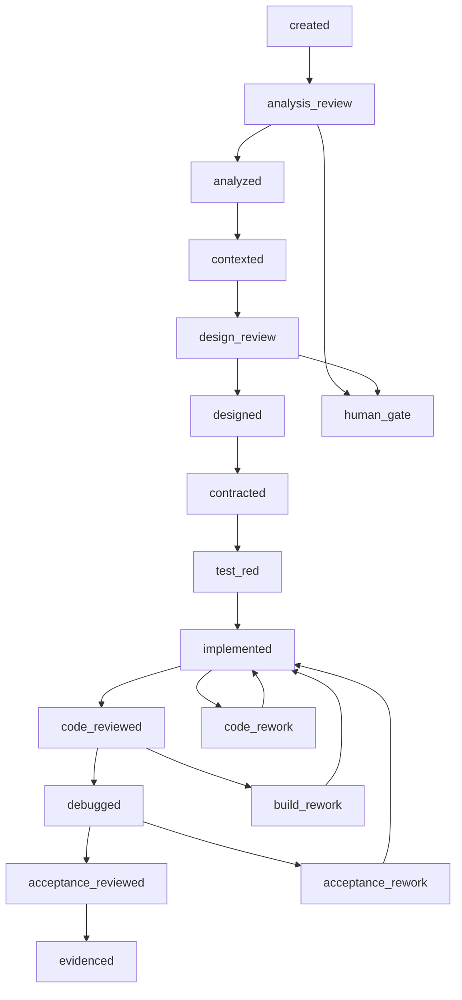
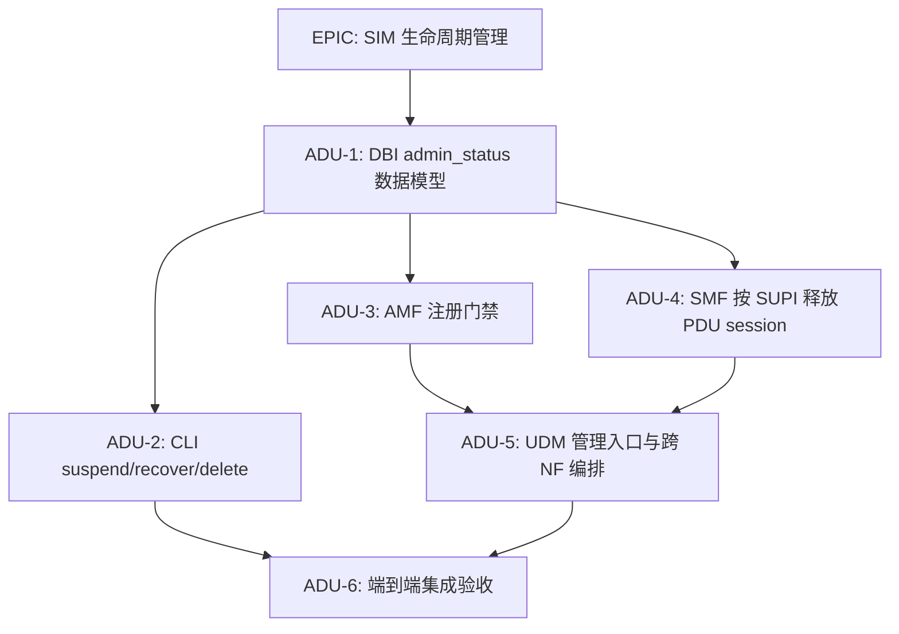
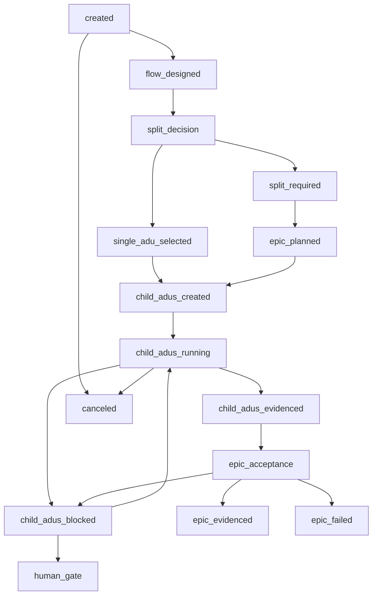

# Agent Factory Phase 3: Epic Orchestration Design Spec

**日期:** 2026-06-11  
**主题:** Agent Factory Phase 3 Epic + 多 ADU 编排  
**适用范围:** 独立版 Agent Factory Dashboard，不包含历史 NMS 集成版本  
**目标读者:** 新接手的 AI Agent、Antigravity、后端、前端、Agent Runtime、QA  
**状态:** Draft for Phase 3 development

---

## 1. 文档目的

Phase 1 已完成通用 Git 仓库注册与项目画像。Phase 2 已完成 Project-Aware 单 ADU 需求开发闭环。Phase 2.5 增强了 ADU Intake、单步执行、人工审核、质量门、模型选择、Token 监控、独立 Dashboard、rework feedback 回流等能力。

Phase 3 的目标是把 Agent Factory 从“单 ADU 自动开发流水线”升级为“Epic + 多 ADU DAG 编排工厂”，用于处理业务描述看似简单、但在目标项目中涉及跨模块、跨服务、跨运行时链路的需求。

典型例子是 Open5GS 中的 SIM 卡远程生命周期管理：

- Remote Suspend: 更新 MongoDB 状态，禁止新注册，并强制释放现有 PDU 会话。
- Remote Recovery: 恢复正常注册和会话建立。
- Remote Delete: 删除签约数据并回收号码资源。

该需求的业务动作只有三个，但技术落点涉及 DBI、MongoDB、CLI/API、AMF、SMF、UDM、UDR、SBI 路由、会话释放和端到端验收。当前 Phase 2 单 ADU 流程会反复出现“函数有实现但无 caller”“局部实现通过但端到端链路不闭合”“developer 用 risks 解释未完成项而 code-reviewer 不接受”等问题。

Phase 3 不应替代 Phase 2，而应在 Phase 2 之上增加复杂需求拆解、依赖编排和父级端到端验收。

---

## 2. 当前版本画像

### 2.1 当前能力阶段

当前版本可称为 **Phase 2.5 Project-Aware Single-ADU Factory**。

它已经具备：

- 任意 Git 仓库注册、Git 顶级根校验、路径安全校验。
- 项目画像与知识包生成。
- 基于已画像项目创建 Project-Aware ADU。
- ADU Intake Agent：把自然语言和上传文件转换为结构化 ADU draft。
- 独立 Dashboard：项目管理、ADU 队列、Agent 状态、Workflow Timeline、运行日志、质量报告、Token 使用、模型选择。
- 页面编排控制：自动执行、继续、单步执行、暂停、取消。
- 人工审核门：需求分析和详细设计文档可页面编辑、通过、打回。
- Agent 执行链路：
  - `requirement-analyst`
  - `context-pack`
  - `detail-designer`
  - `contract`
  - `testwriter`
  - `developer`
  - `code-reviewer`
  - `buildfix-debugger`
  - `acceptance-reviewer`
  - `evidence`
- 质量门：
  - Contract validator
  - Code review validator
  - Acceptance review validator
- rework feedback 回流：
  - `code_rework -> developer` 注入 code-review 报告。
  - `build_rework -> developer` 注入 buildfix/debugger validation summary。
  - `acceptance_rework -> developer` 注入 acceptance-review 报告。
- 项目级产物隔离：
  - 全局注册表在 `/Users/hill/open5gs/.ai-agent/registry/`
  - 项目执行产物在 `<target-repo>/.ai-agent/`
  - 项目画像在 `<target-repo>/.agent-factory/`

### 2.2 当前代码入口

后端：

```text
agent-factory-dashboard/backend/src/index.ts
agent-factory-dashboard/backend/src/config.ts
agent-factory-dashboard/backend/src/interfaces/agent-factory-controller.ts
agent-factory-dashboard/backend/src/application/agent-factory-monitor.ts
agent-factory-dashboard/backend/src/application/project-onboarding.ts
agent-factory-dashboard/backend/src/application/project-adu-factory.ts
agent-factory-dashboard/backend/src/application/adu-intake.ts
agent-factory-dashboard/backend/src/domain/agent-factory.ts
agent-factory-dashboard/backend/src/domain/project.ts
agent-factory-dashboard/backend/src/infrastructure/file-agent-factory-repository.ts
agent-factory-dashboard/backend/src/infrastructure/file-project-repository.ts
agent-factory-dashboard/backend/src/infrastructure/agent-model-settings-repository.ts
agent-factory-dashboard/backend/src/infrastructure/token-budget-repository.ts
```

前端：

```text
agent-factory-dashboard/frontend/src/App.tsx
agent-factory-dashboard/frontend/src/api/agentFactory.ts
agent-factory-dashboard/frontend/src/stores/agentFactory.ts
agent-factory-dashboard/frontend/src/types/agent-factory.ts
agent-factory-dashboard/frontend/src/components/agent-factory/
agent-factory-dashboard/frontend/src/components/projects/
agent-factory-dashboard/frontend/src/components/intake/
```

Python Runtime：

```text
scripts/hermes_agent_orchestrator.py
scripts/hermes_agent_run.py
scripts/hermes_agent_next.py
scripts/hermes_agent_status.py
scripts/hermes_project_profile.py
scripts/project_profile_scan.py
scripts/validate_agent_contract.py
scripts/validate_quality_report.py
```

Agent Prompt：

```text
.ai-agent/prompts/requirement-analyst-agent.md
.ai-agent/prompts/context-pack-agent.md
.ai-agent/prompts/detail-designer-agent.md
.ai-agent/prompts/contract-agent.md
.ai-agent/prompts/testwriter-agent.md
.ai-agent/prompts/developer-agent.md
.ai-agent/prompts/code-reviewer-agent.md
.ai-agent/prompts/buildfix-debugger-agent.md
.ai-agent/prompts/acceptance-reviewer-agent.md
.ai-agent/prompts/evidence-agent.md
.ai-agent/prompts/project-profiler-agent.md
.ai-agent/prompts/adu-intake-agent.md
```

### 2.3 当前全局注册表

```text
/Users/hill/open5gs/.ai-agent/registry/
├── projects.json
├── adu.json
├── runs.json
├── agents.json
├── reviews.json
├── token-budget.json
└── agent-model-settings.json
```

### 2.4 当前项目级产物布局

```text
<target-repo>/.agent-factory/
├── project-profile.json
└── knowledge/*.md

<target-repo>/.ai-agent/
├── analysis/
├── context-packs/
├── designs/
├── contracts/
├── runs/
├── reviews/
├── acceptance/
└── evidence/
```

### 2.5 当前单 ADU 状态机



### 2.6 当前版本已知短板

当前流程适合单个可闭环 ADU，但对跨模块链路型需求存在短板：

1. 缺少 Epic / Feature 级对象。原始需求只能直接注册为 ADU。
2. 缺少“是否需要拆分”的自动判断。
3. 缺少系统调用链设计门禁。detail-designer 容易直接进入文件级设计，未必先锁定端到端链路。
4. 缺少子 ADU DAG 和依赖调度。
5. 缺少父级端到端验收。多个子 ADU 即使分别 evidenced，也需要总体验收确认业务动作闭环。
6. code-review/buildfix/acceptance 的失败项目前虽能反馈给 developer，但缺少 rework-planner 对 findings 做“最小下一轮修复计划”。
7. 对大上下文 rework，developer 模型容易出现重复输出、非法 JSON、局部修复和风险解释替代实现。

---

## 3. Phase 3 目标和非目标

### 3.1 目标

Phase 3 必须实现：

1. 新增 Epic / Feature 对象，用于承载原始复杂需求。
2. 新增 System-Flow Designer Agent，把自然语言需求转换为系统级调用链、数据流、状态流和端到端验收点。
3. 新增 ADU Splitter Agent，判断需求是否可作为单 ADU 执行；若不可，则拆成多个子 ADU 并生成 DAG 依赖图。
4. 新增 Epic Orchestrator，按 DAG 调度子 ADU，聚合 Epic 状态，处理阻塞和最终验收。
5. 新增 Rework Planner Agent，把 code-review/buildfix/acceptance 失败项转换为下一轮最小修复计划。
6. 新增 Epic Acceptance Reviewer Agent，在所有必要子 ADU evidenced 后执行父级端到端验收。
7. Dashboard 支持 Epic 列表、Epic DAG、子 ADU 状态聚合、阻塞定位和父级验收结果。
8. Phase 2 单 ADU 流程必须保持兼容，不能破坏已有项目注册、ADU 创建、单步执行、质量门和产物读取能力。

### 3.2 非目标

Phase 3 MVP 不做：

1. 不做跨 Git 仓库事务提交。
2. 不做自动 merge/rebase。
3. 不做远程 CI 云端调度。
4. 不做复杂资源调度系统；MVP 只支持本地并发上限。
5. 不改历史 NMS 集成版本。
6. 不要求所有 Epic 都必须拆分；小需求仍可走单 ADU。

---

## 4. 设计原则

1. **Epic 负责决策和聚合，ADU 负责开发闭环。**  
   Epic 不直接进入 developer。实际编码仍由子 ADU 使用 Phase 2 流程完成。

2. **复杂性前移。**  
   系统调用链、数据流、端到端验收、拆分边界必须在 developer 前明确。

3. **DAG 优先于线性序列。**  
   子 ADU 可以存在依赖和并行机会，不应全部硬排成单线。

4. **失败先规划再返工。**  
   code-review/buildfix/acceptance fail 后先进入 `rework-planner`，再回 developer，避免把一大包 findings 直接扔给 developer。

5. **父级验收不可省略。**  
   子 ADU 全部 evidenced 只说明局部完成，不等于业务需求端到端完成。

6. **兼容现有 Phase 2。**  
   单 ADU 和旧 Project-Aware ADU 必须继续可用。

---

## 5. 新增核心概念

### 5.1 Epic

Epic 表示用户原始复杂需求。

示例：

```json
{
  "id": "EPIC-SIM-LIFECYCLE-001",
  "project_id": "open5gs",
  "title": "SIM 卡远程生命周期管理",
  "source_requirement": "支持遥晕、遥晕恢复、遥闭，并强制释放现有 PDU 会话。",
  "state": "split_required",
  "child_adus": [],
  "dependencies": [],
  "created_at": "2026-06-11T00:00:00.000Z",
  "updated_at": "2026-06-11T00:00:00.000Z"
}
```

Epic 的职责：

- 保存原始需求。
- 保存系统链路设计。
- 保存拆分决策。
- 保存子 ADU DAG。
- 聚合子 ADU 状态。
- 触发父级验收。

### 5.2 Child ADU

Child ADU 仍是普通 Project-Aware ADU，但增加父级字段：

```json
{
  "id": "ADU-SIM-003",
  "parent_epic_id": "EPIC-SIM-LIFECYCLE-001",
  "depends_on": ["ADU-SIM-001"],
  "scope": "AMF registration gate for suspended SIM",
  "integration_role": "Blocks suspended UE registration after admin_status is set"
}
```

Child ADU 继续使用现有状态机和 Agent：

```text
requirement-analyst -> context-pack -> detail-designer -> contract -> testwriter -> developer -> code-reviewer -> buildfix-debugger -> acceptance-reviewer -> evidence
```

### 5.3 Epic DAG

Epic DAG 表示子 ADU 的依赖关系。

SIM 生命周期需求的示例 DAG：



---

## 6. Phase 3 Agent 设计

### 6.1 system-flow-designer

**职责:** 把原始需求转换成系统级链路设计。

输入：

- Epic 原始需求。
- 项目画像 `project-profile.json`。
- 项目知识包 `.agent-factory/knowledge/*.md`。
- 可选：用户指定的目标模块、约束、非目标。

输出文件：

```text
<target-repo>/.ai-agent/epics/<EPIC_ID>/system-flow.md
<target-repo>/.ai-agent/epics/<EPIC_ID>/system-flow.json
```

`system-flow.json` 最小结构：

```json
{
  "version": 1,
  "epic_id": "EPIC-SIM-LIFECYCLE-001",
  "business_operations": [
    {
      "id": "OP-SUSPEND",
      "name": "Remote Suspend",
      "entrypoints": ["CLI", "UDM management API"],
      "state_changes": ["MongoDB admin_status=SUSPENDED"],
      "runtime_effects": ["Reject new registration", "Release existing PDU sessions"],
      "must_not_degrade": true
    }
  ],
  "module_flows": [
    {
      "operation_id": "OP-SUSPEND",
      "steps": [
        {
          "order": 1,
          "module": "DBI",
          "path_candidates": ["lib/dbi/subscription.c", "lib/dbi/subscription.h"],
          "responsibility": "Persist and read admin_status"
        },
        {
          "order": 2,
          "module": "AMF",
          "path_candidates": ["src/amf/nudm-handler.c"],
          "responsibility": "Reject registration for suspended UE"
        }
      ]
    }
  ],
  "call_graph_rules": [
    "Every newly added non-static function must have at least one caller or be removed.",
    "Every management endpoint handler must be reachable from an explicit route or FSM dispatch."
  ],
  "acceptance_points": [
    "Suspend changes MongoDB admin_status to SUSPENDED",
    "Suspended UE registration is rejected",
    "Existing PDU sessions for the SUPI are released",
    "Recover allows registration again",
    "Delete removes subscriber data from MongoDB"
  ],
  "open_questions": []
}
```

### 6.2 adu-splitter

**职责:** 决定 Epic 是否拆分；若拆分，生成子 ADU 和 DAG。

拆分规则：

必须拆分的条件：

- 涉及 3 个以上核心模块或服务。
- 同时涉及数据持久化、API/CLI、运行时行为。
- 有端到端副作用，如 session release、异步通知、状态机迁移。
- 需要多个独立验收环境或多组命令。
- `allowed_write_paths` 预计超过 8 个文件。
- 单个 developer 无法在一次上下文内可靠完成。

输出文件：

```text
<target-repo>/.ai-agent/epics/<EPIC_ID>/split-plan.json
<target-repo>/.ai-agent/epics/<EPIC_ID>/split-plan.md
```

`split-plan.json` 最小结构：

```json
{
  "version": 1,
  "epic_id": "EPIC-SIM-LIFECYCLE-001",
  "decision": "split_required",
  "reason": "Requirement touches DBI, AMF, SMF, UDM, UDR, CLI, and E2E behavior.",
  "child_adus": [
    {
      "id": "ADU-SIM-001",
      "title": "DBI admin_status 数据模型",
      "goal": "Add persisted admin_status and safe DBI helpers.",
      "scope": "DBI and MongoDB schema access only",
      "allowed_write_paths": ["lib/dbi/subscription.c", "lib/dbi/subscription.h", "lib/proto/types.h"],
      "required_commands": ["meson compile -C build"],
      "acceptance_summary": "admin_status can be set, read, recovered, and deleted without changing subscriber_status."
    }
  ],
  "dependencies": [
    { "from": "ADU-SIM-001", "to": "ADU-SIM-002", "reason": "CLI depends on DBI helpers" }
  ],
  "epic_acceptance": {
    "required_after": ["ADU-SIM-001", "ADU-SIM-002"],
    "assertions": []
  }
}
```

### 6.3 rework-planner

**职责:** 在质量门失败后，把 findings 转换成下一轮最小修复计划。

触发状态：

```text
code_rework
build_rework
acceptance_rework
```

当前 Phase 2 是直接回 developer。Phase 3 应变为：

```text
code_rework -> rework_planning -> developer
build_rework -> rework_planning -> developer
acceptance_rework -> rework_planning -> developer
```

输出文件：

```text
<target-repo>/.ai-agent/rework/<ADU_ID>-rework-plan.json
<target-repo>/.ai-agent/rework/<ADU_ID>-rework-plan.md
```

`rework-plan.json` 最小结构：

```json
{
  "version": 1,
  "adu_id": "ADU-SIM-003",
  "source": "code-review",
  "rework_iteration": 2,
  "must_fix_now": [
    {
      "finding_id": "CR-1",
      "severity": "P1",
      "developer_action": "Remove dead function or add a real caller.",
      "verification_command": "git grep -n \"amf_ue_handle_admin_suspend\" src/ lib/"
    }
  ],
  "defer_or_escalate": [
    {
      "finding_id": "CR-3",
      "decision": "return_to_design",
      "reason": "Requires changing Epic-level acceptance for immediate online UE release."
    }
  ],
  "additional_write_paths": [],
  "return_to": "developer"
}
```

Developer prompt 在 Phase 3 中必须优先读取 `rework-plan.json`，再读原始 review/debugger/acceptance feedback。

### 6.4 epic-acceptance-reviewer

**职责:** 所有必要子 ADU evidenced 后，执行父级端到端验收。

输入：

- Epic 原始需求。
- system-flow.json。
- split-plan.json。
- 所有 child ADU 的 contract、review、acceptance、evidence。
- 当前项目代码 diff。
- 父级 required commands。

输出：

```text
<target-repo>/.ai-agent/epics/<EPIC_ID>/epic-acceptance.json
<target-repo>/.ai-agent/epics/<EPIC_ID>/epic-acceptance.md
```

验收必须回答：

- 所有业务动作是否端到端闭合。
- 子 ADU 之间是否存在集成断点。
- 是否存在局部通过但整体失败。
- 是否存在未声明降级。
- 是否可以进入 `epic_evidenced`。

---

## 7. Epic 状态机

### 7.1 Epic 状态列表

```text
created
flow_designed
split_decision
single_adu_selected
split_required
epic_planned
child_adus_created
child_adus_running
child_adus_blocked
child_adus_evidenced
epic_acceptance
epic_evidenced
epic_failed
human_gate
canceled
```

### 7.2 Epic 流转图



### 7.3 状态聚合规则

Epic 状态不应完全依赖手工写入，应由子 ADU 状态聚合。

| 条件 | Epic 状态 |
|---|---|
| system-flow 已生成，未拆分 | `flow_designed` |
| split-plan 决策为 single | `single_adu_selected` |
| split-plan 决策为 split | `split_required` |
| 子 ADU 已创建，均未启动 | `child_adus_created` |
| 任一子 ADU 正在运行 | `child_adus_running` |
| 任一必要子 ADU `human_gate`、`failed`、超过 rework limit | `child_adus_blocked` |
| 所有必要子 ADU `evidenced` | `child_adus_evidenced` |
| Epic acceptance 正在运行 | `epic_acceptance` |
| Epic acceptance pass | `epic_evidenced` |
| Epic acceptance fail 且无法归因到子 ADU | `epic_failed` |

---

## 8. 数据模型设计

### 8.1 新增 epics.json

新增全局注册表：

```text
/Users/hill/open5gs/.ai-agent/registry/epics.json
```

Schema：

```json
{
  "version": 1,
  "epics": [
    {
      "id": "EPIC-SIM-LIFECYCLE-001",
      "project_id": "open5gs",
      "project_name": "Open5GS",
      "repo_path": "/Users/hill/open5gs/open5gs",
      "title": "SIM 卡远程生命周期管理",
      "source_requirement": "支持遥晕、遥晕恢复、遥闭。",
      "state": "child_adus_running",
      "risk": "high",
      "target_level": "mvp",
      "language": "zh",
      "system_flow_path": ".ai-agent/epics/EPIC-SIM-LIFECYCLE-001/system-flow.json",
      "split_plan_path": ".ai-agent/epics/EPIC-SIM-LIFECYCLE-001/split-plan.json",
      "child_adus": ["ADU-SIM-001", "ADU-SIM-002"],
      "dependencies": [
        { "from": "ADU-SIM-001", "to": "ADU-SIM-002", "reason": "CLI depends on DBI helpers" }
      ],
      "acceptance_path": ".ai-agent/epics/EPIC-SIM-LIFECYCLE-001/epic-acceptance.json",
      "summary": {
        "total_child_adus": 2,
        "evidenced_child_adus": 1,
        "blocked_child_adus": 0,
        "running_child_adus": 1
      },
      "created_at": "2026-06-11T00:00:00.000Z",
      "updated_at": "2026-06-11T00:00:00.000Z"
    }
  ]
}
```

### 8.2 ADU schema 扩展

在 `AgentFactoryAdu` 增加：

```ts
parent_epic_id?: string;
depends_on?: string[];
scope?: string;
integration_role?: string;
epic_sequence?: number;
rework_plan_path?: string;
```

JSON 示例：

```json
{
  "id": "ADU-SIM-004",
  "parent_epic_id": "EPIC-SIM-LIFECYCLE-001",
  "depends_on": ["ADU-SIM-001"],
  "scope": "SMF PDU session release by SUPI",
  "integration_role": "Releases existing sessions when SIM is suspended or deleted",
  "epic_sequence": 4
}
```

### 8.3 runs.json 扩展

`runs.json` 继续保存 Agent run summary，新增可选字段：

```json
{
  "epic_id": "EPIC-SIM-LIFECYCLE-001",
  "adu_id": "ADU-SIM-004",
  "agent": "developer",
  "result": "success"
}
```

Epic-level Agent run 使用：

```json
{
  "epic_id": "EPIC-SIM-LIFECYCLE-001",
  "adu_id": null,
  "agent": "system-flow-designer",
  "result": "success"
}
```

---

## 9. 后端设计

### 9.1 Domain 类型

修改：

```text
agent-factory-dashboard/backend/src/domain/agent-factory.ts
```

新增：

```ts
export type AgentFactoryEpicState =
  | 'created'
  | 'flow_designed'
  | 'split_decision'
  | 'single_adu_selected'
  | 'split_required'
  | 'epic_planned'
  | 'child_adus_created'
  | 'child_adus_running'
  | 'child_adus_blocked'
  | 'child_adus_evidenced'
  | 'epic_acceptance'
  | 'epic_evidenced'
  | 'epic_failed'
  | 'human_gate'
  | 'canceled';

export interface AgentFactoryEpicDependency {
  from: string;
  to: string;
  reason: string;
}

export interface AgentFactoryEpic {
  id: string;
  project_id: string;
  project_name?: string;
  repo_path: string;
  title: string;
  source_requirement: string;
  state: AgentFactoryEpicState;
  risk: 'low' | 'medium' | 'high' | string;
  target_level: 'mvp' | 'production' | string;
  language: string;
  system_flow_path?: string;
  split_plan_path?: string;
  child_adus: string[];
  dependencies: AgentFactoryEpicDependency[];
  acceptance_path?: string;
  summary?: {
    total_child_adus: number;
    evidenced_child_adus: number;
    blocked_child_adus: number;
    running_child_adus: number;
  };
  created_at: string;
  updated_at: string;
}
```

### 9.2 Repository

修改：

```text
agent-factory-dashboard/backend/src/domain/agent-factory-repository.ts
agent-factory-dashboard/backend/src/infrastructure/file-agent-factory-repository.ts
```

新增方法：

```ts
readEpics(): Promise<AgentFactoryEpic[]>;
saveEpic(epic: AgentFactoryEpic): Promise<void>;
getEpic(epicId: string): Promise<AgentFactoryEpic | null>;
listEpicArtifacts(epicId: string, repoPath: string): Promise<AgentFactoryArtifact[]>;
```

安全要求：

- `epics.json` 只允许在全局 registry 下读写。
- Epic artifacts 只能在 `<repo>/.ai-agent/epics/<EPIC_ID>/` 下读写。
- 读取 artifact 必须沿用 `fs.realpath` 和 allowlist 逻辑。
- 禁止通过 Epic artifact API 读取 `.git/`、`.ai-agent/registry/`、系统目录和跨项目路径。

### 9.3 Use Case

新增：

```text
agent-factory-dashboard/backend/src/application/epic-factory.ts
agent-factory-dashboard/backend/src/application/epic-monitor.ts
agent-factory-dashboard/backend/src/application/epic-dag-scheduler.ts
```

`EpicFactory` 职责：

- 创建 Epic。
- 校验项目存在且 `status === "profiled"`。
- 校验 source requirement 非空。
- 初始化 Epic artifacts 目录。
- 写入 `epics.json`。

`EpicMonitor` 职责：

- 读取 Epic + child ADU + runs + artifacts。
- 聚合 Epic 状态。
- 生成 Dashboard view model。

`EpicDagScheduler` 职责：

- 根据 dependencies 找出 runnable child ADUs。
- 避免启动已锁定 ADU。
- 支持 MVP 串行调度和后续并发调度。

### 9.4 REST API

新增接口：

```http
GET  /api/agent-factory/epics
POST /api/agent-factory/projects/:projectId/epics
GET  /api/agent-factory/epics/:epicId
POST /api/agent-factory/epics/:epicId/start
POST /api/agent-factory/epics/:epicId/continue
POST /api/agent-factory/epics/:epicId/step
POST /api/agent-factory/epics/:epicId/cancel
GET  /api/agent-factory/epics/:epicId/artifacts
GET  /api/agent-factory/epics/:epicId/dag
POST /api/agent-factory/epics/:epicId/materialize-child-adus
```

创建 Epic request：

```json
{
  "title": "SIM 卡远程生命周期管理",
  "source_requirement": "支持遥晕、遥晕恢复、遥闭。",
  "risk": "high",
  "target_level": "mvp",
  "language": "zh"
}
```

创建 Epic response：

```json
{
  "epic": {
    "id": "EPIC-2026-0001",
    "state": "created"
  }
}
```

### 9.5 WebSocket 事件

新增事件：

```json
{
  "type": "agentFactoryEvent",
  "payload": {
    "kind": "epic",
    "epicId": "EPIC-2026-0001",
    "action": "epic_state_changed",
    "state": "child_adus_running"
  }
}
```

子 ADU 状态变化后，应广播：

```json
{
  "type": "agentFactoryEvent",
  "payload": {
    "kind": "epic_child",
    "epicId": "EPIC-2026-0001",
    "aduId": "ADU-SIM-001",
    "action": "child_state_changed",
    "state": "evidenced"
  }
}
```

---

## 10. Python Runtime 设计

### 10.1 新增脚本

```text
scripts/hermes_epic_orchestrator.py
```

职责：

1. 读取 `epics.json`。
2. 根据 Epic state 决定下一步：
   - `created -> system-flow-designer`
   - `flow_designed -> adu-splitter`
   - `split_required -> materialize child ADUs`
   - `child_adus_created/running -> schedule runnable child ADU`
   - `child_adus_evidenced -> epic-acceptance-reviewer`
3. 调用 `hermes_agent_run.py` 执行 Epic-level Agent。
4. 调用 `hermes_agent_orchestrator.py` 执行 child ADU。
5. 聚合 child ADU 状态。
6. 广播 NDJSON 事件。

命令行：

```bash
python3 scripts/hermes_epic_orchestrator.py \
  --epic EPIC-2026-0001 \
  --mode step \
  --project open5gs \
  --repo-root /Users/hill/open5gs/open5gs
```

### 10.2 hermes_agent_run.py 扩展

支持 Epic-level execution：

```bash
python3 scripts/hermes_agent_run.py \
  --epic EPIC-2026-0001 \
  --agent system-flow-designer \
  --project open5gs \
  --repo-root /Users/hill/open5gs/open5gs
```

新增参数：

```text
--epic <EPIC_ID>
```

规则：

- `--adu` 和 `--epic` 至少一个。
- Epic-level Agent 允许 `adu_id = null`。
- Epic artifacts 写入 `<repo>/.ai-agent/epics/<EPIC_ID>/`。
- Epic-level run summary 写入全局 `runs.json`，包含 `epic_id`。

### 10.3 Agent 注册

修改：

```text
.ai-agent/registry/agents.json
```

新增：

```json
{
  "system-flow-designer": {
    "description": "Design end-to-end system flows, call graphs, data flows, and hard integration acceptance points for an Epic.",
    "prompt": ".ai-agent/prompts/system-flow-designer-agent.md",
    "worktree": false,
    "hermes_args": ["--profile", "coding", "-t", "hermes-cli"]
  },
  "adu-splitter": {
    "description": "Decide whether an Epic should be a single ADU or split into a DAG of child ADUs.",
    "prompt": ".ai-agent/prompts/adu-splitter-agent.md",
    "worktree": false,
    "hermes_args": ["--profile", "coding", "-t", "hermes-cli"]
  },
  "rework-planner": {
    "description": "Convert quality gate failures into a minimal, executable developer rework plan.",
    "prompt": ".ai-agent/prompts/rework-planner-agent.md",
    "worktree": false,
    "hermes_args": ["--profile", "coding", "-t", "hermes-cli"]
  },
  "epic-acceptance-reviewer": {
    "description": "Verify the whole Epic end-to-end after all required child ADUs are evidenced.",
    "prompt": ".ai-agent/prompts/epic-acceptance-reviewer-agent.md",
    "worktree": false,
    "hermes_args": ["--profile", "coding", "-t", "hermes-cli"]
  }
}
```

---

## 11. Frontend 设计

### 11.1 新增页面和组件

新增：

```text
agent-factory-dashboard/frontend/src/components/epics/EpicsPage.tsx
agent-factory-dashboard/frontend/src/components/epics/CreateEpicModal.tsx
agent-factory-dashboard/frontend/src/components/epics/EpicOverviewPanel.tsx
agent-factory-dashboard/frontend/src/components/epics/EpicDagView.tsx
agent-factory-dashboard/frontend/src/components/epics/EpicChildAduTable.tsx
agent-factory-dashboard/frontend/src/components/epics/EpicArtifactPanel.tsx
agent-factory-dashboard/frontend/src/components/epics/EpicControlPanel.tsx
```

修改：

```text
agent-factory-dashboard/frontend/src/App.tsx
agent-factory-dashboard/frontend/src/api/agentFactory.ts
agent-factory-dashboard/frontend/src/stores/agentFactory.ts
agent-factory-dashboard/frontend/src/types/agent-factory.ts
agent-factory-dashboard/frontend/src/components/projects/ProjectsPage.tsx
```

### 11.2 页面结构

`EpicsPage`：

- 左侧：Epic 列表。
- 中间：Epic DAG。
- 右侧：Epic 概览、控制面板、阻塞原因、父级验收状态。
- 下方：子 ADU 表格，可点击跳转现有 ADU 详情页。

### 11.3 DAG 视觉要求

MVP 可先使用纯 React + CSS grid/list 渲染，不必须引入图形库。

建议第一版：

```text
EPIC
  ├─ ADU-1 DBI                  evidenced
  ├─ ADU-2 CLI                  evidenced
  ├─ ADU-3 AMF Gate             code_reviewed
  ├─ ADU-4 SMF Release          evidenced
  └─ ADU-5 UDM Orchestration    blocked
        └─ ADU-6 E2E Acceptance pending
```

状态颜色应复用现有 `WorkflowTimeline` 的状态体系。

### 11.4 控制面板

Epic 控制按钮：

- `启动 Epic`
- `单步执行`
- `继续自动`
- `暂停`
- `取消`
- `生成子 ADU`
- `运行父级验收`

按钮约束：

- `生成子 ADU` 只在 split-plan 存在且 child ADU 未创建时可用。
- `运行父级验收` 只在所有 required child ADU evidenced 时可用。
- 存在 active lock 时，启动/继续/单步必须禁用。

---

## 12. Prompt 设计

### 12.1 system-flow-designer-agent.md

必须输出：

- 中文 Markdown 系统链路说明。
- JSON system-flow。
- 业务操作列表。
- 每个操作的入口、状态变化、运行时副作用。
- 模块落点和候选文件。
- call graph 规则。
- 必须端到端验证的 acceptance points。
- 明确不允许 developer 自行降级的需求。

最终 JSON：

```json
{
  "result": "success",
  "next_state": "flow_designed",
  "changed_files": [
    ".ai-agent/epics/{{EPIC_ID}}/system-flow.md",
    ".ai-agent/epics/{{EPIC_ID}}/system-flow.json"
  ],
  "artifacts": [
    ".ai-agent/epics/{{EPIC_ID}}/system-flow.md",
    ".ai-agent/epics/{{EPIC_ID}}/system-flow.json"
  ],
  "risks": [],
  "next_agent": "adu-splitter"
}
```

### 12.2 adu-splitter-agent.md

必须输出：

- `decision: single_adu | split_required`
- 子 ADU 列表。
- 每个子 ADU 的 scope、goal、allowed_write_paths、required_commands。
- DAG dependencies。
- 父级验收点。

最终 JSON：

```json
{
  "result": "success",
  "next_state": "split_required",
  "changed_files": [
    ".ai-agent/epics/{{EPIC_ID}}/split-plan.md",
    ".ai-agent/epics/{{EPIC_ID}}/split-plan.json"
  ],
  "artifacts": [
    ".ai-agent/epics/{{EPIC_ID}}/split-plan.md",
    ".ai-agent/epics/{{EPIC_ID}}/split-plan.json"
  ],
  "child_adus": [],
  "dependencies": [],
  "next_agent": "epic-orchestrator"
}
```

### 12.3 rework-planner-agent.md

必须输出：

- 哪些 finding 必须本轮修。
- 哪些 finding 应退回 design/contract。
- 是否需要新增 write paths。
- developer 的最小执行步骤。
- 验证命令。

最终 JSON：

```json
{
  "result": "success",
  "next_state": "rework_planned",
  "changed_files": [
    ".ai-agent/rework/{{ADU_ID}}-rework-plan.md",
    ".ai-agent/rework/{{ADU_ID}}-rework-plan.json"
  ],
  "artifacts": [
    ".ai-agent/rework/{{ADU_ID}}-rework-plan.md",
    ".ai-agent/rework/{{ADU_ID}}-rework-plan.json"
  ],
  "return_to": "developer",
  "next_agent": "developer"
}
```

### 12.4 epic-acceptance-reviewer-agent.md

必须输出：

- 父级验收 JSON 和 Markdown。
- 每个业务操作的端到端结果。
- 子 ADU 证据引用。
- 集成断点。
- 是否可进入 `epic_evidenced`。

最终 JSON：

```json
{
  "result": "success",
  "epic_acceptance_status": "pass",
  "next_state": "epic_evidenced",
  "changed_files": [
    ".ai-agent/epics/{{EPIC_ID}}/epic-acceptance.json",
    ".ai-agent/epics/{{EPIC_ID}}/epic-acceptance.md"
  ],
  "artifacts": [
    ".ai-agent/epics/{{EPIC_ID}}/epic-acceptance.json",
    ".ai-agent/epics/{{EPIC_ID}}/epic-acceptance.md"
  ],
  "risks": [],
  "next_agent": null
}
```

---

## 13. Quality Gates

### 13.1 新增 Epic Validator

新增：

```text
scripts/validate_epic_flow.py
scripts/validate_epic_split_plan.py
scripts/validate_epic_acceptance.py
```

`validate_epic_flow.py` 检查：

- `business_operations` 非空。
- 每个 operation 有 entrypoint、state_changes、runtime_effects。
- `acceptance_points` 非空。
- 无空 path candidates。

`validate_epic_split_plan.py` 检查：

- child ADU ID 唯一。
- dependency 无环。
- dependency 引用的 ADU 都存在。
- 每个 child ADU 有 scope、goal、allowed_write_paths、acceptance_summary。
- 若 decision 为 single，则只能有一个 child ADU。
- 若 decision 为 split_required，则至少两个 child ADU。

`validate_epic_acceptance.py` 检查：

- 所有 required child ADU 已 evidenced。
- 每个 Epic acceptance point 有 evidence。
- 不允许 `pass` 状态下存在 P1/P2 unresolved findings。

### 13.2 子 ADU Validator 兼容

现有：

```text
scripts/validate_agent_contract.py
scripts/validate_quality_report.py
```

继续用于 child ADU。

新增规则：

- 若 ADU 有 `parent_epic_id`，contract 必须引用 Epic system-flow 中对应 operation 或 module_flow。
- 若 ADU 有 `integration_role`，acceptance-reviewer 必须检查该 integration_role 是否有 evidence。

---

## 14. 调度策略

### 14.1 MVP 串行调度

Phase 3 MVP 先实现串行调度：

1. 找出 runnable child ADUs。
2. 按 `epic_sequence` 和依赖拓扑顺序排序。
3. 每次只启动一个 child ADU 的一步或自动流程。
4. 子 ADU 完成后重新聚合 Epic 状态。

Runnable 条件：

- ADU state 非 terminal。
- 所有 `depends_on` 均为 `evidenced`。
- ADU 无 active lock。
- ADU 不在 `human_gate`。
- 父 Epic 未 canceled。

### 14.2 后续并发调度

后续可增加：

```json
{
  "max_parallel_child_adus": 2,
  "project_write_conflict_policy": "disallow_overlapping_write_paths"
}
```

并发启动前必须检查：

- write paths 无重叠。
- 依赖已满足。
- 不共享同一个 build output 锁。

---

## 15. SIM 生命周期需求的 Phase 3 拆分示例

### 15.1 Epic

```text
EPIC-SIM-LIFECYCLE-001
SIM 卡远程生命周期管理
```

### 15.2 子 ADU 建议

| ADU | Scope | 关键验收 |
|---|---|---|
| ADU-SIM-001 | DBI admin_status 数据模型 | MongoDB 可读写 NORMAL/SUSPENDED/DELETED，不破坏 subscriber_status |
| ADU-SIM-002 | CLI suspend/recover/delete | CLI 可更新状态、恢复状态、删除签约数据 |
| ADU-SIM-003 | AMF 注册门禁 | SUSPENDED UE 注册被拒绝，RECOVER 后可注册 |
| ADU-SIM-004 | SMF 按 SUPI 释放 PDU session | 给定 SUPI 可定位并释放所有 PDU session |
| ADU-SIM-005 | UDM 管理入口与跨 NF 编排 | suspend/delete 触发状态更新和 session release |
| ADU-SIM-006 | 端到端集成验收 | suspend/recover/delete 三条业务链路均闭合 |

### 15.3 依赖

```json
[
  { "from": "ADU-SIM-001", "to": "ADU-SIM-002", "reason": "CLI uses DBI helpers" },
  { "from": "ADU-SIM-001", "to": "ADU-SIM-003", "reason": "AMF gate reads admin_status" },
  { "from": "ADU-SIM-001", "to": "ADU-SIM-004", "reason": "SMF release uses SUPI/admin state context" },
  { "from": "ADU-SIM-003", "to": "ADU-SIM-005", "reason": "UDM orchestration depends on AMF behavior" },
  { "from": "ADU-SIM-004", "to": "ADU-SIM-005", "reason": "UDM orchestration triggers SMF release" },
  { "from": "ADU-SIM-002", "to": "ADU-SIM-006", "reason": "E2E tests use CLI management path" },
  { "from": "ADU-SIM-005", "to": "ADU-SIM-006", "reason": "E2E tests require orchestration path" }
]
```

---

## 16. 测试策略

### 16.1 Backend 测试

新增：

```text
agent-factory-dashboard/backend/tools/test-epic-factory.js
agent-factory-dashboard/backend/tools/test-epic-dag.js
agent-factory-dashboard/backend/tools/test-epic-orchestration.js
```

覆盖：

- 创建 Epic。
- 非 profiled 项目拒绝创建 Epic。
- epics.json 读写。
- DAG 无环校验。
- child ADU materialization。
- runnable child ADU 计算。
- child ADU 状态聚合 Epic 状态。
- active lock 阻止重复启动。

### 16.2 Python 测试

新增：

```text
scripts/test_epic_flow_integrity.py
scripts/test_validate_epic_split_plan.py
scripts/test_epic_orchestrator.py
```

覆盖：

- Epic state machine 与 prompt next_state 一致。
- split-plan 有环时失败。
- child ADU depends_on 未 evidenced 时不可调度。
- 所有 child ADU evidenced 后进入 epic_acceptance。
- epic acceptance pass 后进入 epic_evidenced。

### 16.3 Frontend 构建

必须通过：

```bash
cd agent-factory-dashboard/frontend
npm run build
```

### 16.4 Backend 构建

必须通过：

```bash
cd agent-factory-dashboard/backend
npm run build
```

---

## 17. 验收标准

Phase 3 MVP 完成时必须满足：

1. 用户可以在已画像项目下创建 Epic。
2. Epic 可以运行 system-flow-designer，并生成 system-flow artifacts。
3. Epic 可以运行 adu-splitter，并生成 split-plan artifacts。
4. 用户可以在页面查看 Epic DAG。
5. 系统可以根据 split-plan 创建 child ADUs。
6. child ADUs 复用现有 Phase 2 单 ADU 流程。
7. Epic Orchestrator 可以按依赖调度 child ADUs。
8. 子 ADU 阻塞时，Epic 状态显示 `child_adus_blocked` 并定位阻塞 ADU。
9. 所有必要子 ADU evidenced 后，可运行 epic-acceptance-reviewer。
10. Epic acceptance pass 后，Epic 状态进入 `epic_evidenced`。
11. Phase 2 原有 Project-Aware ADU 功能不退化。
12. 所有新增 JSON 产物可被 deterministic validator 校验。

---

## 18. 开发顺序建议

建议按以下顺序开发：

1. Domain schema：Epic 类型、ADU 扩展字段。
2. Repository：`epics.json` 读写和 artifact 安全访问。
3. EpicFactory：创建 Epic。
4. Epic validators：先实现 deterministic 校验。
5. Prompt：system-flow-designer、adu-splitter、rework-planner、epic-acceptance-reviewer。
6. Python：`hermes_agent_run.py` 支持 `--epic`。
7. Python：`hermes_epic_orchestrator.py`。
8. Materialize child ADUs。
9. EpicMonitor 和 DAG 聚合。
10. Frontend EpicsPage 和 DAG 视图。
11. Epic 控制面板。
12. 集成测试。

---

## 19. 新 Agent 上手阅读顺序

全新的开发 Agent 在开始 Phase 3 前，应按此顺序阅读：

1. 本文档。
2. `docs/superpowers/specs/2026-06-10-agent-factory-phase2-code-architecture-guide.md`
3. `docs/superpowers/specs/2026-06-09-agent-factory-phase2-design.md`
4. `docs/superpowers/specs/2026-06-10-agent-factory-adu-intake-agent-design.md`
5. `scripts/hermes_agent_orchestrator.py`
6. `scripts/hermes_agent_run.py`
7. `agent-factory-dashboard/backend/src/interfaces/agent-factory-controller.ts`
8. `agent-factory-dashboard/backend/src/application/agent-factory-monitor.ts`
9. `agent-factory-dashboard/backend/src/application/project-adu-factory.ts`
10. `agent-factory-dashboard/frontend/src/stores/agentFactory.ts`
11. `agent-factory-dashboard/frontend/src/components/agent-factory/AgentFactoryPage.tsx`

---

## 20. 设计自检

- 无旧 NMS 范围要求。
- Phase 2 单 ADU 流程保持兼容。
- Epic 不直接编码，子 ADU 复用现有 developer/code-review/buildfix/acceptance。
- 复杂需求先做 system-flow，再决定是否拆分。
- DAG 调度 MVP 支持串行，后续再做并发。
- 所有新增 Agent 均有明确输入、输出、artifact 和 next_state。
- 所有新增 JSON 产物均要求 deterministic validator。
- SIM 生命周期需求已作为拆分示例覆盖。

