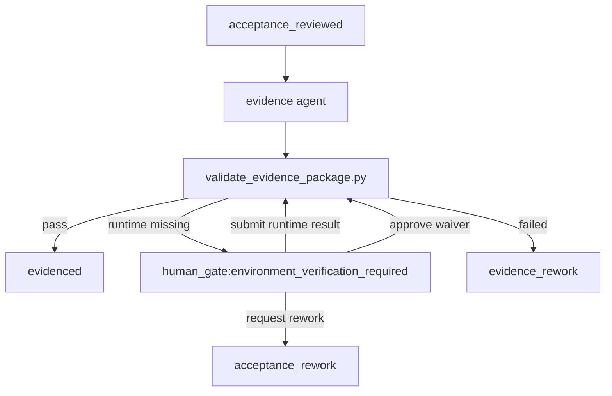

# Agent Factory Phase 3.5 Runtime Reliability & Evidence Governance 详细设计

**日期:** 2026-06-13
**主题:** Agent Factory Phase 3.5 运行闭环稳定化、证据治理、Human Gate 产品化与 Token 成本治理
**适用范围:** 独立版 Agent Factory Dashboard，不包含历史 NMS 集成版本
**目标读者:** Antigravity、后端、前端、Python Runtime、Agent Prompt、QA、新接手 AI Agent
**状态:** Ready for implementation

---

## 1. 背景

Agent Factory 当前已经具备从通用 Git 仓库注册、项目画像、ADU Intake、Project-Aware 单 ADU 开发，到 Epic 多 ADU DAG 编排的完整骨架。Phase 3 引入 Epic、子 ADU 拆分、父级验收和写路径策略后，系统已经可以处理更复杂的需求。

但在近期调试 Open5GS SIM 卡远程生命周期管理需求时，暴露出下一阶段必须解决的运行稳定性问题：

1. 页面状态与真实运行状态不一致，用户点击“继续自动”或“单步执行”后，无法判断系统是否真正启动、卡在哪里、为什么没有推进。
2. Epic 与子 ADU 的状态聚合不清晰，子 ADU 已完成但列表仍显示 `Blocked`，父级状态变更在前端不可见。
3. Acceptance / Evidence / Human Gate 边界不够硬，环境验证缺失时容易在 `acceptance failed`、`evidence pass`、`human_gate` 之间出现口径不一致。
4. 运行环境问题经常出现，例如 Docker、MongoDB、WebUI、HTTP runtime 不可用，需要用户做明确判断，而不是让 Agent 强行判定。
5. Token 消耗巨大，复杂需求未跑完就可能产生数十 M 输入 Token，说明上下文投喂、历史注入、rework 上下文和 artifact 读取策略需要系统治理。
6. 当前质量门已经有 validator，但 Evidence 的结构化校验不足，无法保证每个 contract assertion 都有匹配证据、运行结果或人工豁免。

Phase 3.5 的目标不是增加更多编码 Agent，而是把 Agent Factory 从“能自动跑流程”升级为“可解释、可审计、可暂停、可恢复、成本可控”的运行工厂。

---

## 2. 当前版本画像

### 2.1 已具备能力

当前版本可以称为 **Phase 3 Project-Aware Epic Agent Factory**，已具备：

- 任意 Git 仓库注册、Git 顶级根校验、项目画像和知识包生成。
- ADU Intake：自然语言或原始需求文档生成 ADU 草案。
- 草案未解答问题回答面板，支持将澄清内容传递给后续 Agent。
- Project-Aware ADU 创建与项目级 artifact 隔离。
- Epic 创建、系统链路设计、ADU 拆分、子 ADU DAG 调度、父级验收。
- 独立 Dashboard，包含 Projects、ADU Queue、Epics、Agent 运行日志、质量报告、Token 使用、模型选择。
- 编排控制：自动执行、继续自动、单步执行、暂停、取消。
- 人工审核：需求分析、详细设计、写路径扩展、环境验证相关 human gate。
- 写路径策略引擎：baseline write paths、derived write paths、人工批准扩展。
- 质量门：contract validator、code-review validator、acceptance validator、epic validator。
- Rework 回流：code review、buildfix、acceptance 等失败结果可以返回给 developer。

### 2.2 当前关键入口

后端：

```text
agent-factory-dashboard/backend/src/index.ts
agent-factory-dashboard/backend/src/interfaces/agent-factory-controller.ts
agent-factory-dashboard/backend/src/application/agent-factory-monitor.ts
agent-factory-dashboard/backend/src/application/epic-monitor.ts
agent-factory-dashboard/backend/src/application/epic-factory.ts
agent-factory-dashboard/backend/src/application/adu-intake.ts
agent-factory-dashboard/backend/src/application/project-adu-factory.ts
agent-factory-dashboard/backend/src/infrastructure/file-agent-factory-repository.ts
agent-factory-dashboard/backend/src/websocket/broadcaster.ts
```

前端：

```text
agent-factory-dashboard/frontend/src/App.tsx
agent-factory-dashboard/frontend/src/api/agentFactory.ts
agent-factory-dashboard/frontend/src/stores/agentFactory.ts
agent-factory-dashboard/frontend/src/components/agent-factory/
agent-factory-dashboard/frontend/src/components/epics/
agent-factory-dashboard/frontend/src/components/intake/
agent-factory-dashboard/frontend/src/components/projects/
```

Python Runtime：

```text
scripts/hermes_agent_run.py
scripts/hermes_agent_orchestrator.py
scripts/hermes_epic_orchestrator.py
scripts/validate_agent_contract.py
scripts/validate_quality_report.py
scripts/validate_epic_flow.py
scripts/validate_epic_split_plan.py
scripts/validate_epic_acceptance.py
scripts/write_path_policy.py
```

Agent Prompts：

```text
.ai-agent/prompts/requirement-analyst-agent.md
.ai-agent/prompts/detail-designer-agent.md
.ai-agent/prompts/contract-agent.md
.ai-agent/prompts/testwriter-agent.md
.ai-agent/prompts/developer-agent.md
.ai-agent/prompts/code-reviewer-agent.md
.ai-agent/prompts/buildfix-debugger-agent.md
.ai-agent/prompts/acceptance-reviewer-agent.md
.ai-agent/prompts/evidence-agent.md
.ai-agent/prompts/system-flow-designer-agent.md
.ai-agent/prompts/adu-splitter-agent.md
.ai-agent/prompts/epic-acceptance-reviewer-agent.md
.ai-agent/prompts/rework-planner-agent.md
```

### 2.3 当前主要短板

1. 运行状态没有统一 Operation 模型，页面无法稳定表达“请求已提交、进程已启动、Agent 正在执行、等待 gate、失败、完成”。
2. Human Gate 类型分散，缺少统一列表、统一处置动作和统一审计记录。
3. Evidence 缺少强校验，无法确保 assertion、运行结果、人工豁免之间完全匹配。
4. Epic 聚合状态不够可解释，子 ADU 完成后父级状态和队列状态可能没有及时反映。
5. Token 统计偏“事后展示”，缺少运行前预算预估、上下文裁剪和异常消耗拦截。
6. Rework 链路虽然存在，但缺少统一 rework package，developer 有时仍会收到过多无关上下文。

---

## 3. Phase 3.5 目标和非目标

### 3.1 目标

Phase 3.5 必须实现：

1. 建立统一 Operation / Event 运行模型，让每次启动、继续、单步、暂停、取消都有可追踪的 operation id。
2. 建立统一 Human Gate Center，集中处理分析审核、设计审核、写路径扩展、环境验证、命令例外、澄清问题等人工介入。
3. 固化 Evidence Governance：contract assertion 必须对应运行证据、静态证据、人工豁免或明确未验证状态。
4. 完善 Environment Verification Gate：运行环境不可用时，由人选择运行验证、批准豁免或打回返工。
5. 修复和产品化 Epic / 子 ADU 状态聚合，让页面明确显示“完成、阻塞、等待人工、等待父级聚合、已豁免”等状态。
6. 增加 Token 成本治理：运行前预估、上下文裁剪、Agent 级预算、异常消耗提示和报表。
7. 增加质量门反例测试集，避免再次出现 acceptance fail 但进入 evidenced、脚本存在被当成运行证据等问题。

### 3.2 非目标

Phase 3.5 不做：

1. 不新增新的核心开发 Agent，除非为了实现 governance 需要轻量 evaluator。
2. 不改造 Hermes CLI 本身。
3. 不引入数据库，继续使用现有 JSON registry，必要时新增 JSON 注册表。
4. 不实现多用户 RBAC，只记录 `operator` 字段，默认为本地用户或 `local-operator`。
5. 不解决所有项目模板通用化问题，Phase 4 再做 Universal Productization。
6. 不移除现有 ADU / Epic 流程，所有变更必须向后兼容。

---

## 4. 总体架构

### 4.1 架构原则

1. **状态先行:** 所有编排动作先创建 Operation，再执行 Python 进程。
2. **事件可回放:** Python stdout NDJSON、后端 spawn 状态、前端操作都写入事件注册表。
3. **Gate 一等公民:** Human Gate 不再只是 ADU 的一个 state，而是有独立对象、类型、动作和审计记录。
4. **证据不可自证:** Evidence Agent 不能仅凭自己判断 pass，必须匹配 contract/acceptance/validator 规则。
5. **成本前置:** Token 预算不只做事后统计，运行前必须估算上下文大小和本轮预算风险。
6. **Epic 可解释:** 父级状态必须能解释是哪个子 ADU、哪个 gate、哪个 assertion 导致阻塞。

### 4.2 新增/改造模块

后端新增：

```text
agent-factory-dashboard/backend/src/application/orchestration-operation-store.ts
agent-factory-dashboard/backend/src/application/human-gate-service.ts
agent-factory-dashboard/backend/src/application/evidence-governance.ts
agent-factory-dashboard/backend/src/application/token-governance.ts
agent-factory-dashboard/backend/src/domain/orchestration-operation.ts
agent-factory-dashboard/backend/src/domain/human-gate.ts
agent-factory-dashboard/backend/src/domain/evidence-governance.ts
```

前端新增：

```text
agent-factory-dashboard/frontend/src/components/human-gates/HumanGateCenterPage.tsx
agent-factory-dashboard/frontend/src/components/human-gates/HumanGateDetailPanel.tsx
agent-factory-dashboard/frontend/src/components/human-gates/EnvironmentVerificationPanel.tsx
agent-factory-dashboard/frontend/src/components/human-gates/WaiverDecisionPanel.tsx
agent-factory-dashboard/frontend/src/components/operations/OperationStatusBanner.tsx
agent-factory-dashboard/frontend/src/components/operations/OperationEventTimeline.tsx
agent-factory-dashboard/frontend/src/components/token/TokenGovernancePanel.tsx
agent-factory-dashboard/frontend/src/components/evidence/EvidenceMatrixPanel.tsx
```

Python Runtime 改造：

```text
scripts/hermes_agent_run.py
scripts/hermes_agent_orchestrator.py
scripts/hermes_epic_orchestrator.py
scripts/validate_quality_report.py
scripts/validate_evidence_package.py
scripts/context_budget.py
```

注册表新增：

```text
.ai-agent/registry/operations.json
.ai-agent/registry/events.json
.ai-agent/registry/human-gates.json
.ai-agent/registry/evidence-waivers.json
.ai-agent/registry/token-governance.json
```

---

## 5. 数据模型设计

### 5.1 Operation

新增 `.ai-agent/registry/operations.json`：

```json
{
  "version": 1,
  "operations": [
    {
      "operation_id": "op-20260613-001",
      "scope": "adu",
      "target_id": "ADU-6603-004",
      "epic_id": "EPIC-6603",
      "project_id": "open5gs",
      "action": "continue",
      "mode": "auto",
      "status": "running",
      "created_at": "2026-06-13T10:00:00+08:00",
      "started_at": "2026-06-13T10:00:01+08:00",
      "finished_at": null,
      "spawn": {
        "pid": 12345,
        "command": "python3 scripts/hermes_agent_orchestrator.py ...",
        "cwd": "/Users/hill/open5gs"
      },
      "current_agent": "acceptance-reviewer",
      "current_state": "debugged",
      "result": null,
      "error": null
    }
  ]
}
```

字段说明：

- `scope`: `adu | epic | project | intake`
- `action`: `start | continue | step | pause | cancel | materialize_child_adus | approve_gate | reject_gate`
- `mode`: `auto | step | manual`
- `status`: `queued | spawning | running | waiting_human | completed | failed | canceled`
- `result`: `success | failed | human_gate | no_op`

### 5.2 Event

新增 `.ai-agent/registry/events.json`：

```json
{
  "version": 1,
  "events": [
    {
      "event_id": "evt-20260613-001",
      "operation_id": "op-20260613-001",
      "scope": "adu",
      "target_id": "ADU-6603-004",
      "type": "agent_started",
      "severity": "info",
      "message": "acceptance-reviewer started",
      "payload": {
        "agent": "acceptance-reviewer",
        "state": "debugged"
      },
      "created_at": "2026-06-13T10:00:02+08:00"
    }
  ]
}
```

事件类型：

```text
operation_created
process_spawned
agent_started
agent_stdout
agent_completed
quality_gate_passed
quality_gate_failed
human_gate_opened
human_gate_resolved
state_changed
token_budget_warning
token_hard_stop
epic_child_started
epic_child_completed
epic_aggregate_updated
operation_completed
operation_failed
```

### 5.3 Human Gate

新增 `.ai-agent/registry/human-gates.json`：

```json
{
  "version": 1,
  "gates": [
    {
      "gate_id": "gate-ADU-6603-004-env-001",
      "scope": "adu",
      "target_id": "ADU-6603-004",
      "epic_id": "EPIC-6603",
      "project_id": "open5gs",
      "gate_type": "environment_verification_required",
      "status": "pending",
      "title": "A5/A6 runtime evidence required",
      "reason": "MongoDB + WebUI runtime environment was not available during acceptance review.",
      "source_agent": "acceptance-reviewer",
      "source_run_id": "20260612-221044-ADU-6603-004-acceptance-reviewer",
      "pre_gate_state": "debugged",
      "affected_assertions": ["A5", "A6"],
      "available_actions": ["submit_runtime_result", "approve_waiver", "request_rework"],
      "created_at": "2026-06-13T10:00:00+08:00",
      "resolved_at": null,
      "resolution": null
    }
  ]
}
```

`gate_type` 枚举：

```text
analysis_review
design_review
clarification_required
write_path_expansion
environment_verification_required
acceptance_waiver
command_policy_exception
token_budget_approval
manual_intervention
```

`status` 枚举：

```text
pending
approved
rejected
rework_requested
waived
resolved
canceled
```

### 5.4 Evidence Waiver

新增 `.ai-agent/registry/evidence-waivers.json`：

```json
{
  "version": 1,
  "waivers": [
    {
      "waiver_id": "waiver-ADU-6603-004-A5-A6-001",
      "gate_id": "gate-ADU-6603-004-env-001",
      "adu_id": "ADU-6603-004",
      "epic_id": "EPIC-6603",
      "project_id": "open5gs",
      "assertion_ids": ["A5", "A6"],
      "waiver_type": "environment_unavailable",
      "reason": "Runtime MongoDB + WebUI environment is not available on this machine. The prepared script will be executed in staging.",
      "risk": "Runtime integration is not fully proven in local environment.",
      "follow_up": "Run node tests/ai-agent-mvp/ADU-6603-004-runtime-test.js in staging before release.",
      "operator": "local-operator",
      "created_at": "2026-06-13T10:05:00+08:00"
    }
  ]
}
```

### 5.5 Evidence Matrix

项目级 evidence JSON 需要扩展为 matrix 结构：

```json
{
  "version": 2,
  "adu_id": "ADU-6603-004",
  "overall_status": "pending_environment_verification",
  "assertion_evidence": [
    {
      "assertion_id": "A5",
      "status": "waived",
      "verification_type": "runtime",
      "required_evidence": "script_result",
      "evidence_items": [
        {
          "type": "prepared_script",
          "path": "tests/ai-agent-mvp/ADU-6603-004-runtime-test.js",
          "status": "ready"
        },
        {
          "type": "waiver",
          "waiver_id": "waiver-ADU-6603-004-A5-A6-001"
        }
      ],
      "notes": "Runtime test script is ready but execution is waived for local environment."
    }
  ]
}
```

`status` 枚举：

```text
pass
fail
not_verified
pending_environment_verification
waived
not_applicable
```

规则：

- `pass`: 必须有实际命令输出、测试结果、curl 输出或其它可验证 artifact。
- `waived`: 必须引用 `evidence-waivers.json` 中的 waiver。
- `pending_environment_verification`: 必须打开 human gate。
- `not_verified`: 不能进入 `evidenced`。

### 5.6 Token Governance

新增 `.ai-agent/registry/token-governance.json`：

```json
{
  "version": 1,
  "defaults": {
    "warning_input_tokens": 1200000,
    "hard_input_tokens": 3000000,
    "warning_output_tokens": 120000,
    "hard_output_tokens": 300000,
    "max_context_artifact_bytes": 200000,
    "max_history_runs": 6
  },
  "agent_budgets": {
    "requirement-analyst": {
      "warning_input_tokens": 800000,
      "hard_input_tokens": 1500000
    },
    "developer": {
      "warning_input_tokens": 1500000,
      "hard_input_tokens": 3500000
    },
    "acceptance-reviewer": {
      "warning_input_tokens": 1000000,
      "hard_input_tokens": 2000000
    }
  },
  "context_policy": {
    "knowledge_pack_mode": "selective",
    "run_history_mode": "summarized",
    "artifact_mode": "referenced_with_snippets",
    "diff_mode": "relevant_files_only"
  }
}
```

---

## 6. 后端设计

### 6.1 Operation Store

新增 `orchestration-operation-store.ts`，负责：

- 创建 operation。
- 更新 operation 状态。
- 追加 events。
- 根据 target 查询最近 operation。
- 读取 operation event timeline。
- 清理过旧 events，默认保留最近 5000 条。

核心接口：

```ts
createOperation(input: CreateOperationInput): Promise<OrchestrationOperation>
markSpawning(operationId: string, spawn: SpawnInfo): Promise<void>
markRunning(operationId: string, patch: RunningPatch): Promise<void>
markWaitingHuman(operationId: string, gateId: string): Promise<void>
markCompleted(operationId: string, result: OperationResult): Promise<void>
markFailed(operationId: string, error: string): Promise<void>
appendEvent(event: AgentFactoryEventInput): Promise<void>
listEvents(filter: EventFilter): Promise<AgentFactoryEvent[]>
getActiveOperation(targetId: string): Promise<OrchestrationOperation | null>
```

所有 `start/continue/step/pause/cancel` API 必须先创建 operation，再 spawn Python。

### 6.2 Human Gate Service

新增 `human-gate-service.ts`，负责：

- 从 ADU/Epic 状态和 run result 创建 gate。
- 查询所有 pending gates。
- 解析 gate action。
- 关闭 gate 并恢复 ADU/Epic 状态。
- 写入 waiver。
- 请求 rework。

核心接口：

```ts
openGate(input: OpenHumanGateInput): Promise<HumanGate>
listGates(filter: HumanGateFilter): Promise<HumanGate[]>
getGate(gateId: string): Promise<HumanGate | null>
submitRuntimeResult(gateId: string, input: RuntimeResultInput): Promise<HumanGateResolution>
approveWaiver(gateId: string, input: WaiverInput): Promise<HumanGateResolution>
requestRework(gateId: string, input: ReworkRequestInput): Promise<HumanGateResolution>
cancelGate(gateId: string, reason: string): Promise<void>
```

### 6.3 Evidence Governance Service

新增 `evidence-governance.ts`，负责：

- 读取 contract assertions。
- 读取 acceptance report。
- 读取 evidence JSON。
- 读取 waivers。
- 生成 Evidence Matrix。
- 判断 ADU 是否允许进入 `evidenced`。

核心接口：

```ts
buildEvidenceMatrix(aduId: string, repoRoot: string): Promise<EvidenceMatrix>
validateEvidencePackage(aduId: string, repoRoot: string): Promise<EvidenceValidationResult>
getAssertionCoverage(aduId: string, repoRoot: string): Promise<AssertionCoverage[]>
```

### 6.4 Token Governance Service

新增 `token-governance.ts`，负责：

- 按 Agent 估算 prompt token。
- 分解 token 来源：system prompt、project profile、knowledge pack、run history、artifact、diff。
- 判断是否触发 warning/hard stop。
- 给出裁剪建议。

核心接口：

```ts
estimateNextRun(input: TokenEstimateInput): Promise<TokenEstimate>
getTokenBreakdown(scope: 'adu' | 'epic', id: string): Promise<TokenBreakdown>
getAgentBudget(agentId: string): Promise<AgentTokenBudget>
updateAgentBudget(agentId: string, patch: AgentTokenBudgetPatch): Promise<void>
```

### 6.5 API 设计

新增或改造 API：

```text
GET  /api/agent-factory/operations?targetId=&scope=
GET  /api/agent-factory/operations/:operationId
GET  /api/agent-factory/operations/:operationId/events

GET  /api/agent-factory/events?targetId=&operationId=&limit=

GET  /api/agent-factory/human-gates?status=pending
GET  /api/agent-factory/human-gates/:gateId
POST /api/agent-factory/human-gates/:gateId/runtime-result
POST /api/agent-factory/human-gates/:gateId/waive
POST /api/agent-factory/human-gates/:gateId/request-rework
POST /api/agent-factory/human-gates/:gateId/cancel

GET  /api/agent-factory/adus/:aduId/evidence-matrix
POST /api/agent-factory/adus/:aduId/validate-evidence

GET  /api/agent-factory/token-governance
PUT  /api/agent-factory/token-governance
POST /api/agent-factory/token-governance/estimate-next-run

GET  /api/agent-factory/epics/:epicId/aggregate-state
POST /api/agent-factory/epics/:epicId/reconcile
```

API 约束：

- 所有 `aduId`、`epicId`、`gateId`、`operationId` 必须走白名单正则。
- 所有 artifact 路径继续走 repository allowlist 与 `realpath` 校验。
- human gate resolution 不能直接信任前端传入的 ADU state，必须由后端根据 gate 类型计算下一状态。

---

## 7. Python Runtime 设计

### 7.1 Orchestrator Operation 注入

`hermes_agent_orchestrator.py` 和 `hermes_epic_orchestrator.py` 新增参数：

```text
--operation-id <operationId>
```

每个关键动作输出 NDJSON：

```json
{"event":"agent_started","operation_id":"op-...","adu_id":"ADU-...","agent":"developer","state":"test_red"}
{"event":"state_changed","operation_id":"op-...","from":"test_red","to":"implemented"}
{"event":"human_gate_opened","operation_id":"op-...","gate_type":"environment_verification_required","gate_id":"gate-..."}
```

后端 spawn stdout parser 必须同时：

- 实时广播 WebSocket。
- 写入 `events.json`。
- 更新 `operations.json`。

### 7.2 Human Gate 标准返回

所有 Agent 或 validator 需要人工介入时，统一返回：

```json
{
  "result": "human_gate",
  "next_state": "human_gate",
  "gate_type": "environment_verification_required",
  "gate_title": "Runtime evidence required",
  "gate_reason": "MongoDB + WebUI environment was unavailable.",
  "affected_assertions": ["A5", "A6"],
  "pre_gate_state": "debugged",
  "next_agent": "human"
}
```

Runner 规则：

- `result == human_gate` 时退出码为 `20`。
- 写入 run record 的 `effective_returncode = 20`。
- ADU 设置：

```json
{
  "state": "human_gate",
  "human_gate_required": true,
  "gate_type": "environment_verification_required",
  "pre_gate_state": "debugged"
}
```

- Orchestrator 不得把退出码 20 当作 failed。
- 后端必须创建或更新 `human-gates.json`。

### 7.3 Evidence Validator

新增 `scripts/validate_evidence_package.py`。

输入：

```text
python3 scripts/validate_evidence_package.py \
  --adu ADU-6603-004 \
  --repo-root /path/to/repo \
  --registry-dir /Users/hill/open5gs/.ai-agent/registry
```

校验规则：

1. Contract 中所有 `must_pass=true` assertion 必须出现在 evidence matrix。
2. `verification_type=runtime` 的 assertion：
   - `status=pass` 时必须有 `script_result`、`curl_output` 或等价运行结果。
   - 只有 `prepared_script` 不得 pass。
   - `status=waived` 时必须引用有效 waiver。
3. Acceptance report 中的 `missing_evidence` 不得被 evidence 静默覆盖。
4. 若 acceptance_status 为 `fail` 且仅为环境证据缺失，evidence 应为 `pending_environment_verification` 或 `waived`。
5. Evidence 总状态为 `pass` 或所有缺失项均有 waiver 时，才允许 ADU 进入 `evidenced`。

退出码：

```text
0  pass
1  validation failed
20 human gate required
```

### 7.4 Context Budget

新增 `scripts/context_budget.py`，供 runner 在调用 Hermes 前执行：

```text
python3 scripts/context_budget.py \
  --agent developer \
  --adu ADU-6603-004 \
  --repo-root /path/to/repo \
  --registry-dir /path/to/.ai-agent/registry \
  --mode estimate
```

输出：

```json
{
  "estimated_input_tokens": 1420000,
  "budget_status": "warning",
  "breakdown": {
    "system_prompt": 12000,
    "project_profile": 35000,
    "knowledge_pack": 180000,
    "run_history": 600000,
    "artifacts": 420000,
    "diff": 173000
  },
  "recommended_truncations": [
    {
      "source": "run_history",
      "action": "summarize",
      "expected_saving_tokens": 420000
    }
  ]
}
```

Runner 行为：

- `ok`: 正常运行。
- `warning`: 写入 event，但允许运行。
- `hard_stop`: 不调用 Hermes，创建 `token_budget_approval` human gate。

---

## 8. 前端设计

### 8.1 Operation Status Banner

在 ADU 页面和 Epic 页面顶部增加统一状态条：

```text
Operation: op-20260613-001
Status: Running
Action: Continue Auto
Current Agent: acceptance-reviewer
Current State: debugged
Last Event: human_gate_opened
```

按钮规则：

- 有 active operation 时，`启动/继续/单步` 禁用。
- active operation 状态为 `waiting_human` 时，显示“前往 Human Gate”。
- active operation 状态为 `failed` 时，显示错误摘要和“查看事件”。

### 8.2 Operation Event Timeline

展示 operation 事件：

```text
10:00:00 operation_created
10:00:01 process_spawned pid=12345
10:00:02 agent_started acceptance-reviewer
10:00:20 quality_gate_failed missing runtime evidence A5/A6
10:00:20 human_gate_opened environment_verification_required
```

支持：

- 按 severity 过滤。
- 展开 event payload。
- 跳转到 run log。

### 8.3 Human Gate Center

新增主导航页面 `Human Gates`。

列表字段：

```text
Gate ID
Type
Target
Epic
Project
Source Agent
Status
Age
Reason
Available Actions
```

详情页根据 gate type 渲染不同处理面板。

### 8.4 Environment Verification Panel

用于 `environment_verification_required`。

必须显示：

- 受影响 assertion 列表。
- Acceptance missing evidence 原文。
- 已准备好的验证命令或脚本。
- 最近 buildfix/code-review 结果。
- 当前 evidence matrix。

操作：

1. **提交运行结果**
   - 输入 command。
   - 输入 exit code。
   - 粘贴 stdout/stderr 或上传结果文件路径。
   - 后端验证后更新 evidence matrix。
2. **批准环境豁免**
   - 选择 assertion id，支持多选。
   - 填写 waiver reason。
   - 填写 follow-up。
   - 确认风险。
3. **打回返工**
   - 选择打回目标：developer / rework-planner。
   - 填写 rework instruction。

### 8.5 Evidence Matrix Panel

在 ADU 页面和 Human Gate 详情中展示：

```text
Assertion | Required Type | Status | Evidence | Waiver | Source
A1        | static        | pass   | code-review | - | acceptance
A5        | runtime       | waived | prepared script + waiver | waiver-... | human
A6        | runtime       | pending_environment_verification | script ready | - | acceptance
```

颜色规则：

- pass: green
- waived: blue
- pending_environment_verification: amber
- not_verified/fail: red

### 8.6 Epic Aggregate Visibility

Epic 页面需要显示：

1. 父级状态。
2. 子 ADU 聚合状态。
3. 阻塞原因。
4. 下一步可执行动作。

子 ADU 状态不要只显示 `Blocked`，改为更具体：

```text
Completed
Running
Waiting Human Gate
Blocked by Failed Agent
Blocked by Evidence Missing
Blocked by Write Path Approval
Waiting Parent Aggregation
Canceled
```

Epic `继续自动` 点击后，如果无可调度子 ADU，必须显示 no-op 事件：

```text
No runnable child ADU. 4 completed, 0 pending, 0 failed, parent acceptance pending.
```

---

## 9. Agent Prompt 改造

### 9.1 Evidence Agent

必须强化：

- 必须读取 acceptance review。
- 不得把脚本存在当成脚本执行结果。
- 不得把 `node --check` 当成 runtime pass。
- runtime assertion 缺少执行结果时，返回 human gate。
- human waiver 只能标记 `waived`，不能标记 `pass`。

### 9.2 Acceptance Reviewer

必须强化：

- `script_result` 必须包含实际执行命令、exit code 和输出。
- 环境不可用时，不应生成 mismatch finding，除非实现本身错误。
- 环境缺证应写入 `missing_evidence`，让 runner 打开 `environment_verification_required` gate。

### 9.3 Developer

必须强化：

- 接收 `rework_package`，只修复 package 指定问题。
- 如果缺少运行环境，不得在代码中伪造通过结果。
- 如果新增测试脚本，必须在 final JSON 中区分：
  - `prepared_test_scripts`
  - `executed_test_results`

### 9.4 Rework Planner

必须强化：

- 将 code-review/buildfix/acceptance 失败项压缩为最小修复计划。
- 区分 implementation issue、test issue、environment issue、policy issue。
- environment issue 不应直接打回 developer，除非需要 developer 提供可运行脚本或补充日志。

---

## 10. 状态机调整

### 10.1 ADU 状态

保留现有状态，新增或明确以下派生状态展示：

```text
human_gate:environment_verification_required
human_gate:write_path_expansion
human_gate:token_budget_approval
human_gate:clarification_required
evidence_pending
evidence_waived
```

注册表中仍可保持：

```json
{
  "state": "human_gate",
  "gate_type": "environment_verification_required"
}
```

前端展示层负责组合显示。

### 10.2 Evidence 流转



### 10.3 Epic 聚合

Epic 聚合规则：

```text
all child ADUs evidenced or waived -> parent_acceptance_ready
any child ADU human_gate -> child_adus_waiting_human
any child ADU failed/rework -> child_adus_blocked
no runnable child and parent acceptance missing -> parent_acceptance_pending
parent acceptance pass -> evidenced/completed
parent acceptance fail env-only -> human_gate:environment_verification_required
parent acceptance fail mismatch -> epic_rework
```

---

## 11. Token 成本治理设计

### 11.1 Token 来源拆分

每次 run record 增加：

```json
{
  "token_breakdown": {
    "system_prompt": 12000,
    "agent_prompt": 18000,
    "adu_context": 25000,
    "project_profile": 35000,
    "knowledge_pack": 120000,
    "run_history": 350000,
    "artifact_snippets": 480000,
    "diff_context": 220000,
    "rework_package": 60000
  }
}
```

### 11.2 上下文裁剪策略

Runner 构建 prompt 时遵循：

1. 默认不注入完整 runs.json，只注入当前 ADU 最近 3 到 6 次相关 run 摘要。
2. 不注入完整 artifact，大文件只提供路径、摘要和相关片段。
3. Developer rework 只注入：
   - 当前失败 finding。
   - 相关文件 diff。
   - 相关 contract assertion。
   - 最近一次 developer 结果摘要。
4. Epic parent 不注入所有子 ADU 完整日志，只注入每个子 ADU 状态摘要和 evidence matrix。

### 11.3 Token 看板

新增 Token Governance 面板：

- 当前 ADU/Epic 总消耗。
- 按 Agent 排名。
- 按来源拆分。
- 本轮预计消耗。
- 异常 run 标记。
- 建议裁剪动作。

---

## 12. 测试策略

### 12.1 后端测试

新增：

```text
agent-factory-dashboard/backend/tools/test-orchestration-operation.js
agent-factory-dashboard/backend/tools/test-human-gates.js
agent-factory-dashboard/backend/tools/test-evidence-governance.js
agent-factory-dashboard/backend/tools/test-token-governance.js
agent-factory-dashboard/backend/tools/test-epic-aggregate-visibility.js
```

必须覆盖：

1. operation 创建、运行中、完成、失败、waiting_human。
2. active operation 存在时禁止重复启动。
3. stdout event 写入 events.json。
4. environment gate 创建、提交运行结果、批准 waiver、打回 rework。
5. invalid gate action 返回 400/409。
6. evidence matrix 能正确匹配 contract assertion。
7. waiver 必须引用有效 gate。
8. Epic 子 ADU completed 不得显示 Blocked。
9. Epic continue 无可运行子 ADU 时必须产生 no-op event。

### 12.2 Python 测试

新增：

```text
scripts/test_validate_evidence_package.py
scripts/test_context_budget.py
scripts/test_operation_events.py
```

必须覆盖反例：

1. 只有测试脚本文件，没有执行结果，不得 pass。
2. `node --check` 不得作为 runtime assertion pass。
3. `acceptance_status=fail` 且 missing runtime evidence，进入 human gate。
4. 有 waiver 时 assertion 状态为 `waived`，不是 `pass`。
5. acceptance fail 不得进入 evidenced。
6. token hard stop 不调用 Hermes。
7. run history 超限时被摘要化。

### 12.3 前端测试或手工验收

至少手工验收：

1. 点击 ADU 单步后按钮立即禁用，Operation Banner 显示 running。
2. 后端 crash 或 spawn 失败时页面显示 failed operation。
3. Human Gate Center 能看到 pending gate。
4. 环境验证 gate 可以选择 assertion 并保持选中状态。
5. 提交 waiver 后 evidence matrix 更新为 waived。
6. Epic 页面子 ADU 状态显示正确。
7. Epic 继续自动无动作时显示 no-op 原因。

### 12.4 回归测试

所有开发完成后必须运行：

```text
cd agent-factory-dashboard/backend && npm run build
cd agent-factory-dashboard/frontend && npm run build
python3 -m py_compile scripts/hermes_agent_run.py scripts/hermes_agent_orchestrator.py scripts/hermes_epic_orchestrator.py scripts/validate_quality_report.py scripts/validate_evidence_package.py scripts/context_budget.py
cd agent-factory-dashboard/backend && npm run test:project-adu
cd agent-factory-dashboard/backend && npm run test:quality-gates
cd agent-factory-dashboard/backend && npm run test:epic-dag
cd agent-factory-dashboard/backend && npm run test:write-path-expansions
```

如果项目脚本名称与实际 package.json 不一致，Antigravity 应以实际 `package.json` 为准，但必须在 walkthrough 中列出执行过的命令。

---

## 13. 实施步骤建议

### Step 1: Operation / Event 基础设施

- 新增 domain 类型。
- 新增 operation store。
- 改造 ADU/Epic start/continue/step/pause/cancel API。
- 后端 spawn stdout parser 写 events。
- 前端 Operation Banner 和 Event Timeline。

验收标准：

- 任意一次 ADU 单步执行都能在页面看到 operation 和事件。
- 重复点击不会重复启动。

### Step 2: Human Gate Center

- 新增 human-gates registry。
- 后端 gate service。
- Python human gate 标准输出对齐。
- 前端 Human Gate Center。
- 环境验证 gate 详情页。

验收标准：

- acceptance 环境证据缺失时，自动创建 gate。
- 用户可以提交运行结果、批准 waiver 或打回 rework。

### Step 3: Evidence Governance

- 新增 evidence matrix schema。
- 新增 `validate_evidence_package.py`。
- Evidence Agent prompt 改造。
- Acceptance Reviewer prompt 改造。
- Runner 在 evidence 后调用 validator。

验收标准：

- 只有脚本没有运行结果时不能进入 evidenced。
- waiver 后可以进入 evidenced，但 assertion 状态必须是 waived。

### Step 4: Epic 聚合与可视化修复

- 改造 epic-monitor 聚合逻辑。
- 增加 reconcile API。
- 前端区分子 ADU 阻塞类型。
- Epic continue 无动作时返回 no-op operation event。

验收标准：

- 已完成子 ADU 不再显示 Blocked。
- Epic 页面能解释父级为什么未推进。

### Step 5: Token Governance

- 新增 token governance registry。
- 新增 context budget 脚本。
- Runner 调用预算估算。
- 前端 Token Governance Panel。

验收标准：

- 每次 run 有 token breakdown。
- 超过 hard stop 时不调用 Hermes，并打开 token approval gate。

### Step 6: 全量回归与文档

- 补充测试。
- 更新 developer guide。
- 更新 walkthrough。
- 记录已知限制。

---

## 14. 兼容性与迁移

### 14.1 旧 ADU

旧 ADU 没有 operation、human gate、evidence matrix 时：

- monitor 读取时动态生成 view，不写回污染 registry。
- evidence v1 仍可展示，但进入新流程时应补生成 matrix。
- 旧 `state=human_gate` 且没有 gate 记录时，后端应创建 synthetic gate。

### 14.2 旧 Epic

旧 Epic 没有 aggregate detail 时：

- epic-monitor 根据子 ADU 实时计算。
- reconcile API 可以补写聚合摘要。

### 14.3 旧 Evidence

旧 evidence JSON 没有 assertion matrix 时：

- `buildEvidenceMatrix` 从 contract + acceptance + old evidence 尽量转换。
- 无法确定的 assertion 标记为 `not_verified`，不得自动 pass。

---

## 15. 风险与控制

| 风险 | 影响 | 控制措施 |
|---|---|---|
| Operation/Event 注册表增长过快 | 文件变大、页面慢 | 限制保留条数，支持按 target 过滤 |
| Human Gate 与 ADU state 不一致 | 流程卡住 | gate resolution 后统一由 service 写 ADU |
| Waiver 被滥用 | 未验证功能被放行 | waiver 必须记录 assertion、原因、风险、follow-up |
| Token hard stop 误拦截 | 正常任务不能跑 | warning 与 hard stop 分级，允许人工批准 |
| 旧数据迁移导致视图污染 | registry 混入 view 字段 | repository 保存前清洗核心字段 |
| Epic 聚合误判 | 父级状态不可信 | 增加 reconcile API 和反例测试 |

---

## 16. 验收标准

Phase 3.5 完成后必须满足：

1. 用户点击任意编排按钮后，页面立即显示 operation 状态。
2. 编排失败、无动作、等待人工时，页面必须显示明确原因。
3. 所有 human gate 都能在统一页面看到和处理。
4. 环境验证缺失不会被 evidence 标记为 pass。
5. 人工豁免后，evidence 显示 `waived`，并引用 waiver 记录。
6. Contract assertion、acceptance report、evidence matrix 三者能互相追溯。
7. Epic 子 ADU 完成后不再错误显示 Blocked。
8. Epic 继续自动无可执行任务时有 no-op 事件和原因。
9. Token 看板能显示每个 Agent 的消耗和上下文来源拆分。
10. Token hard stop 生效时不会调用 Hermes。
11. 后端、前端、Python 编译通过。
12. 新增反例测试覆盖 acceptance/evidence/human gate/token/epic aggregation 的关键失败路径。

---

## 17. 建议交付物

Antigravity 完成开发后，应提交：

```text
task.md
walkthrough.md
backend/frontend/python build logs
新增测试清单
关键反例测试输出
Phase 3.5 功能截图或操作说明
```

walkthrough 必须特别说明：

1. ADU-6603-004 这类环境验证缺失场景如何处理。
2. 只有自动化脚本但没有执行结果时，为什么不能 pass。
3. 人工 waiver 如何进入 evidence matrix。
4. Epic 页面如何显示子 ADU 完成、阻塞和父级聚合状态。
5. Token hard stop 如何验证未调用 Hermes。

---

## 18. 开发优先级

推荐优先级：

1. P1 Operation/Event + Human Gate Center + Evidence Validator。
2. P1 Environment Verification Gate + Waiver。
3. P1 Epic 聚合状态修复。
4. P2 Token Governance。
5. P2 前端 Evidence Matrix 和 Token Breakdown 优化。
6. P3 文档、清理、旧数据迁移工具。

Phase 3.5 的成功标准不是“新增多少 Agent”，而是让现有 Agent 运行结果变得可信、可解释、可审计、可控成本。
