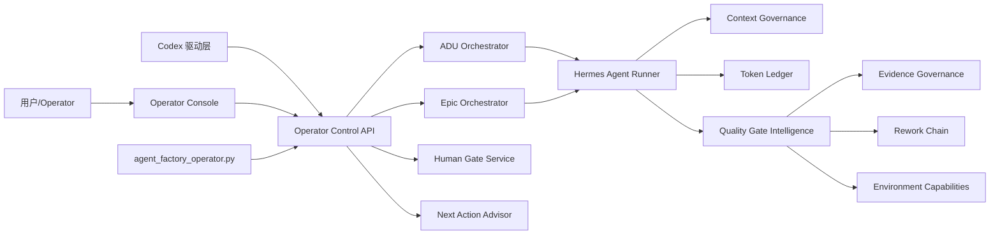

# Agent Factory Phase 3.7 至 Phase 3.9 改造详细设计

日期：2026-06-17

适用项目：`<workspace-root>` 下的独立 Agent Factory Dashboard 与 Agent Factory Runtime

目标读者：Antigravity / Agent Factory 开发者 / 后续接手的新 Agent

## 1. 背景与当前版本画像

Agent Factory 当前已经从 Open5GS NMS 中解耦为独立 Dashboard，并具备以下能力：

- 通用 Git 仓库注册与项目画像。
- 基于项目画像创建 ADU / Epic。
- ADU 多 Agent 流程：需求分析、详细设计、契约、开发、代码审查、构建修复、验收审查、证据归档。
- Epic 拆分与子 ADU 串行调度。
- Human Gate、澄清问题、写路径扩展、环境验证豁免、证据矩阵。
- Token 预算与运行日志展示。
- Phase 3.6 已经开始解决移植性、自举配置、本机路径硬编码等问题。

当前真实使用方式正在从“用户自己在页面逐步点击”变为：

> 用户描述需求，由一个人类 Operator / Codex 驱动 Agent Factory 完整执行需求开发、审核、返工、证据归档与验收。

因此后续改造不应只继续增加页面组件，而应把 Agent Factory 升级为一个可被 Operator 稳定驱动的开发控制平面。

## 2. 总体目标

Phase 3.7 至 Phase 3.9 的总体目标是：

1. 让 Operator 可以通过统一 API / CLI / 页面控制任意需求的下一步动作。
2. 显著降低 Token 浪费，让每次 Agent 运行的上下文来源、预算、复用策略可观测、可解释、可治理。
3. 让质量门失败、环境缺失、验收争议、返工路径都能被系统结构化解释，并可靠反馈给正确的 Agent。

三个阶段的边界如下：

| 阶段 | 名称 | 核心目标 |
|---|---|---|
| Phase 3.7 | Operator Control Layer | 建立“我来驱动 Agent Factory”的统一操作层 |
| Phase 3.8 | Cost & Context Governance | 建立 Token / 上下文治理能力，降低无效消耗 |
| Phase 3.9 | Quality Gate Intelligence | 建立质量门解释、证据策略、返工闭环智能化 |

## 3. 设计原则

### 3.1 独立 Dashboard 优先

后续只维护 `agent-factory-dashboard` 独立版本，不再更新 NMS 内嵌版本。

### 3.2 控制层只编排，不绕过状态机

新增 Operator API / CLI 只能调用既有 ADU / Epic 编排能力，不允许直接篡改核心状态。所有状态改变必须留下 operation / event / audit 记录。

### 3.3 所有 Agent 运行必须可解释

每次 Agent 运行至少应能回答：

- 为什么现在运行这个 Agent？
- 输入上下文来自哪些文件、摘要和历史结果？
- 消耗了多少 Token？
- 产出了什么？
- 如果失败，应该把反馈交给哪个 Agent？

### 3.4 人工判断是一等公民

环境问题、运行条件不足、验收豁免、需求澄清，不能被当成“失败”粗暴处理。系统应支持人工给出判断，并将判断作为后续流程的正式输入。

### 3.5 默认中文过程文档

过程文档默认使用中文；代码标识符、JSON key、协议名、函数名、路径、命令保持英文。

## 4. 总体架构



## 5. Phase 3.7：Operator Control Layer

### 5.1 目标

Phase 3.7 解决“如何让一个人或 Codex 稳定驱动 Agent Factory”的问题。

完成后应支持：

- Operator 输入自然语言需求，系统建议创建 ADU 还是 Epic。
- Operator 查询某个 ADU / Epic 当前应该做什么。
- Operator 一键执行推荐动作，或选择单步 / 自动 / 暂停 / 取消 / 审批 / 打回。
- 所有操作都具备幂等保护、锁保护和审计记录。
- Codex 可以通过 CLI 或 REST API 可靠驱动流程，不依赖手动点页面。

### 5.2 新增核心概念

#### 5.2.1 Operator Target

```ts
export type OperatorTargetType =
  | 'project'
  | 'draft'
  | 'adu'
  | 'epic'
  | 'human_gate'
  | 'operation';

export interface OperatorTargetRef {
  type: OperatorTargetType;
  id: string;
  project_id?: string;
}
```

#### 5.2.2 Operator Action

```ts
export type OperatorActionType =
  | 'create_draft'
  | 'answer_clarifications'
  | 'register_adu'
  | 'create_epic'
  | 'start'
  | 'continue_auto'
  | 'step'
  | 'pause'
  | 'cancel'
  | 'approve_review'
  | 'request_rework'
  | 'approve_write_path'
  | 'reject_write_path'
  | 'submit_runtime_evidence'
  | 'grant_environment_waiver'
  | 'materialize_child_adus'
  | 'open_child_adu';

export interface OperatorAction {
  id: string;
  target: OperatorTargetRef;
  action: OperatorActionType;
  requested_by: 'human' | 'codex' | 'system';
  idempotency_key: string;
  payload?: Record<string, unknown>;
  created_at: string;
}
```

#### 5.2.3 Next Action Recommendation

```ts
export type OperatorActionPriority = 'required' | 'recommended' | 'optional' | 'blocked';

export interface OperatorNextAction {
  target: OperatorTargetRef;
  state: string;
  recommended_action: OperatorActionType | null;
  priority: OperatorActionPriority;
  reason: string;
  blocking_reasons: string[];
  required_inputs: Array<{
    key: string;
    label: string;
    type: 'text' | 'markdown' | 'choice' | 'file' | 'boolean';
    required: boolean;
  }>;
  safe_to_auto_continue: boolean;
  estimated_risk: 'low' | 'medium' | 'high';
}
```

### 5.3 后端模块设计

新增目录：

```text
agent-factory-dashboard/backend/src/application/operator/
  operator-control.ts
  next-action-advisor.ts
  operator-audit-log.ts
  operator-action-validator.ts
```

新增基础设施：

```text
agent-factory-dashboard/backend/src/infrastructure/operator/
  file-operator-action-repository.ts
  operator-lock-service.ts
```

新增接口：

```text
agent-factory-dashboard/backend/src/interfaces/rest/operator-controller.ts
```

### 5.4 API 设计

#### 5.4.1 创建需求草案

`POST /api/agent-factory/operator/intake`

请求：

```json
{
  "project_id": "ueransim",
  "raw_requirement": "为 UERANSIM 增加 xxx 功能",
  "source_files": [],
  "preferred_granularity": "auto",
  "language": "zh"
}
```

响应：

```json
{
  "draft_id": "DRAFT-20260617-001",
  "recommended_target": "adu",
  "reason": "需求改动范围集中，不需要拆分 Epic",
  "clarification_questions": []
}
```

`preferred_granularity` 可选值：

- `auto`
- `adu`
- `epic`

#### 5.4.2 查询下一步动作

`GET /api/agent-factory/operator/:targetType/:targetId/next-action`

示例响应：

```json
{
  "target": { "type": "adu", "id": "ADU-6603-004", "project_id": "open5gs" },
  "state": "human_gate",
  "recommended_action": "submit_runtime_evidence",
  "priority": "required",
  "reason": "A5/A6 为 runtime 断言，需要运行证据或人工环境豁免",
  "blocking_reasons": ["missing_runtime_evidence:A5", "missing_runtime_evidence:A6"],
  "required_inputs": [
    {
      "key": "runtime_log",
      "label": "运行期测试输出",
      "type": "markdown",
      "required": false
    },
    {
      "key": "waiver_reason",
      "label": "环境豁免原因",
      "type": "markdown",
      "required": false
    }
  ],
  "safe_to_auto_continue": false,
  "estimated_risk": "medium"
}
```

#### 5.4.3 执行动作

`POST /api/agent-factory/operator/:targetType/:targetId/actions`

请求：

```json
{
  "action": "continue_auto",
  "idempotency_key": "operator-20260617-continue-001",
  "requested_by": "codex",
  "payload": {}
}
```

响应：

```json
{
  "operation_id": "OP-20260617-001",
  "accepted": true,
  "status": "running",
  "message": "ADU orchestrator started"
}
```

要求：

- 后端必须校验 `AGENT_FACTORY_ENABLE_CONTROL=true`。
- 同一个 `idempotency_key` 重复提交必须返回同一个 operation 结果。
- 若目标已有活跃 operation，返回 `409 Conflict`，并带上活跃 operation 信息。

#### 5.4.4 获取 Operator Handoff

`GET /api/agent-factory/operator/:targetType/:targetId/handoff`

用于 Codex 接手时一次性获取上下文摘要。

响应：

```json
{
  "target": { "type": "epic", "id": "EPIC-6603" },
  "summary": "当前 Epic 已拆分 4 个子 ADU，其中 4 个完成，等待 Epic 验收聚合。",
  "current_state": "child_adus_completed",
  "next_action": {},
  "recent_events": [],
  "quality_risks": [],
  "token_summary": {},
  "artifact_links": []
}
```

### 5.5 CLI 设计

新增：

```text
scripts/agent_factory_operator.py
```

命令：

```bash
python3 scripts/agent_factory_operator.py next --adu ADU-6603-004
python3 scripts/agent_factory_operator.py act --adu ADU-6603-004 --action continue_auto
python3 scripts/agent_factory_operator.py handoff --epic EPIC-6603
python3 scripts/agent_factory_operator.py intake --project ueransim --requirement-file /path/to/requirement.md
```

CLI 默认通过本地文件系统和 Python 脚本执行，不强依赖后端服务；如果设置 `AGENT_FACTORY_API_BASE`，则优先调用 REST API。

### 5.6 前端设计

#### 5.6.1 新增页面：Operator Console

路径：

```text
agent-factory-dashboard/frontend/src/components/operator/OperatorConsolePage.tsx
```

页面区域：

- 左侧：Project / Epic / ADU 快速搜索。
- 中间：当前目标状态、推荐动作、风险提示。
- 右侧：动作执行面板、必填输入、最近事件。

#### 5.6.2 需求工作台

```text
agent-factory-dashboard/frontend/src/components/operator/RequirementWorkbench.tsx
```

能力：

- 文本框输入自然语言需求。
- 上传原始需求文档。
- 选择项目。
- 系统建议 ADU / Epic。
- 展示澄清问题并要求填写。
- 注册成功后跳转到对应 ADU 或 Epic 页面。

#### 5.6.3 下一步动作卡片

```text
agent-factory-dashboard/frontend/src/components/operator/NextActionCard.tsx
```

在以下页面复用：

- ADU 任务看板。
- Epic 编排页。
- Human Gate Center。

### 5.7 数据文件

新增运行态注册表：

```text
.ai-agent/registry/operator-actions.json
.ai-agent/registry/operator-operations.json
.ai-agent/registry/operator-handoffs.json
```

必须加入：

- `.gitignore`
- `scripts/agent_factory_bootstrap.py`
- `scripts/agent_factory_doctor.py` 运行态文件拦截清单
- `scripts/check_tracked_path_leaks.py` 的安全扫描白名单/黑名单规则

### 5.8 Phase 3.7 验收标准

必须满足：

- 可以通过页面输入需求并完成 ADU / Epic 创建建议。
- 可以通过 API 查询任意 ADU / Epic 的下一步推荐动作。
- 可以通过 API / CLI 执行 start / continue / step / pause / cancel。
- 重复提交同一个 idempotency key 不会重复启动编排器。
- 活跃 operation 存在时，二次启动返回 409。
- 所有动作写入 audit log。
- 前端动作失败不会吞错，必须展示后端真实错误。

### 5.9 Phase 3.7 测试

新增：

```text
agent-factory-dashboard/backend/tools/test-operator-control.js
agent-factory-dashboard/backend/tools/test-next-action-advisor.js
scripts/test_agent_factory_operator.py
```

必测场景：

- ADU created -> next action 为 start。
- ADU human_gate + runtime evidence missing -> next action 为 submit_runtime_evidence。
- Epic children completed -> next action 为 continue_auto 或 epic_acceptance。
- 重复 idempotency key 不重复创建 operation。
- active lock 存在时返回 409。
- disabled / unprofiled project 不允许 intake 注册。

## 6. Phase 3.8：Cost & Context Governance

### 6.1 目标

Phase 3.8 解决“为什么 Token 消耗巨大、上下文到底喂了什么、如何减少重复消耗”的问题。

完成后应支持：

- 每次 Agent 运行生成上下文清单。
- Token 消耗按 project / epic / adu / agent / run 聚合。
- 运行前可以预估 Token，超预算时给出明确截断/摘要/降级建议。
- 已验证的画像、分析、设计、审查结果可被摘要缓存复用。
- 页面上能解释“这次为什么消耗这么多 Token”。

### 6.2 核心概念

#### 6.2.1 Context Manifest

每次 Agent 运行前生成：

```json
{
  "run_id": "RUN-xxx",
  "target_type": "adu",
  "target_id": "ADU-6603-004",
  "agent_id": "developer",
  "model": {
    "provider": "openai",
    "model": "gpt-5"
  },
  "inputs": [
    {
      "type": "file",
      "path": ".ai-agent/analysis/ADU-6603-004-requirement-analysis.md",
      "bytes": 18321,
      "estimated_tokens": 4200,
      "mode": "full"
    },
    {
      "type": "summary",
      "source_path": ".agent-factory/knowledge/project-summary.md",
      "cache_key": "project-summary:v3:open5gs",
      "estimated_tokens": 900,
      "mode": "cached_summary"
    }
  ],
  "estimated_input_tokens": 18800,
  "budget": {
    "soft_limit": 30000,
    "hard_limit": 60000
  },
  "created_at": "2026-06-17T10:00:00Z"
}
```

#### 6.2.2 Token Ledger

统一记录真实消耗：

```json
{
  "run_id": "RUN-xxx",
  "project_id": "open5gs",
  "epic_id": "EPIC-6603",
  "adu_id": "ADU-6603-004",
  "agent_id": "developer",
  "provider": "openai",
  "model": "gpt-5",
  "estimated_input_tokens": 18800,
  "actual_input_tokens": 24400,
  "actual_output_tokens": 3100,
  "cache_hit_tokens": 8200,
  "cost_estimate_usd": 0.0,
  "created_at": "2026-06-17T10:00:00Z"
}
```

#### 6.2.3 Context Cache

缓存对象：

- 项目画像摘要。
- 代码索引摘要。
- 已批准需求分析摘要。
- 已批准详细设计摘要。
- Code review 结论摘要。
- Rework plan 摘要。
- Evidence matrix 摘要。

缓存文件：

```text
.ai-agent/context-cache/
  project-open5gs-profile-v1.md
  ADU-6603-004-analysis-approved-v1.md
  ADU-6603-004-design-approved-v1.md

.ai-agent/registry/context-cache-index.json
```

### 6.3 后端模块设计

新增：

```text
agent-factory-dashboard/backend/src/application/cost-governance/
  token-ledger.ts
  context-manifest-service.ts
  context-budget-service.ts
  context-cache-service.ts
```

新增基础设施：

```text
agent-factory-dashboard/backend/src/infrastructure/cost-governance/
  file-token-ledger-repository.ts
  file-context-manifest-repository.ts
  file-context-cache-repository.ts
```

新增控制器：

```text
agent-factory-dashboard/backend/src/interfaces/rest/cost-governance-controller.ts
```

### 6.4 Runner 改造

修改：

```text
scripts/hermes_agent_run.py
```

新增流程：

1. 根据 ADU / Epic / Agent / State 收集候选上下文。
2. 生成 `context_manifest`。
3. 根据 Agent 预算策略执行 soft / hard 检查。
4. 若超 soft limit：广播 `context_budget_warning`。
5. 若超 hard limit：
   - 可自动摘要时，先生成摘要再重试预算检查。
   - 不可自动摘要时，进入 `human_gate`，`gate_type=context_budget_exceeded`。
6. Hermes 返回后，解析真实 token 用量，写入 token ledger。

### 6.5 Budget Policy

新增配置：

```text
.ai-agent/policies/token-budget-policy.json
```

示例：

```json
{
  "version": 1,
  "default": {
    "soft_input_limit": 80000,
    "hard_input_limit": 160000,
    "soft_output_limit": 12000,
    "hard_output_limit": 30000
  },
  "agents": {
    "developer": {
      "soft_input_limit": 120000,
      "hard_input_limit": 220000,
      "allow_context_cache": true,
      "allow_auto_summarization": true
    },
    "code-reviewer": {
      "soft_input_limit": 90000,
      "hard_input_limit": 180000,
      "allow_context_cache": true,
      "allow_auto_summarization": true
    },
    "requirement-analyst": {
      "soft_input_limit": 50000,
      "hard_input_limit": 100000,
      "allow_context_cache": true,
      "allow_auto_summarization": false
    }
  }
}
```

### 6.6 API 设计

#### 6.6.1 Token Ledger

`GET /api/agent-factory/cost/token-ledger?projectId=&epicId=&aduId=&agentId=`

返回：

```json
{
  "summary": {
    "actual_input_tokens": 97000000,
    "actual_output_tokens": 545000,
    "runs": 31,
    "top_agents": []
  },
  "items": []
}
```

#### 6.6.2 Context Manifest

`GET /api/agent-factory/cost/context-manifests/:runId`

#### 6.6.3 Context Preview

`POST /api/agent-factory/cost/context-preview`

请求：

```json
{
  "target_type": "adu",
  "target_id": "ADU-6603-004",
  "agent_id": "developer"
}
```

响应：

```json
{
  "estimated_input_tokens": 86000,
  "top_inputs": [],
  "budget_status": "within_soft_limit",
  "recommendations": [
    "使用已批准详细设计摘要替代完整设计文档",
    "排除历史失败 run 的完整 stdout，仅保留最近 rework-plan"
  ]
}
```

#### 6.6.4 Context Cache

`GET /api/agent-factory/cost/context-cache?targetId=`

`POST /api/agent-factory/cost/context-cache/rebuild`

### 6.7 前端设计

#### 6.7.1 Cost Center 页面

新增：

```text
agent-factory-dashboard/frontend/src/components/cost/CostCenterPage.tsx
```

功能：

- 按项目 / Epic / ADU / Agent 查看 Token 消耗。
- 显示 Top Token Runs。
- 显示 Token 趋势。
- 显示预算超限记录。

#### 6.7.2 Context Inspector

```text
agent-factory-dashboard/frontend/src/components/cost/ContextInspectorPanel.tsx
```

展示：

- 某次 run 的输入文件列表。
- 每个输入的 token 估算。
- 是否使用缓存摘要。
- 是否被截断。
- 是否命中预算策略。

#### 6.7.3 Run Forecast

在 ADU / Epic 控制面板增加“运行前预估”按钮：

- 预计输入 token。
- 预计输出 token。
- 是否会触发 hard stop。
- 建议使用的模型。
- 建议是否先生成摘要。

### 6.8 Phase 3.8 验收标准

必须满足：

- 每个 run 都有 context manifest。
- token ledger 可按 project / epic / adu / agent 聚合。
- 页面可定位某次高消耗 run 的主要上下文来源。
- 超 hard limit 时不会继续调用 Hermes。
- 缓存摘要可被复用，且缓存失效规则可测试。
- 预算策略文件不存在时，系统自动使用安全默认值。

### 6.9 Phase 3.8 测试

新增：

```text
agent-factory-dashboard/backend/tools/test-cost-governance.js
scripts/test_context_budget.py
scripts/test_context_cache.py
```

必测场景：

- context manifest 生成稳定。
- hard limit 前置拦截不调用 Hermes。
- 已批准分析文档生成缓存摘要。
- 源文件 hash 改变后缓存失效。
- token ledger 能正确聚合历史 runs，不只统计最近 50 条。
- context preview 不修改任何状态。

## 7. Phase 3.9：Quality Gate Intelligence

### 7.1 目标

Phase 3.9 解决“质量门失败后，到底谁应该修、怎么修、是否可以人工豁免、为什么状态这么走”的问题。

完成后应支持：

- 每个质量门失败都生成结构化解释。
- 返工反馈能可靠送达对应 Agent。
- 环境问题和实现问题分开处理。
- 验收断言具备证据策略：自动测试、运行期测试、人工验证、环境豁免。
- 页面可以清楚展示 rework chain，而不是只看到 failed / blocked。

### 7.2 核心概念

#### 7.2.1 Quality Decision

```ts
export type QualityDecisionKind =
  | 'pass'
  | 'fail_implementation'
  | 'fail_contract'
  | 'missing_evidence'
  | 'environment_blocked'
  | 'waived_by_human'
  | 'needs_clarification';

export interface QualityDecision {
  id: string;
  target_type: 'adu' | 'epic';
  target_id: string;
  agent_id: string;
  source_report_path: string;
  decision: QualityDecisionKind;
  affected_assertions: string[];
  severity: 'P0' | 'P1' | 'P2' | 'P3';
  explanation: string;
  recommended_next_agent: string | null;
  recommended_action: 'continue' | 'rework' | 'human_gate' | 'waive' | 'stop';
  feedback_payload: Record<string, unknown>;
  created_at: string;
}
```

#### 7.2.2 Rework Chain

```ts
export interface ReworkChain {
  id: string;
  adu_id: string;
  source_agent: 'code-reviewer' | 'buildfix-debugger' | 'acceptance-reviewer' | 'evidence-validator';
  target_agent: 'developer' | 'contract' | 'detail-designer' | 'requirement-analyst';
  source_report_path: string;
  rework_plan_path: string;
  status: 'open' | 'in_progress' | 'resolved' | 'waived' | 'superseded';
  created_at: string;
  resolved_at?: string;
}
```

#### 7.2.3 Environment Capability

```ts
export interface EnvironmentCapability {
  project_id: string;
  capability_id: string;
  label: string;
  status: 'available' | 'missing' | 'unknown' | 'disabled';
  evidence: string;
  last_checked_at: string;
}
```

示例 capability：

- `docker`
- `mongodb`
- `open5gs-runtime`
- `ueransim-runtime`
- `network-namespace`
- `sudo-permission`
- `http-localhost`

### 7.3 后端模块设计

新增：

```text
agent-factory-dashboard/backend/src/application/quality-intelligence/
  quality-decision-service.ts
  quality-gate-explainer.ts
  rework-chain-service.ts
  environment-capability-service.ts
  evidence-strategy-service.ts
```

新增基础设施：

```text
agent-factory-dashboard/backend/src/infrastructure/quality-intelligence/
  file-quality-decision-repository.ts
  file-rework-chain-repository.ts
  file-environment-capability-repository.ts
```

新增控制器：

```text
agent-factory-dashboard/backend/src/interfaces/rest/quality-intelligence-controller.ts
```

### 7.4 Python 工具设计

新增：

```text
scripts/quality_gate_explainer.py
scripts/environment_probe.py
scripts/evidence_strategy_planner.py
```

#### 7.4.1 quality_gate_explainer.py

输入：

```bash
python3 scripts/quality_gate_explainer.py \
  --repo-root /path/to/project \
  --adu-id ADU-6603-004 \
  --report .ai-agent/reviews/ADU-6603-004-acceptance-review.json \
  --kind acceptance
```

输出：

```json
{
  "decision": "missing_evidence",
  "affected_assertions": ["A5", "A6"],
  "recommended_next_agent": "evidence",
  "recommended_action": "human_gate",
  "explanation": "A5/A6 是 runtime 断言，当前只有代码走查和脚本文件，没有运行期执行记录或人工环境豁免。",
  "feedback_payload": {
    "required_evidence": [
      "运行 tests/ai-agent-mvp/ADU-6603-004-runtime-test.js 的输出",
      "或由人工确认当前环境无法执行并提交 environment waiver"
    ]
  }
}
```

### 7.5 Runner / Orchestrator 改造

质量门失败时，不再只写 `failed` 或 `human_gate`，而是：

1. 调用对应 validator。
2. validator 返回非 0 或 exit 20。
3. 调用 `quality_gate_explainer.py` 生成 `quality_decision`。
4. 根据 `quality_decision.recommended_action`：
   - `rework`：进入 rework-planner，再回到 target agent。
   - `human_gate`：进入 human_gate，设置 `gate_type`。
   - `stop`：进入 failed。
   - `continue`：继续。
5. 将 decision ID 写入 ADU：

```json
{
  "state": "human_gate",
  "gate_type": "environment_verification_required",
  "latest_quality_decision_id": "QD-20260617-001"
}
```

### 7.6 Evidence Strategy

Contract 中每个 assertion 应具备证据策略：

```json
{
  "id": "A5",
  "description": "端到端生命周期闭环",
  "must_pass": true,
  "verification_type": "runtime",
  "evidence_strategy": {
    "acceptable_evidence": [
      "automated_test_output",
      "manual_runtime_verification",
      "environment_waiver"
    ],
    "required_capabilities": ["mongodb", "open5gs-runtime", "http-localhost"],
    "waiver_allowed": true
  }
}
```

### 7.7 API 设计

#### 7.7.1 质量门解释

`GET /api/agent-factory/quality/:targetType/:targetId/decisions`

#### 7.7.2 返工链

`GET /api/agent-factory/quality/adus/:aduId/rework-chains`

#### 7.7.3 环境能力

`GET /api/agent-factory/quality/projects/:projectId/environment-capabilities`

`POST /api/agent-factory/quality/projects/:projectId/environment-capabilities/probe`

#### 7.7.4 证据策略

`GET /api/agent-factory/quality/adus/:aduId/evidence-strategy`

### 7.8 前端设计

#### 7.8.1 Quality Center 页面

新增：

```text
agent-factory-dashboard/frontend/src/components/quality/QualityCenterPage.tsx
```

视图：

- 当前所有质量门问题。
- 按 P1/P2/P3 分类。
- 按 implementation / environment / evidence / contract 分类。
- 可跳转到 ADU / Epic / Human Gate。

#### 7.8.2 Rework Chain Timeline

```text
agent-factory-dashboard/frontend/src/components/quality/ReworkChainTimeline.tsx
```

展示：

```text
code-reviewer failed
  -> rework-planner generated plan
  -> developer fixed
  -> code-reviewer passed
```

必须能看出：

- 哪个 Agent 提出问题。
- 哪个 Agent 被要求修复。
- 反馈是否已经被消费。
- 修复后是否重新验证通过。

#### 7.8.3 Environment Capability Panel

```text
agent-factory-dashboard/frontend/src/components/quality/EnvironmentCapabilityPanel.tsx
```

展示：

- Docker 是否可用。
- MongoDB 是否可用。
- 项目运行时是否可用。
- 哪些 assertion 依赖这些能力。

### 7.9 Phase 3.9 验收标准

必须满足：

- Code review failed 时，developer 能看到结构化反馈。
- Buildfix failed / human_gate 时，能区分环境问题与代码问题。
- Acceptance failed 时，系统能指出是实现缺口、证据缺失，还是环境能力不足。
- runtime assertion 不能仅凭 acceptance report pass 放行，必须有运行证据或人工豁免。
- Epic 汇总时可以解释每个子 ADU 的质量状态。
- 页面不再只显示 blocked，而能显示 blocked 的类型和推荐处理动作。

### 7.10 Phase 3.9 测试

新增：

```text
agent-factory-dashboard/backend/tools/test-quality-intelligence.js
scripts/test_quality_gate_explainer.py
scripts/test_environment_probe.py
scripts/test_evidence_strategy.py
```

必测场景：

- code-reviewer 返回 P1 finding，即使 status pass 也判定 invalid pass。
- acceptance-reviewer 缺少 runtime evidence，进入 environment verification human gate。
- 人工 waiver 后，quality decision 为 waived_by_human。
- rework-planner 生成反馈后，developer payload 包含 rework_plan。
- 子 ADU quality failed 时 Epic 不能进入 evidenced。

## 8. 跨阶段状态与动作规则

### 8.1 ADU 下一步动作映射

| ADU 状态 | 推荐动作 | 说明 |
|---|---|---|
| `created` | `start` | 启动需求分析 |
| `analysis_review` | `approve_review` / `request_rework` | 等待人工审核需求分析 |
| `analyzed` | `step` / `continue_auto` | 进入详细设计 |
| `design_review` | `approve_review` / `request_rework` | 等待人工审核详细设计 |
| `designed` | `step` / `continue_auto` | 进入 contract |
| `contracted` | `step` / `continue_auto` | 进入 developer |
| `implemented` | `step` / `continue_auto` | 进入 code-reviewer |
| `code_rework` | `step` | 先进入 rework-planner / developer |
| `acceptance_rework` | `step` | 先进入 rework-planner / developer |
| `human_gate` | 根据 `gate_type` | 进入对应人工处置 |
| `evidenced` | 无 | 完成 |
| `failed` | `request_rework` / `cancel` | 视 quality decision 决定 |

### 8.2 Epic 下一步动作映射

| Epic 状态 | 推荐动作 | 说明 |
|---|---|---|
| `created` | `start` | 运行系统链路设计 |
| `flow_designed` | `continue_auto` | 运行拆分 |
| `split_planned` | `materialize_child_adus` | 生成子 ADU |
| `child_adus_created` | `continue_auto` | 调度子 ADU |
| `child_adus_running` | `step` / `pause` | 执行中 |
| `child_adus_blocked` | `open_child_adu` | 处理阻塞子 ADU |
| `child_adus_completed` | `continue_auto` | 运行 Epic 验收 |
| `acceptance_review` | `approve_review` / `request_rework` | Epic 级验收 |
| `evidenced` | 无 | 完成 |

## 9. 安全与移植性要求

### 9.1 控制 API 开关

所有会改变状态的 API 必须要求：

```text
AGENT_FACTORY_ENABLE_CONTROL=true
```

否则返回 `403 Forbidden`。

### 9.2 路径安全

- 所有 `project_id`、`adu_id`、`epic_id`、`operation_id` 使用白名单正则。
- 文件读取必须经过已有 allowlist / realpath 校验。
- 不允许将用户输入拼接为 shell 字符串。
- 子进程调用必须使用 `spawn` / `execFile` 参数数组。

### 9.3 运行态文件不可提交

新增 registry 必须：

- 加入 `.gitignore`。
- 加入 doctor staged 拦截。
- 加入 bootstrap 默认初始化。
- 加入 portability scan。

### 9.4 幂等与锁

所有控制动作必须：

- 接收 `idempotency_key`。
- 写入 operator action log。
- 检查 active operation lock。
- 对重复请求返回已有 operation。

## 10. 模型选择建议

### 10.1 贵模型

建议使用高能力模型的 Agent：

- `requirement-analyst`：需要识别隐含需求、边界条件、待澄清问题。
- `detail-designer`：需要做架构级方案、影响面、文件级设计。
- `code-reviewer`：需要发现实现偏差、质量风险、安全问题。
- `acceptance-reviewer`：需要判断实现是否满足 contract，尤其是复杂验收。
- `system-flow-designer`：Epic 级系统链路设计。
- `adu-splitter`：Epic 拆分质量直接影响后续整体成本。

### 10.2 性价比模型

建议使用中等成本模型的 Agent：

- `developer`：可以结合上下文缓存和明确 contract 控制成本；复杂任务可升级模型。
- `buildfix-debugger`：多数是错误定位和小修。
- `evidence`：偏整理和归档。
- `rework-planner`：如果输入质量门解释足够结构化，可使用中等模型。
- `adu-intake`：初稿可用中等模型，复杂需求可升级。

### 10.3 低成本模型

建议使用低成本模型或规则逻辑：

- token 预估。
- context manifest 生成。
- path policy 判定。
- environment probe。
- artifact list 聚合。
- dashboard summary 的普通格式化。

## 11. 开发顺序建议

### 11.1 Phase 3.7 开发顺序

1. 建立 operator action / operation 数据模型。
2. 实现 Next Action Advisor。
3. 实现 Operator Control API。
4. 实现 CLI。
5. 增加 Operator Console 页面。
6. 加测试与 doctor/bootstrap/gitignore。

### 11.2 Phase 3.8 开发顺序

1. 实现 context manifest 生成。
2. 实现 token ledger 聚合。
3. runner 接入预算预检。
4. 实现 context cache。
5. 增加 Cost Center / Context Inspector。
6. 加预算与缓存测试。

### 11.3 Phase 3.9 开发顺序

1. 实现 quality decision 数据模型。
2. 实现 quality gate explainer。
3. 接入 runner / orchestrator。
4. 实现 rework chain。
5. 实现 environment capability registry。
6. 实现 Quality Center 和 Rework Timeline。
7. 加质量门反例测试。

## 12. 总体验收命令

每期必须至少通过：

```bash
cd "$AGENT_FACTORY_WORKSPACE/agent-factory-dashboard/backend"
npm run build
npm run check:portable
npm run doctor -- --skip-hermes
npm run test:operator
npm run test:cost-governance
npm run test:quality-intelligence

cd "$AGENT_FACTORY_WORKSPACE/agent-factory-dashboard/frontend"
npm run build

cd "$AGENT_FACTORY_WORKSPACE"
python3 -m py_compile scripts/agent_factory_operator.py
python3 -m py_compile scripts/quality_gate_explainer.py
python3 -m py_compile scripts/environment_probe.py
python3 -m py_compile scripts/evidence_strategy_planner.py
git diff --check
```

如果某个测试脚本依赖 Hermes 或外部模型，应提供 mock 模式，不允许 CI / 本地基础验收因为缺少 LLM API Key 而失败。

## 13. 交付物清单

### Phase 3.7

- Operator Control API。
- Operator CLI。
- Next Action Advisor。
- Requirement Workbench。
- Operator Console。
- operator-actions / operations / handoffs registry。
- 测试：operator-control、next-action、operator-cli。

### Phase 3.8

- Context Manifest。
- Token Ledger。
- Context Budget Policy。
- Context Cache。
- Cost Center。
- Context Inspector。
- Run Forecast。
- 测试：cost-governance、context-budget、context-cache。

### Phase 3.9

- Quality Decision。
- Quality Gate Explainer。
- Rework Chain。
- Environment Capability Registry。
- Evidence Strategy Engine。
- Quality Center。
- Rework Chain Timeline。
- 测试：quality-intelligence、quality-gate-explainer、environment-probe、evidence-strategy。

## 14. 风险与规避

| 风险 | 影响 | 规避 |
|---|---|---|
| Operator API 绕过状态机 | 状态污染 | API 只能调用已有 orchestrator / service，不直接写状态 |
| Token Ledger 再次写入运行态文件进 Git | 隐私泄漏 | gitignore + doctor staged 拦截 + portability scan |
| Context Cache 使用过期摘要 | 实现偏差 | cache key 必须包含源文件 hash 和 artifact version |
| Quality Explainer 误判环境问题 | 错误豁免 | environment waiver 必须人工确认并绑定 assertion |
| 页面继续膨胀 | 使用困难 | Operator / Cost / Quality 独立页面，任务看板只保留运行详情 |
| CLI 与 REST 语义不一致 | 自动化不可控 | CLI 优先复用同一 service 或同一 action schema |

## 15. 最终效果

完成 Phase 3.7 至 Phase 3.9 后，Agent Factory 应从“可以跑 Agent 的看板”升级为：

> 一个可由人类 Operator / Codex 稳定驱动的软件需求开发控制平面。

用户只需要给出需求，Operator 可以：

1. 判断创建 ADU 还是 Epic。
2. 注册需求并补齐澄清信息。
3. 驱动 Agent 流程。
4. 观察成本与上下文。
5. 处理人工质量门。
6. 识别环境问题和实现问题。
7. 将返工反馈送回正确 Agent。
8. 最终获得可解释、可审计、可验收的开发结果。
