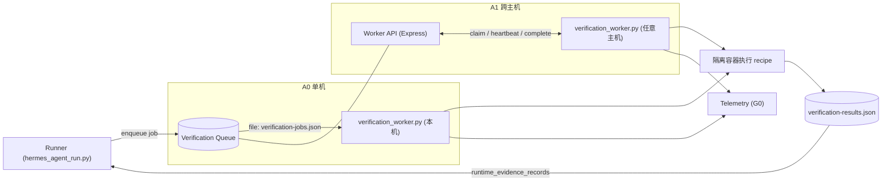
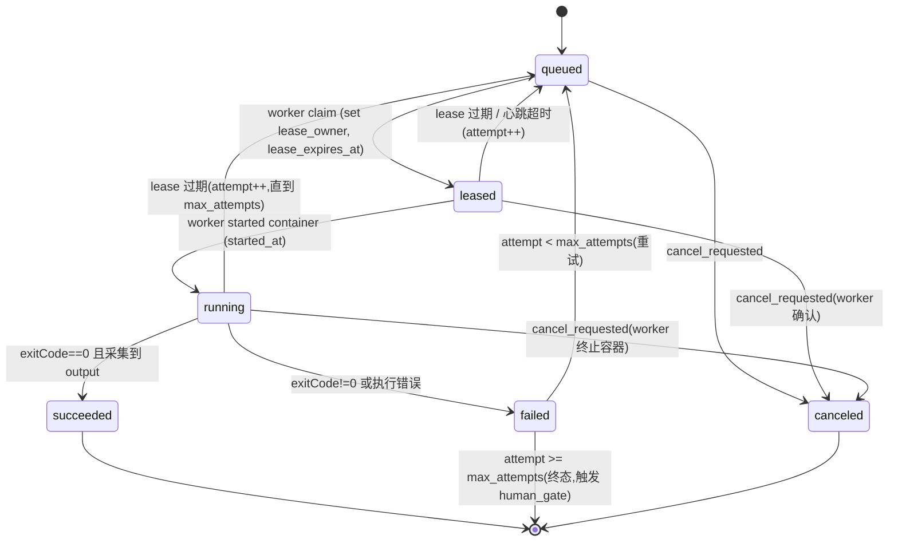

# Agent Factory Phase A0/A1：Verification Worker 详细设计

日期：2026-06-23

适用项目：`<workspace-root>` 下的独立 Agent Factory Dashboard 与 Runtime

上游文档：`docs/superpowers/plans/2026-06-22-agent-factory-feature-completion-roadmap.md`（Phase A）

目标读者：实现 Verification Worker 的开发者 / Agent

## 1. 背景与范围

Roadmap Phase A 的目标:把"runtime 断言只能走人工门"变成"自建 worker 在隔离容器里跑出真实证据"。本文细化 **A0(单机 MVP)** 与 **A1(Worker API + 租约,跨主机可靠)**;A2(持久化队列 + 多 worker 抢占的强一致后端)只给出演进接口,不在本文实现。

本设计的直接收益与刚合并的 evidence 验证器闭环:

- `scripts/validate_evidence_package.py` 现要求 runtime 断言具备**精确 assertion id + 非空 command + 非空 output + `exitCode === 0`** 的证据(单数 `assertion_id` 或复数 `assertion_ids`)。
- Worker 产出的结果必须正好是这个形状,写入 `adu.runtime_evidence_records`,从而让 runtime 断言**自动满足**,而不是落 `human_gate`。
- `human-gate-service.ts` 已会在人工提交运行结果时写入 `assertion_ids`;Worker 是其"自动化对应物"。

## 2. 设计目标与非目标

目标:

- 在隔离容器内执行项目自带的 build/test/lint/run 命令,产出确定性、可归档的证据。
- 语言/技术栈无关:执行逻辑由项目画像中的 `execution_recipe` 驱动。
- A0 单机可用、零外部依赖(文件队列);A1 起跨主机可靠(HTTP + 租约 + 心跳 + 取消 + 重试)。
- 执行不可信仓库代码时满足容器隔离硬性要求。
- 全链路可观测(G0 遥测与 A 同期)。

非目标(本文不做):

- 多 worker 强一致抢占队列(A2)。
- 真实 5GC 仿真编排(UERANSIM/网络命名空间等)——由具体项目的 `execution_recipe` + capabilities 表达,不在 worker 核心内写死。
- 交付/合并(Phase B)、回归目录(Phase C)。

## 3. 术语

| 术语 | 含义 |
|---|---|
| Control Plane | 现有后端(Express/TS)+ Runner(`scripts/hermes_agent_run.py`),负责入队/分配/回填证据 |
| Worker | 常驻 Linux 进程(`scripts/verification_worker.py`),领取作业并在容器内执行 |
| Job | 一次验证作业(对应某 ADU 的某次 runtime 校验需求) |
| Recipe | 项目执行配方 `execution_recipe`,定义如何 build/test/run |
| Lease | 作业租约:worker 领取后持有,需心跳续租,过期则作业回到队列 |

## 4. 总体架构



集成点:Runner 在 evidence 步骤(或 runtime 断言缺证据时)**入队作业**而非直接落 `human_gate`;作业成功后把结果写成 `runtime_evidence_records`(带 `assertion_ids`),再跑 `validate_evidence_package.py`。仅当 worker 不可用 / 能力缺失 / 超预算时才落 `human_gate`。

## 5. 数据模型

### 5.1 Verification Job

```json
{
  "job_id": "VJOB-20260623-0001",
  "schema_version": 1,
  "status": "queued",
  "target": { "type": "adu", "id": "REQ-XXXX", "project_id": "open5gs" },
  "assertion_ids": ["A5", "A6"],
  "recipe_ref": { "project_id": "open5gs", "version": 3, "hash": "sha256:..." },
  "steps": ["unit_test"],
  "required_capabilities": ["docker"],
  "timeout_seconds": 1800,
  "idempotency_key": "REQ-XXXX:A5,A6:recipe-v3:unit_test",
  "attempt": 0,
  "max_attempts": 2,
  "lease_owner": null,
  "lease_expires_at": null,
  "cancel_requested": false,
  "created_at": "2026-06-23T10:00:00Z",
  "started_at": null,
  "finished_at": null
}
```

字段约束:`job_id` / `target.id` / `project_id` 走白名单正则;`assertion_ids` 必须是合约里存在的断言 id(精确);`idempotency_key` 决定去重(见 5.4);`steps` 取自 recipe 的键。

### 5.2 Job 状态机



唯一的状态变更者:`queued↔leased↔running` 由 worker 经 API/文件驱动;过期回收由 Control Plane 的 reaper 执行(A0 由 worker 启动时自检,A1 由后端定时器)。

### 5.3 Verification Result

```json
{
  "job_id": "VJOB-20260623-0001",
  "status": "succeeded",
  "assertion_ids": ["A5", "A6"],
  "command": "make e2e-test",
  "exitCode": 0,
  "output": "....(截断后的 stdout/stderr 摘要)....",
  "artifacts": [{ "name": "junit.xml", "path": ".ai-agent/verification/VJOB-.../junit.xml", "bytes": 12044 }],
  "duration_ms": 84213,
  "worker_id": "worker-linux-01",
  "image": "node:20@sha256:...",
  "started_at": "...", "finished_at": "..."
}
```

回填规则:`status==succeeded` 时,Control Plane 向 `adu.runtime_evidence_records` 追加 `{ assertion_ids, command, exitCode, output }`(正是验证器要求的形状)。原始大输出 / artifacts 存盘,`output` 字段只保留截断摘要(避免 token/JSON 膨胀)。

### 5.4 幂等

`idempotency_key` = `target.id : sorted(assertion_ids) : recipe.version : steps`。入队时若存在同 key 的活跃(queued/leased/running)或近期 succeeded 作业,直接复用其结果,不重复执行。

### 5.5 Execution Recipe

```json
{
  "schema_version": 1,
  "project_id": "open5gs",
  "version": 3,
  "hash": "sha256:...",
  "base_image": "node:20@sha256:...",
  "setup": ["npm ci"],
  "build": ["npm run build"],
  "unit_test": ["npm test --silent"],
  "integration_test": [],
  "lint": ["npm run lint"],
  "run": [],
  "capabilities": ["docker"],
  "approved_by": "local-user",
  "approved_at": "2026-06-23T09:00:00Z"
}
```

确定性校验(见 §9):recipe 必须过 JSON Schema + 镜像 allowlist(固定 digest)+ 命令策略;**首次生成必须人工确认**;每次变更产生新的 `version` + `hash` + 审批记录。

## 6. A0 — 单机 MVP

### 6.1 队列与结果文件(仅单机)

- `.ai-agent/registry/verification-jobs.json`(`{ version, jobs: [...] }`)
- `.ai-agent/registry/verification-results.json`(`{ version, results: [...] }`)

并发安全:所有读改写经现有 `scripts/registry_lock.py`(跨进程锁)。A0 假设单 worker;锁仅防 Runner 入队与 worker 领取的交叉写。

### 6.2 `scripts/verification_worker.py` 主循环(A0)

```
loop:
  acquire registry lock
    job = first job with status==queued and capabilities ⊆ worker_capabilities
    if job: set status=leased, lease_owner=worker_id, lease_expires_at=now+ttl
  release lock
  if no job: sleep(poll_interval); continue
  emit telemetry: job_claimed
  set status=running, started_at=now (locked write)
  result = run_recipe_in_container(job)   # §6.3
  write result to verification-results.json (locked)
  set job status = succeeded|failed, finished_at (locked)
  if succeeded: control-plane backfills runtime_evidence_records (§5.3)
  emit telemetry: job_finished (duration, exitCode, status)
```

启动自检(reaper):worker 启动时扫描 `leased/running` 且 `lease_expires_at < now` 的作业,`attempt++` 后置回 `queued`(或超 `max_attempts` 则 `failed`)。

### 6.3 容器执行 `run_recipe_in_container`

1. 把目标仓库**只读快照**导出到临时目录(`git archive` 或只读 bind),**不直接挂载工作仓库**。
2. 创建可写临时工作目录 `workdir`(容器内 `/work`,可写),只读源码挂到 `/src`(或快照拷入 `/work`)。
3. 以隔离 profile(§9.1)`docker run` 执行 recipe 的目标 step 序列(`setup`→指定 `steps`)。
4. 采集 `exitCode`、stdout/stderr(限长)、声明的 artifacts。
5. 容器执行后销毁(`--rm`)。

### 6.4 Runner 集成

改 `scripts/hermes_agent_run.py` / `run_trusted_verification.py`:对 runtime 断言,若存在 recipe 且 worker 可用 → 入队作业并等待结果(或异步 + 后续 `next-action`);成功 → 写 `runtime_evidence_records`;失败/超时/无能力 → 落 `human_gate`(`gate_type=environment_verification_required`),保持现有人工兜底。

## 7. A1 — Worker API + 租约(跨主机)

### 7.1 传输模型:Worker 主动拉取(pull)

Worker 位于任意主机,仅发起**出站** HTTP 到 Control Plane(防火墙/NAT 友好)。鉴权用共享 token(`AGENT_FACTORY_WORKER_TOKEN`,Bearer)。

### 7.2 API 契约

| 方法 & 路径 | 用途 | 请求 | 响应 |
|---|---|---|---|
| `POST /api/agent-factory/worker/claim` | 领取一个匹配能力的作业并获得租约 | `{ worker_id, capabilities[] }` | `{ job } 或 204` |
| `POST /api/agent-factory/worker/heartbeat` | 续租 + 查询取消 | `{ worker_id, job_id }` | `{ lease_expires_at, cancel_requested }` |
| `POST /api/agent-factory/worker/complete` | 提交结果 | `{ job_id, result }` | `{ accepted: true }` |
| `GET /api/agent-factory/worker/jobs/:id` | 查询作业状态(调试) | — | `{ job }` |

`claim` 在服务端事务内原子地选作业并写租约;`complete` 校验 `lease_owner==worker_id` 且租约未过期(否则拒绝,防止过期 worker 覆盖)。

### 7.3 租约 / 心跳 / 取消 / 重试

- 租约 TTL 默认 120s;worker 每 ~30s 心跳续租。
- 后端 reaper 定时(如每 30s)回收 `lease_expires_at < now` 的作业:`attempt++` 置回 `queued`,超 `max_attempts` → `failed`(触发 human_gate)。
- 取消:Control Plane 置 `cancel_requested=true`;worker 在心跳响应里看到后终止容器并报 `canceled`。
- 重试退避:第 N 次重试延迟 `min(60*2^N, 600)` 秒。

### 7.4 鉴权与安全

- Worker token 必须配置;缺失则 `claim` 返回 403。
- 作业 payload 不含密钥;若 recipe 需密钥,按作业最小授权注入(env),用完容器销毁。

## 8. 安全与隔离(硬性要求)

### 8.1 容器隔离 profile

执行不可信仓库代码,`docker run` 必须:

- 只读源码快照(非挂载工作仓库)+ 可写临时 `workdir`。
- rootless / 非特权用户;`--cap-drop=ALL`;`--security-opt no-new-privileges`;seccomp/AppArmor profile。
- 资源限额:`--cpus`、`--memory`、`--pids-limit`、磁盘配额、`timeout`(墙钟)。
- 默认 `--network none`;仅当作业声明需要时按白名单开放。
- 禁止挂载 Docker socket;禁止特权挂载。
- 基础镜像来自 **allowlist 且固定 digest**;执行后 `--rm` 销毁。

### 8.2 命令/路径安全

- 子进程一律 `execFile`/`spawn` 参数数组,不拼接 shell 字符串。
- `job_id`/`project_id`/`adu_id` 白名单正则;路径经 realpath/allowlist 校验。

## 9. Recipe 生成与确定性校验

- 由 `project-profiler-agent` + `scripts/hermes_project_profile.py` 生成 `execution_recipe` 草案。
- **确定性校验**(`scripts/validate_execution_recipe.py`,新增):
  - JSON Schema(字段/类型);`base_image` 在 allowlist 且带 digest;
  - 命令策略:禁 shell 元字符拼接、提权(`sudo`)、宿主路径访问、网络下载到特权位置;
  - 优先确定性 Adapter(Node/Python/CMake/Meson 等已知项目类型给出标准命令模板),LLM 只补未知部分;
  - 首次/变更必须**人工确认**,记录 `version`/`hash`/`approved_by`。
- 未通过校验或未审批的 recipe → 拒绝执行,作业落 `human_gate`。

## 10. 失败处理与重试

| 情形 | 处理 |
|---|---|
| exitCode!=0 | `failed`;`attempt<max` 则重试,否则终态 → `human_gate`(实现缺口,转 rework 或人工) |
| 租约过期/worker 崩溃 | reaper 回收 → `queued`(attempt++) |
| 能力缺失(无匹配 worker) | 作业滞留 `queued`;超 `assignment_timeout` → `human_gate`(`environment_verification_required`) |
| 超时(墙钟) | 终止容器 → `failed`(同上重试逻辑) |
| recipe 未审批/非法 | 不执行 → `human_gate` |

## 11. 遥测(G0,与本阶段同期)

每作业发射:`queue_wait_ms`、`execution_duration_ms`、`exitCode`、`status`、`attempt`、`worker_id`、`artifact_bytes`、`image`。统一 schema(`.ai-agent/registry/verification-telemetry.jsonl` 或经后端事件),供 Phase G1 聚合。

## 12. 接口与文件清单

新增:

```
scripts/verification_worker.py            # worker daemon(A0 文件队列 / A1 HTTP 拉取)
scripts/validate_execution_recipe.py      # recipe 确定性校验
.ai-agent/registry/verification-jobs.json     # A0 队列(运行态,gitignore)
.ai-agent/registry/verification-results.json  # A0 结果(运行态,gitignore)
.ai-agent/policies/verification-image-allowlist.json
agent-factory-dashboard/backend/src/application/runtime/verification-job-service.ts
agent-factory-dashboard/backend/src/interfaces/rest/worker-controller.ts   # A1 Worker API
```

修改:

```
scripts/hermes_project_profile.py         # 产出 execution_recipe
scripts/hermes_agent_run.py               # runtime 断言 → 入队 + 回填 runtime_evidence_records
.ai-agent/prompts/project-profiler-agent.md  # 生成 recipe 的指引
```

贯穿:新注册表加入 `.gitignore` + doctor staged 拦截 + bootstrap 初始化 + portability scan。

## 13. 测试计划

- `scripts/test_verification_worker.py`:队列领取原子性、租约过期回收、attempt++、取消、幂等去重(纯文件,无需 Docker)。
- `scripts/test_validate_execution_recipe.py`:schema、镜像 allowlist、命令策略反例、未审批拒绝。
- Recipe 执行用 **mock 容器后端**(注入一个假的 `run_recipe_in_container`,返回构造的 exitCode/output),使 CI 无需真实 Docker。
- 端到端(可选,需 Docker 的环境):一个最小 Node/Python 样例项目,runtime 断言经 worker 自动拿到 `exitCode 0` 证据并通过 `validate_evidence_package.py`。
- CI 在无 Docker 时跳过端到端,仅跑文件/schema 单测(沿用现有"mock 模式不因缺依赖失败"的约定)。

## 14. A0 → A1 → A2 演进

- A0:文件队列、单机、单 worker;Runner 同进程入队。接口以"队列读写 + run_recipe"抽象,便于替换后端。
- A1:把队列读写换成 Worker API(pull + lease);worker 可在任意主机;后端 reaper 接管回收。数据模型不变(同一 Job/Result schema)。
- A2(本文不实现):持久化队列后端(SQLite/Redis),多 worker 抢占用行锁/原子 `claim`,崩溃回收与去重下沉到队列层。Job/Result schema 与 API 契约保持不变。

## 15. 验收标准

A0:

- 某通用样例项目(Node 或 Python)的 runtime 断言,无人工介入即经 worker 拿到 `command + exitCode 0 + output` 证据并写入 `runtime_evidence_records`,`validate_evidence_package.py` 返回 0。
- 隔离 profile 生效(只读源码、无网络、资源限额、容器即用即毁);可用 `docker inspect`/探针验证。
- 未审批/非法 recipe 被拒,作业落 `human_gate`。
- 单测覆盖队列原子性、租约回收、幂等;CI 无 Docker 亦全绿(mock)。

A1:

- 另一主机的 worker 可领取作业、心跳续租、提交结果;过期 worker 的 `complete` 被拒。
- reaper 能回收过期租约并重试;取消能终止运行中作业。

## 16. 风险与规避

| 风险 | 规避 |
|---|---|
| 容器逃逸/污染主机 | §8.1 全套隔离;只读源码;禁 docker socket;镜像 allowlist+digest |
| LLM recipe 注入任意命令 | §9 schema+命令策略+人工审批+确定性 Adapter 优先 |
| 文件队列跨主机不可靠 | A0 明确仅单机;跨主机必须 A1(API+租约) |
| 过期 worker 覆盖新结果 | `complete` 校验 `lease_owner` + 租约有效 |
| 大输出撑爆 JSON/token | `output` 截断摘要,原始 artifacts 存盘 |
| 运行态文件进 Git | gitignore + doctor 拦截 + portability scan |
| worker 不可用导致流程卡死 | 能力缺失/超时 → `human_gate` 人工兜底,不无限等待 |
```
